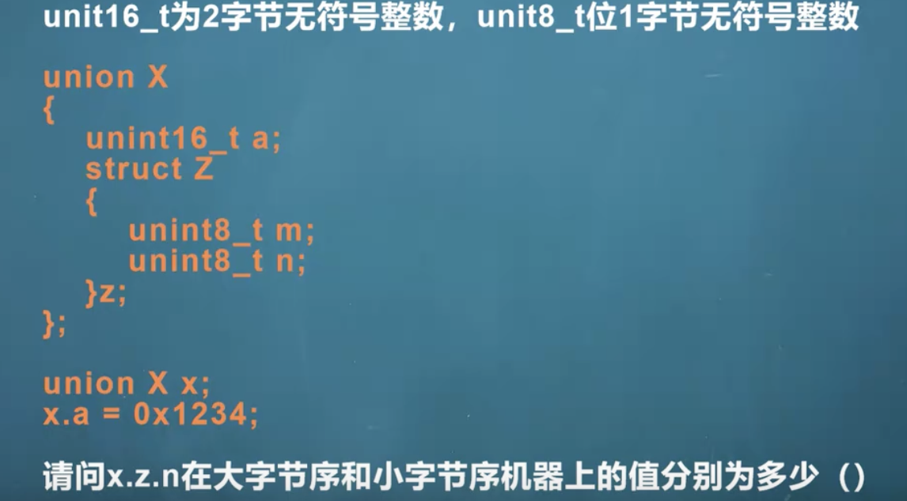
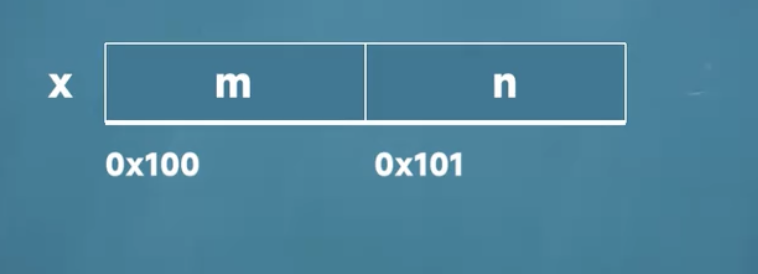

# 大小端判断

大小端的判断可以使用union和数组来做，因为union的内存是共享的，同时数组的内容一定是从低地址开始的.

* 小端模式：低位在低地址
* 大端模式：低位在高地址

```c
#include <cstdio>
#include <stdint.h>

union Test{
    short val;
    unsigned char ch[2];
};

int main() {
    Test t;
    t.val=0x1234;
    if(t.ch[0]==0x34)
    {
        printf("小端\n");
    }else if(t.ch[0]==0x12){
        printf("大端\n");
    }

    return 0;
}
```

## 联合体下的字节序面试题
对于字节序而言，有一些常见的面试题，例如：


a和结构体z是占用一块内存空间的，如下：


对于小端排序而言,x.z.n为0x12
对于大端排序而言,x.z.n为0x34