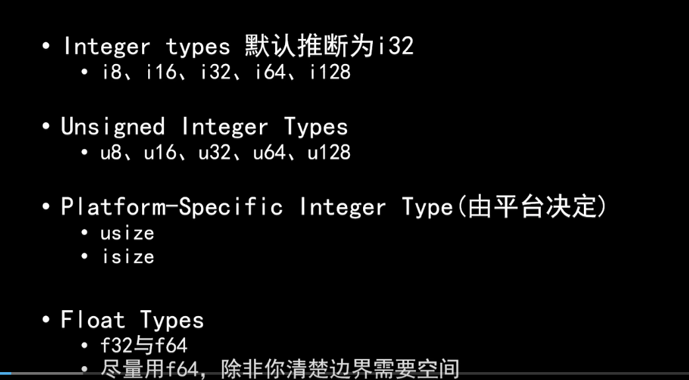

# 基本数据类型



```rust
fn main() {
    println!("u8:{}-{}", u8::MIN, u8::MAX); //打印类型边界
    println!("u8: {} bytes", std::mem::size_of::<u8>()); //查看u8占多少个字节

    let my_char: char = 'C';
    let my_emoj: char = '😁';
    println!("{}:{}", my_char, my_emoj);
}

```