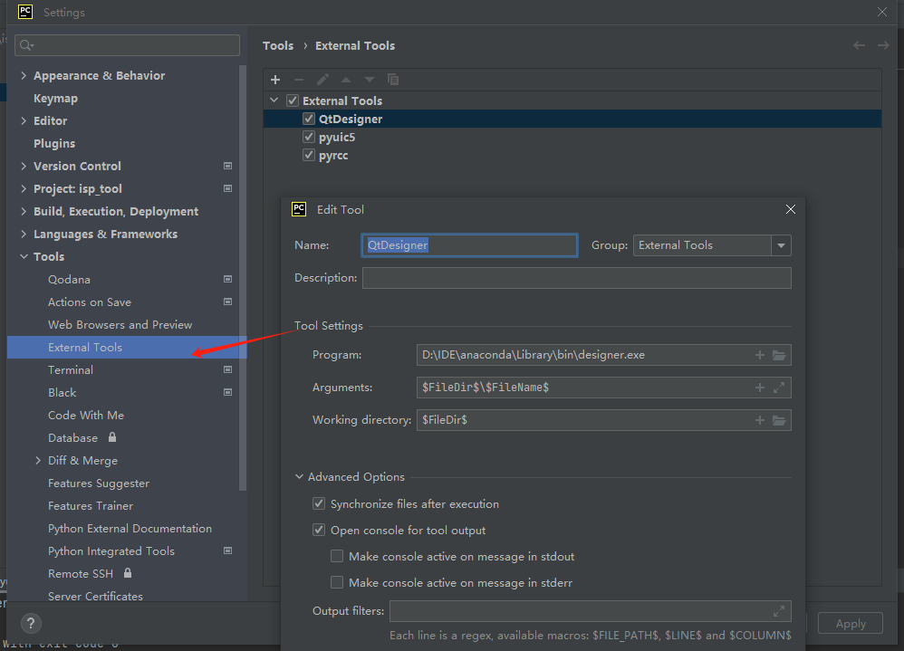

# PYQT安装

```shell
pip install PyQt5
pip install pyqt5-tools
```


## pycharm设置外部工具



QtDesigner

```shell
Program: D:\IDE\anaconda\Library\bin\designer.exe
Arguments: $FileDir$\$FileName$
Working directory: $FileDir$
```

pyuic5

```shell
Program：D:\IDE\anaconda\envs\pyqt5\Scripts\pyuic5.exe
Arguments：$FileName$ -o $FileNameWithoutExtension$.py
Working directory：$FileDir$
```

pyrcc

```shell
Program：D:\IDE\anaconda\envs\pyqt5\Scripts\pyrcc5.exe
Arguments：$FileName$ -o $FileNameWithoutExtension$.py
Working directory：$FileDir$
```


