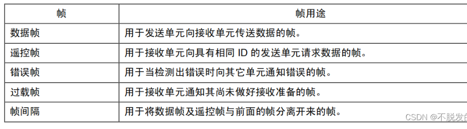
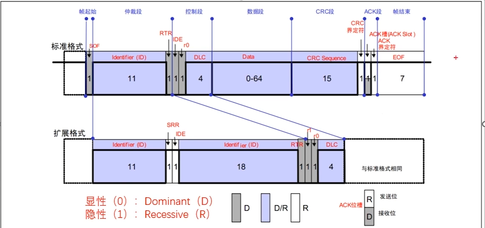

# 2.CAN协议层

CAN以帧的形式通讯。

## 1.数据帧

* ID,用于区分报文消息。同时多个设备发送的时候，**ID**小的优先发送，ID大的等待下次空闲在发送。
* RTR，远程请求标志位，用于区分数据帧还是遥控帧。数据帧必须是显性0，遥控帧必须是隐性1 。

ID和RTR组成了仲裁段。如果ID都一样，那么数据帧的优先级大于遥控帧。

* IDE,用于区分标准格式还是扩展格式，标准格式是显性0，扩展格式是隐性1
* R0，保留位
* DLC,数据段长度
* DATA,数据，最大64个位，8个字节
* CRC校验，15个位

ACK槽，当发送方发完数据，总线回归到隐性1的状态，接收方收到数据后，接收方会在ACK界定槽把总线拉倒显性0。

我们可以到在ACK槽前面有一个CRC界定符，这个是发送发必须发隐性1，也可以理解成提前释放总线。

ACK槽后面是ACK界定符，这个是隐性1的状态，也就是接收方必须释放掉总线。