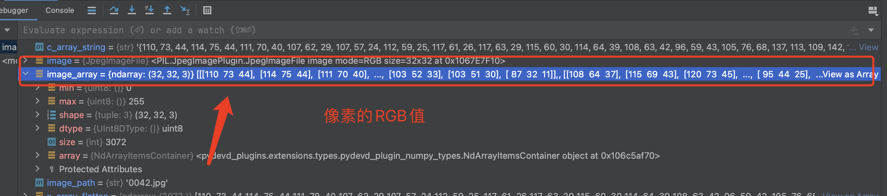

# TFLITE CIFAR10

## 模型搭建

数据集处理

```python
from keras.datasets import cifar10
from keras.preprocessing.image import ImageDataGenerator
from keras.models import Sequential, load_model, Model
from keras.layers import Input, Dense, Dropout, Activation, Flatten
from keras.layers import Convolution2D, MaxPooling2D, GlobalAveragePooling2D
import pandas as pd
import matplotlib.pyplot as plt
import time, pickle
from keras.utils import to_categorical
from keras import layers
import tensorflow as tf
from tensorflow.keras.callbacks import EarlyStopping

(x_train, y_train), (x_test, y_test) = cifar10.load_data()

y_train = y_train.reshape(y_train.shape[0])
y_test = y_test.reshape(y_test.shape[0])

print('x_train shape:', x_train.shape)
print(x_train.shape[0], 'training samples')
print(x_test.shape[0], 'validation samples')

x_train = x_train.astype('float32')
x_test = x_test.astype('float32')
x_train /= 255
x_test /= 255

y_train = to_categorical(y_train, 10)
y_test = to_categorical(y_test, 10)

```

模型搭建

```python
def build_model():
    model = tf.keras.Sequential()
    model.add(layers.Conv2D(32, kernel_size=(4,4), strides=1,activation='relu', input_shape=(32, 32, 3)))
    model.add(layers.MaxPooling2D((2, 2)))

    model.add(layers.Conv2D(32, kernel_size=(4,4), strides=1,activation='relu'))
    model.add(layers.MaxPooling2D((2, 2)))


    model.add(layers.Flatten())
    model.add(layers.Dense(256, activation='relu'))
    model.add(layers.Dense(10, activation='softmax'))

    print(model.summary())
    return model

model=build_model()
```

tflite模型转换

```python

converter = tf.lite.TFLiteConverter.from_keras_model(model)
tflite_model = converter.convert()
open("cifar10.tflite", "wb").write(tflite_model)
```


## ESP32推理

本文采用的是2DCNN，添加所需的op算子即可

```c
static tflite::MicroMutableOpResolver<5> resolver;
// 这里需要添加我们模型使用的层
if (resolver.AddReshape() != kTfLiteOk)
{
    ESP_LOGI(TAG, "Add reshape failed");
    return;
}

if (resolver.AddConv2D() != kTfLiteOk)
{
    ESP_LOGI(TAG, "Add reshape failed");
    return;
}

if (resolver.AddMaxPool2D() != kTfLiteOk)
{
    ESP_LOGI(TAG, "Add reshape failed");
    return;
}

if (resolver.AddFullyConnected() != kTfLiteOk)
{
    ESP_LOGI(TAG, "Add reshape failed");
    return;
}

if (resolver.AddSoftmax() != kTfLiteOk)
{
    ESP_LOGI(TAG, "Add reshape failed");
    return;
}
```

### PC端JPG图片转换为数组

每一个像素点都有RGB三个数值，依次排开即可，以下为python的一段实例

```python
from PIL import Image
import numpy as np

def image_to_c_array(image_path):
    # 读取图片
    image = Image.open(image_path)

    print(image.size)
    # 转换为numpy数组
    image_array = np.array(image)


    # 归一化
    # normalized_image_array = image_array / 255.0
    print(image_array.size)
    x_array_flatten = image_array.flatten()
    print(len(x_array_flatten))
    c_array_string = "{" + ", ".join(str(pixel) for pixel in x_array_flatten) + "}"

    with open("image_array.h", "w") as f:
        f.write("#ifndef IMAGE_ARRAY_H\n")
        f.write("#define IMAGE_ARRAY_H\n\n")
        f.write("const float image_array[] = %s;\n" % c_array_string)
        f.write("#endif\n")


# 调用函数生成.h文件
image_to_c_array("0042.jpg")
```




## esp_jpeg解码jpg

```c
size_t pic_buf_size = 32 * 32 * sizeof(uint32_t);
        uint8_t *pic_buf = (uint8_t *)heap_caps_malloc(pic_buf_size + 1, MALLOC_CAP_SPIRAM); // create out image buffer
        esp_jpeg_image_cfg_t jpeg_cfg = {
            .indata = (uint8_t *)file_buf,
            .indata_size = filesize,
            .outbuf = (uint8_t *)pic_buf,
            .outbuf_size = pic_buf_size,
            .out_format = JPEG_IMAGE_FORMAT_RGB888,
            .out_scale = JPEG_IMAGE_SCALE_0,
        };

        // // decode jpg
        esp_jpeg_image_output_t outimage;
        esp_jpeg_decode(&jpeg_cfg, &outimage);
        ESP_LOGI(TAG, "%s size: %d x %d", filename, outimage.width, outimage.height);
```

和上面python版本的一样，解码出来的pic_buf存放的也是每一个的像素，类似于这样

```c
pic_buf[]= {像素0的R，像素0的G，像素0的B，像素1的R....}
```

所以在输入网络的时候，pic_buf的长度一定是图像宽*图像高*3，其中3为RGB，包括解码的时候选择RGB888

推理端的代码,记得归一化

```c
void cifar10_model_predict(const uint8_t *pic, int size)
{
    for (int i = 0; i < size; i++)
    {
        input->data.f[i] = pic[i] / 255.0f;
    }

    TfLiteStatus invoke_status = interpreter->Invoke();
    if (invoke_status != kTfLiteOk)
    {
        MicroPrintf("Invoke failed on");
        return;
    }

    for (int i = 0; i < 10; i++)
    {
        printf("%.2f ", output->data.f[i]);
    }
    printf("\n");
}
```