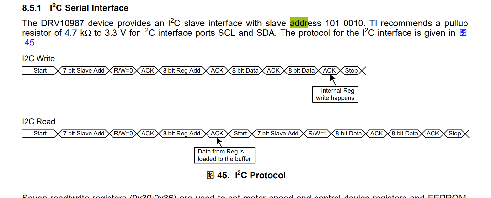
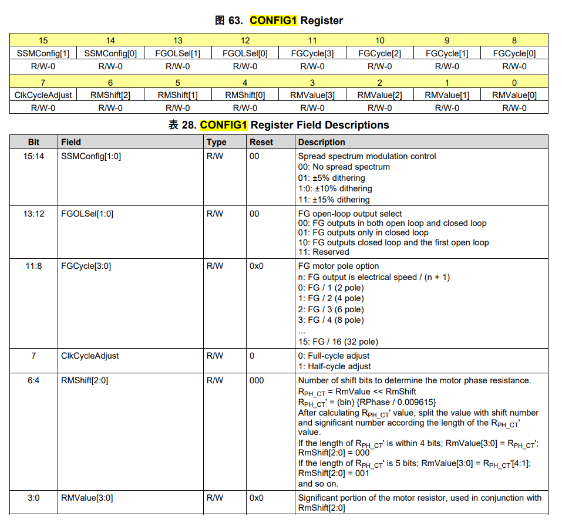

# DRV10987

I2C的地址是 101 0010 , 47页



# 寄存器

## 配置电机参数所在的寄存器

0x90~0x96，用以配置电机参数并优化应用的旋转曲线

电机相电阻 （RPH_CT） 和 BEMF 常数 （Kt） 是用于表征 BLDC 电机的两个重要参数。DRV10987设备需要在寄存器中配置这些参数。通过在 Config1 寄存器中写入 Rm[6：0]（RMShift[2：0] 和 RMValue[3：0]）的值来设置电机相电阻。BEMF 常数通过在 Config2 寄存器中写入 Kt[6：0]（KTShift[2：0] 和 KTValue[3：0]）的值进行编程。

### 0x90

0X90的默认参数是




如何计算 RM[6:0]，其中由RMShift[2:0] 和 RMValue[3:0] 构成

首先我们需要计算 Rmding = RPH_CT / 0.00967

然后，Rmding = RMValue << RMShift

```python
def calculate_rm_and_rmshift(r):
    # 检查r是否在有效范围内
    if r < 0 or r > 18.324:
        raise ValueError("The resistance value must be in the range 0 to 18.324")

    # 计算rmdig
    rmdig = r / 0.00967
    print("rmdig:", rmdig)
    # 初始化rm和rmshift
    rm = 0
    rmshift = 0

    # 计算rmshift和rm，使得rm << rmshift = rmdig
    for rmshift in range(8):
        if rmdig < (1 << (rmshift + 4)):
            rm = int(rmdig / (1 << rmshift))
            break

    # 验证结果
    if rm >= 16:
        raise RuntimeError("Unable to find valid rm and rmshift for given r")

    return rm, rmshift


# 测试函数
r = 9.9328  # 示例电阻值，可以替换成其他值进行测试
rm, rmshift = calculate_rm_and_rmshift(r)
print(f"r = {r}, rm = {rm}, rmshift = {rmshift}")

```


