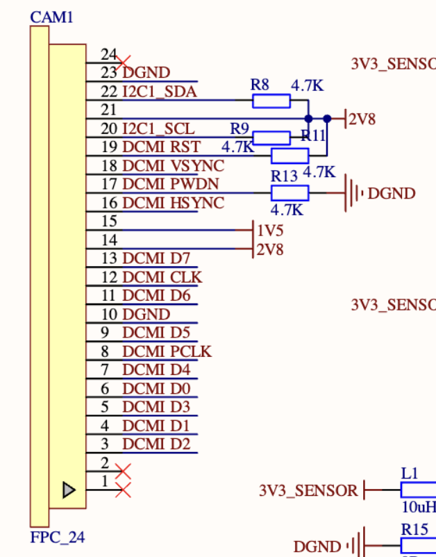
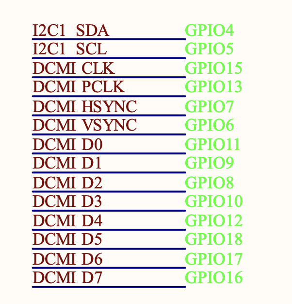
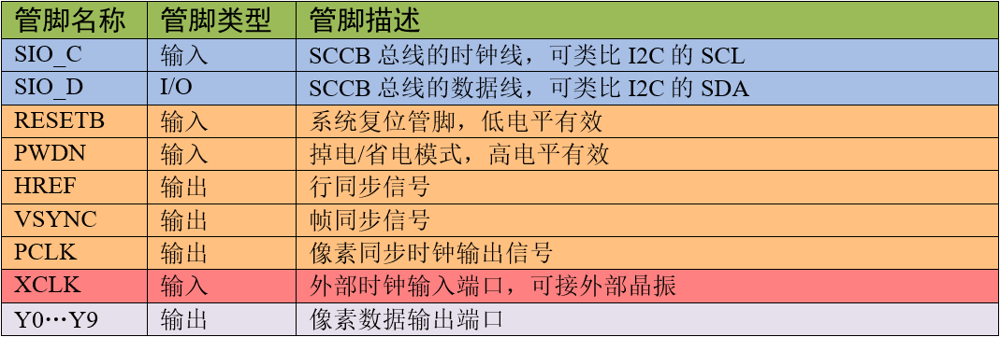

# ESP CAMERA学习

开发环境：
* ESP32-S3
* idf master (2024年03月15日)

camera的引脚定义如下：






在使用esp-camera组件前，需要开启psram，可以把这些内容放到sdkdefaults中
```config
CONFIG_ESP32S3_DEFAULT_CPU_FREQ_240=y
CONFIG_SPIRAM_SUPPORT=y
CONFIG_ESP32S3_SPIRAM_SUPPORT=y
CONFIG_SPIRAM_SPEED_80M=y
CONFIG_SPIRAM_MODE_OCT=y
```


### 1.配置camera
本文采用的ST7789，所有formate设置的RGB565，此外分辨率设置为240x240
```c
static camera_config_t camera_config = {
    .pin_pwdn = -1,
    .pin_reset = -1,
    .pin_xclk = 15,
    .pin_sccb_sda = 4,
    .pin_sccb_scl = 5,
    .pin_d7 = 16,
    .pin_d6 = 17,
    .pin_d5 = 18,
    .pin_d4 = 12,
    .pin_d3 = 10,
    .pin_d2 = 8,
    .pin_d1 = 9,
    .pin_d0 = 11,
    .pin_vsync = 6,
    .pin_href = 7,
    .pin_pclk = 13,
    .xclk_freq_hz = 20000000, // EXPERIMENTAL: Set to 16MHz on ESP32-S2 or ESP32-S3 to enable EDMA mode
    .ledc_timer = LEDC_TIMER_0,
    .ledc_channel = LEDC_CHANNEL_0,
    .pixel_format = PIXFORMAT_RGB565,
    .frame_size = FRAMESIZE_240X240,
    .jpeg_quality = 12, // 0-63 lower number means higher quality
    .fb_count = 1,
    .grab_mode = CAMERA_GRAB_WHEN_EMPTY,
};

esp_err_t camera_init()
{
    esp_err_t err = esp_camera_init(&camera_config);
    if (err != ESP_OK)
    {
        ESP_LOGE(TAG, "Camera Init Failed");
        return err;
    }
    return ESP_OK;
}
```


### 2.显示摄像头数据到lcd中：
```c
while (1)
{
    camera_fb_t *pic = esp_camera_fb_get();
    esp_lcd_panel_draw_bitmap(lcd_panel, 0, 0, 240 + 1, 240 + 1, pic->buf);
    esp_camera_fb_return(pic);
}
```

### 3.camera配置
如果想设置一些翻转或其他的话
```c
sensor_t *s = esp_camera_sensor_get();
s->set_hmirror(s, 1);
```
