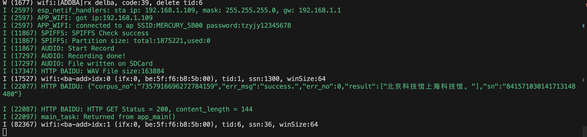

# 百度语音识别

## 1.开发环境：
* esp-idf 5.1
* esp32 s3
* microphone:MSM261S4030H0

百度文档：[短语音识别标准版API](https://ai.baidu.com/ai-doc/SPEECH/Jlbxdezuf)

这里请求我们选择RAW方式

```c
Content-Type: audio/pcm;rate=16000
```

请求格式如下：
```c
POST http://vop.baidu.com/server_api?dev_pid=1537&cuid=******&token=1.a6b7dbd428f731035f771b8d********.86400.1292922000-2346678-124328
```

## 2.ESP32

### 1.整体流程：
1. 录音
2. 转成wav格式，保存至spiffs
3. 读取保存的wav文件到buffer
4. 调用http client

关于这里为什么要保存到spiffs，主要是考虑到录制的时间太长的，malloc一块大buffer容易失败


### 2.spiffs创建
我的分区表如下
```c
# Name,   Type, SubType, Offset,  Size, Flags
# Note: if you have increased the bootloader size, make sure to update the offsets to avoid overlap
nvs,      data, nvs,     0x9000,  0x6000,
phy_init, data, phy,     0xf000,  0x1000,
factory,  app,  factory, 0x10000, 1M,
storage,  data, spiffs,  ,        2000K,
```

关于spiffs可以参考idf的例子，我的如下

```c
#include "app_spiffs.h"

static const char *TAG = "SPIFFS";

esp_err_t app_spiffs_init(char *mount_path)
{
    esp_err_t ret;
    esp_vfs_spiffs_conf_t conf = {
        .base_path = mount_path,
        .partition_label = NULL,
        .max_files = 5,
        .format_if_mount_failed = true, // 如果挂载失败，将格式化文件系统
    };

    ESP_ERROR_CHECK(esp_vfs_spiffs_register(&conf));

    // 检查spiffs
    ret = esp_spiffs_check(conf.partition_label);
    if (ret != ESP_OK)
    {
        ESP_LOGI(TAG, "SPIFFS Check failed:%s", esp_err_to_name(ret));
    }
    else
    {
        ESP_LOGI(TAG, "SPIFFS Check success");
    }

    // 获取spiffs的信息
    size_t total = 0, used = 0;
    ret = esp_spiffs_info(conf.partition_label, &total, &used);
    if (ret != ESP_OK)
    {
        ESP_LOGI(TAG, "Failed to get spiffs partition info:%s", esp_err_to_name(ret));
        return ESP_FAIL;
    }
    else
    {
        ESP_LOGI(TAG, "Partition size: total:%d,used:%d ", total, used);
    }

    // 如果used > total，再次检查
    if (used > total)
    {
        ESP_LOGW(TAG, "Number of used bytes cannot be larger than total. Performing SPIFFS_check().");
        ret = esp_spiffs_check(conf.partition_label);
        if (ret != ESP_OK)
        {
            ESP_LOGE(TAG, "SPIFFS_check() failed (%s)", esp_err_to_name(ret));
            return ESP_FAIL;
        }
        else
        {
            ESP_LOGI(TAG, "SPIFFS_check() successful");
        }
    }
    return ret;
}
```

### 3.i2s初始化

i2s的录音主要参考idf的例子：[IDF I2S录音]([1](https://github.com/espressif/esp-idf/tree/master/examples/peripherals/i2s/i2s_recorder))

```c
#include "hal_i2s.h"
#include "app_spiffs.h"
#include <sys/unistd.h>
#include <sys/stat.h>
#include "esp_log.h"
#include "esp_heap_caps.h"

static const char *TAG = "AUDIO";
i2s_chan_handle_t rx_handle = NULL;
record_info_t record_info = {};

esp_err_t hal_i2s_microphone_init(i2s_microphone_config_t config)
{
    esp_err_t ret_val = ESP_OK;
    i2s_chan_config_t chan_cfg = I2S_CHANNEL_DEFAULT_CONFIG(config.i2s_num, I2S_ROLE_MASTER);

    ret_val |= i2s_new_channel(&chan_cfg, NULL, &rx_handle);
    i2s_std_config_t std_cfg = {
        .clk_cfg = I2S_STD_CLK_DEFAULT_CONFIG(config.sample_rate),
        .slot_cfg = I2S_STD_PHILIPS_SLOT_DEFAULT_CONFIG(config.bits_per_sample, I2S_SLOT_MODE_MONO),
        .gpio_cfg = {
            .mclk = GPIO_NUM_NC,
            .bclk = config.bclk_pin,
            .ws = config.ws_pin,
            .dout = GPIO_NUM_NC,
            .din = config.din_pin,
            .invert_flags = {
                .mclk_inv = false,
                .bclk_inv = false,
                .ws_inv = false,
            },
        },
    };

    std_cfg.slot_cfg.slot_mask = I2S_STD_SLOT_LEFT;
    ret_val |= i2s_channel_init_std_mode(rx_handle, &std_cfg);
    ret_val |= i2s_channel_enable(rx_handle);
    record_info.i2s_config = config;
    return ret_val;
}

void hal_i2s_record(char *file_path, int record_time)
{
    ESP_LOGI(TAG, "Start Record");
    record_info.flash_wr_size = 0;
    record_info.byte_rate = 1 * record_info.i2s_config.sample_rate * record_info.i2s_config.bits_per_sample / 8; // 声道数×采样频率×每样本的数据位数/8。播放软件利用此值可以估计缓冲区的大小。
    record_info.bytes_all = record_info.byte_rate * record_time;                                                 // 设定时间下的所有数据大小
    record_info.sample_size = record_info.i2s_config.bits_per_sample * 1024;                                     // 每一次采样的带下
    const wav_header_t wav_header = WAV_HEADER_PCM_DEFAULT(record_info.bytes_all, record_info.i2s_config.bits_per_sample, record_info.i2s_config.sample_rate, 1);

    // 判断文件是否存在
    struct stat st;
    if (stat(file_path, &st) == 0)
    {
        ESP_LOGI(TAG, "%s exit", file_path);
        unlink(file_path); // 如果存在就删除
    }

    // 创建WAV文件
    FILE *f = fopen(file_path, "a");
    if (f == NULL)
    {
        ESP_LOGI(TAG, "Failed to open file");
        return;
    }
    fwrite(&wav_header, sizeof(wav_header), 1, f);

    while (record_info.flash_wr_size < record_info.bytes_all)
    {
        char *i2s_raw_buffer = heap_caps_calloc(1, record_info.sample_size, MALLOC_CAP_DMA);
        if (i2s_raw_buffer == NULL)
        {
            continue;
        }

        // Malloc success
        if (i2s_channel_read(rx_handle, i2s_raw_buffer, record_info.sample_size, &record_info.read_size, 100) == ESP_OK)
        {
            fwrite(i2s_raw_buffer, record_info.read_size, 1, f);
            record_info.flash_wr_size += record_info.read_size;
        }
        else
        {
            ESP_LOGI(TAG, "Read Failed!\n");
        }
        free(i2s_raw_buffer);
    }

    ESP_LOGI(TAG, "Recording done!");
    fclose(f);
    ESP_LOGI(TAG, "File written on SDCard");
}
```

```c
#pragma once

#include "driver/i2s_common.h"
#include "driver/i2s_std.h"
#include "driver/i2s_tdm.h"
#include "driver/gpio.h"
#include "driver/i2s_pdm.h"
#include "wav_formate.h"

typedef struct
{
    uint16_t sample_rate;
    uint16_t bits_per_sample;
    gpio_num_t ws_pin;
    gpio_num_t bclk_pin;
    gpio_num_t din_pin;
    i2s_port_t i2s_num;
} i2s_microphone_config_t;

typedef struct
{
    i2s_microphone_config_t i2s_config; // i2s的配置信息
    int byte_rate;                      // 1s下的采样数据
    int bytes_all;                      // 录音时间下的所有数据大小
    int sample_size;                    // 每一次采样的大小
    int flash_wr_size;                  // 当前录音的大小
    size_t read_size;                   // i2s读出的长度
} record_info_t;

extern i2s_chan_handle_t rx_handle;

esp_err_t hal_i2s_microphone_init(i2s_microphone_config_t config);
void hal_i2s_record(char *file_path, int record_time);
```


### 4.http请求

首先我们把保存的wav文件读取出来

```c
wav_file = fopen("/spiffs/record.wav", "r");
if (wav_file == NULL)
{
    ESP_LOGI(TAG, "Read audio file failed");
}
fseek(wav_file, 0, SEEK_END);
wav_file_size = ftell(wav_file);
fseek(wav_file, 0, SEEK_SET);
ESP_LOGI(TAG, "WAV File size:%zu", wav_file_size);
wav_raw_buffer = heap_caps_malloc(wav_file_size + 1, MALLOC_CAP_DMA);
if (wav_raw_buffer == NULL)
{
    ESP_LOGI(TAG, "Malloc wav raw buffer fail");
    return;
}
fread(wav_raw_buffer, 1, wav_file_size, wav_file);
fclose(wav_file);
```

#### 1.设置esp http client的url

```c
char *access_token = "xxx";
char *url_formate = "http://vop.baidu.com/server_api?dev_pid=1537&cuid=dPKArKm9yCGIOwPoCSjTDzmIIj4cBsEV&token=%s";
```

这里的access_token需要自己去api控制台获取

#### 2.然后设置header
```c
esp_http_client_set_header(client, "Content-Type", "audio/pcm;rate=16000");
esp_http_client_set_header(client, "Accept", "application/json");
```

#### 3.填写post_field
```c
esp_http_client_set_post_field(client, wav_raw_buffer, wav_file_size);
```

#### 4.整体调用
```c
void app_main(void)
{
    // Init NVS
    esp_err_t ret = nvs_flash_init();
    if (ret == ESP_ERR_NVS_NO_FREE_PAGES || ret == ESP_ERR_NVS_NEW_VERSION_FOUND)
    {
        ESP_ERROR_CHECK(nvs_flash_erase());
        ret = nvs_flash_init();
    }
    ESP_ERROR_CHECK(ret);

    // Connect WIFI
    app_wifi_init("MERCURY_5B00", "tzyjy12345678");

    // Init spiffs
    ESP_ERROR_CHECK(app_spiffs_init("/spiffs"));

    // Init i2s microphone
    ESP_ERROR_CHECK(hal_i2s_microphone_init(i2s_microphone_config));
    hal_i2s_record("/spiffs/record.wav", 5);
    wav_file = fopen("/spiffs/record.wav", "r");
    if (wav_file == NULL)
    {
        ESP_LOGI(TAG, "Read audio file failed");
    }
    fseek(wav_file, 0, SEEK_END);
    wav_file_size = ftell(wav_file);
    fseek(wav_file, 0, SEEK_SET);
    ESP_LOGI(TAG, "WAV File size:%zu", wav_file_size);
    wav_raw_buffer = heap_caps_malloc(wav_file_size + 1, MALLOC_CAP_DMA);
    if (wav_raw_buffer == NULL)
    {
        ESP_LOGI(TAG, "Malloc wav raw buffer fail");
        return;
    }
    fread(wav_raw_buffer, 1, wav_file_size, wav_file);
    fclose(wav_file);

    // HTTP
    esp_http_client_config_t config = {
        .method = HTTP_METHOD_POST,
        .event_handler = app_http_baidu_speech_recognition_event_handler,
        .buffer_size = 4 * 1024,
    };
    char *url = heap_caps_malloc(strlen(url_formate) + strlen(access_token) + 1, MALLOC_CAP_DMA);
    sprintf(url, url_formate, access_token);
    config.url = url;
    client = esp_http_client_init(&config);
    esp_http_client_set_method(client, HTTP_METHOD_POST);
    esp_http_client_set_header(client, "Content-Type", "audio/pcm;rate=16000");
    esp_http_client_set_header(client, "Accept", "application/json");
    esp_http_client_set_post_field(client, wav_raw_buffer, wav_file_size);

    esp_err_t err = esp_http_client_perform(client);
    if (err == ESP_OK)
    {
        ESP_LOGI(TAG, "HTTP GET Status = %d, content_length = %d", esp_http_client_get_status_code(client), (int)esp_http_client_get_content_length(client));
    }
    else
    {
        ESP_LOGI(TAG, "HTTP GET request failed: %s", esp_err_to_name(err));
    }
    esp_http_client_cleanup(client);

    free(url);
}

```

## 3.实验效果

