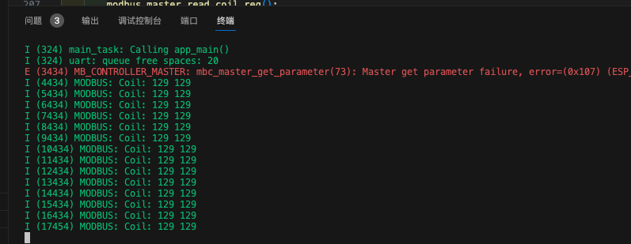
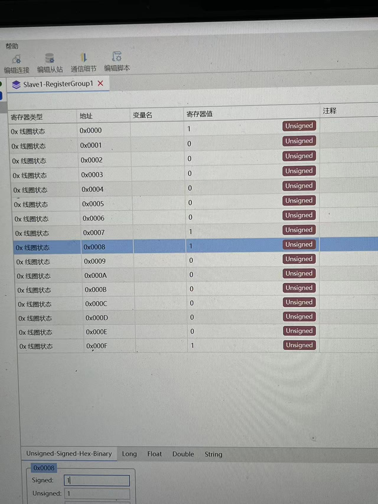

# modbus serial master

开发环境
* esp idf 5.1
* esp-modbus


### Device parameters
对于master而言，需要理解的主要是device parameters，下面是一个parameters的例子

```c
enum
{
    CID_INPUT = 0,
    CID_COIL,
    CID_HOLDING,
};

const mb_parameter_descriptor_t device_parameters[] = {
    {CID_INPUT, (const char *)("INPUT"), (const char *)(""), 1, MB_PARAM_INPUT, 0x00, 5,
     INPUT_OFFSET(input_value1), PARAM_TYPE_U16, sizeof(uint16_t), OPTS(0, 0, 0), PAR_PERMS_READ_WRITE_TRIGGER},
    {CID_COIL, (const char *)("COIL"), (const char *)(""), 1, MB_PARAM_COIL, 0x00, 16,
     COIL_OFFSET(coil_value1), PARAM_TYPE_U8, sizeof(uint8_t), OPTS(0, 0, 0), PAR_PERMS_READ_WRITE_TRIGGER},
    {CID_HOLDING, (const char *)("HOLDING"), (const char *)(""), 1, MB_PARAM_HOLDING, 0x00, 5,
     HOLDING_OFFSET(holding_value1), PARAM_TYPE_U16, sizeof(uint16_t), OPTS(0, 0, 0), PAR_PERMS_READ_WRITE_TRIGGER},
};
```

可以看到，我们这边分别定义了输入寄存器、线圈与保持寄存器，其中，关于mb_parameter_descriptor_t的定义如下：

```c
typedef struct {
    uint16_t            cid;                /*!< Characteristic cid */
    const char*         param_key;          /*!< The key (name) of the parameter */
    const char*         param_units;        /*!< The physical units of the parameter */
    uint8_t             mb_slave_addr;      /*!< Slave address of device in the Modbus segment */
    mb_param_type_t     mb_param_type;      /*!< Type of modbus parameter */
    uint16_t            mb_reg_start;       /*!< This is the Modbus register address. This is the 0 based value. */
    uint16_t            mb_size;            /*!< Size of mb parameter in registers */
    uint16_t            param_offset;       /*!< Parameter name (OFFSET in the parameter structure) */
    mb_descr_type_t     param_type;         /*!< Float, U8, U16, U32, ASCII, etc. */
    mb_descr_size_t     param_size;         /*!< Number of bytes in the parameter. */
    mb_parameter_opt_t  param_opts;         /*!< Parameter options used to check limits and etc. */
    mb_param_perms_t    access;             /*!< Access permissions based on mode */
} mb_parameter_descriptor_t;
```

其中：
* mb_size: 是你要读取的数量
  * CID_INPUT这个parameters里，5就是要读取5个输入寄存器
  * CID_COIL这个parameters里，16就是要读取16个线圈，注意，每一个线圈只有1个位
* param_size：是每一个数据的字节数
  * CID_INPUT里，每一个数据的大小为2个字节,同时数据保存的类型也是uint16_t
  * CID_COIL里，每一个数据的大小为1个字节，就是sizeof(uint8_t),但是我们上面写的是16个线圈，所以读取数据的时候要写两个uint8_t来存放结果

### master读取

对于读取，只需要选择好device parameters里的cid即可，下面是一个读取线圈的例子
```c
esp_err_t modbus_master_read_coil_reg()
{
    esp_err_t err = mbc_master_get_cid_info(CID_COIL, &param_descriptor);
    if ((err != ESP_ERR_NOT_FOUND) && (param_descriptor != NULL))
    {
        void *temp_data_ptr = master_get_param_data(param_descriptor);
        assert(temp_data_ptr);
        uint8_t type = 0;
        uint8_t value[2] = {0};
        err = mbc_master_get_parameter(CID_COIL, (char *)param_descriptor->param_key, (uint8_t *)&value, &type);
        if (err == ESP_OK)
        {
            ESP_LOGI(TAG, "Coil: %d %d", (*(uint8_t *)&value[0]), *(uint8_t *)&value[1]);
        }
    }
    return err;
}
```

我们在刚才的device parameters里定义了要读16个线圈，返回的数据每一个是uint8_t，所以需要两个uint8_t的数据，所以我这里写一个数组。

实验效果如下：





127就是10000001


### Ref
https://blog.csdn.net/jiangchuan465/article/details/136086289