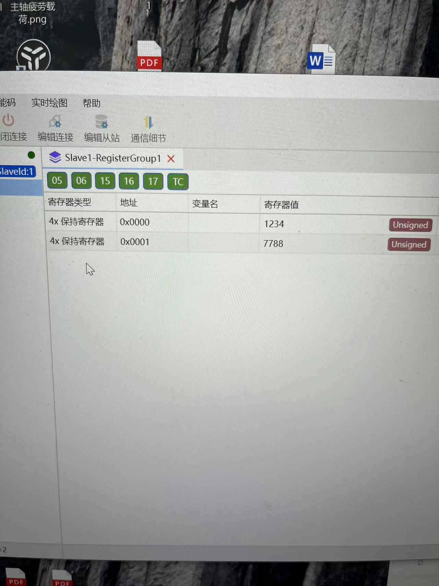

# modbus serial slave

开发环境：
* esp idf 5.1
* esp-modbus 1.0.13


### 1.mb_register_area_descriptor_t

对于slave而言，最重要的定义你的reg area

```c
// 离散输入寄存器
mb_register_area_descriptor_t descrete_reg_area = {
    .type = MB_PARAM_DISCRETE,
    .start_offset = 0x0000,
    .address = (void *)&discrete_reg_params,
    .size = sizeof(discrete_reg_params_t),
};
ESP_ERROR_CHECK(mbc_slave_set_descriptor(descrete_reg_area));

// 线圈
mb_register_area_descriptor_t coil_reg_area = {
    .type = MB_PARAM_COIL,
    .start_offset = 0x0000,
    .address = (void *)&coil_reg_params,
    .size = sizeof(coil_reg_params_t),
};
ESP_ERROR_CHECK(mbc_slave_set_descriptor(coil_reg_area));

// 保持寄存器
mb_register_area_descriptor_t holding_reg_area = {
    .type = MB_PARAM_HOLDING,
    .start_offset = 0x0000,
    .address = (void *)&holding_reg_params,
    .size = sizeof(holding_reg_params_t),
};
ESP_ERROR_CHECK(mbc_slave_set_descriptor(holding_reg_area));
```

可以看到我们这里定义了输入寄存器，保持寄存器、线圈

其中，偏移默认为0x0000，如果要修改的话，记得同步改上位机的偏移地址

### 2.等待主机读取

这个比较简单，主要根据event做对应的动作就行

```c
while (1)
{
    mb_event_group_t event = mbc_slave_check_event(MB_READ_WRITE_MASK);

    if (event & MB_EVENT_DISCRETE_RD)
    {
        // 主机读取离散输入寄存器
        ESP_ERROR_CHECK(mbc_slave_get_param_info(&reg_info, 10));
        ESP_LOGI(TAG, "DISCRETE READ");
    }
    else if (event & MB_EVENT_COILS_RD)
    {
        // 主机读取线圈
        ESP_LOGI(TAG, "COIL READ");
    }
    else if (event & MB_EVENT_COILS_WR)
    {
        // 主机写线圈
        ESP_LOGI(TAG, "COIL WRITE");
        ESP_LOGI(TAG, "Coil: %d %d", coil_reg_params.coils_port_0, coil_reg_params.coils_port_1);
    }
    else if (event & MB_EVENT_HOLDING_REG_RD)
    {
        // 主机读取保持寄存器
        ESP_LOGI(TAG, "HOLDING READ");
    }
    else if (event & MB_EVENT_HOLDING_REG_WR)
    {
        // 主机写保持寄存器
        ESP_LOGI(TAG, "HOLDING WRITE");
        ESP_LOGI(TAG, "Holding: %d %d", holding_reg_params.holding_0, holding_reg_params.holding_1);
    }
}

```

感觉做从机比主机简单一点。


简单跑一个实验：
我们设置保持寄存器的两个值为1234和7788
```c
holding_reg_params_t holding_reg_params = {1234, 7788};
```

