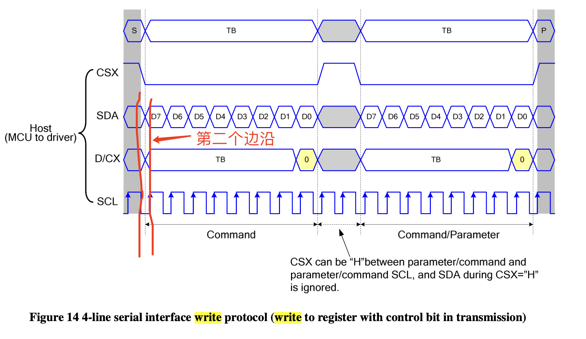

# ST7789V驱动
首先，我们在驱动ST7789V时，一共需要设置这么几个脚
* MOSI：SPI
* CLK：SPI
* CS：SPI
* DC：用于驱动数据还是命令，低电平是写命令，高电平是写数据
* RES：复位信号，低电平有效
* BL:背光信号

此外，我们还需要知道ST7789V的SPI Mode，查看手册的FIG14可以知道，空闲时刻，也就是CS为高电平的时候，SCL为高，而且是在第二个边沿采样采样的。

我们看command为多少，都是在手册的第9章

ST7789的初始化流程可以分为：
1. 软件复位，command=0x01, 在9.1.2 SWRESET (01h): Software Reset
2. 关闭睡眠模式(sleep out)，command=0x11，在9.1.12 SLPOUT (11h): Sleep Out
3. 设置像素格式，我们这里是RGB565,在9.1.32 COLMOD (3Ah): Interface Pixel Format，所以command=3ah，data中color format为65k，也就是RGB565格式，16bit/pixel，所以data=0x55
4. 设置列地址，Column Address Set，command=0x2a，手册中提到了XS和XE的范围在0~239，这个和购买的屏幕分辨率直接相关，我们这块屏幕是240x240,所以设置的 XS=0,XE=F0.
5. 设置行地址同理，command=0x2b
6. 颜色反转,P9.1.16 INVON (21h): Display Inversion On
7. 开显示,command=0x29，记得打开背光哈。