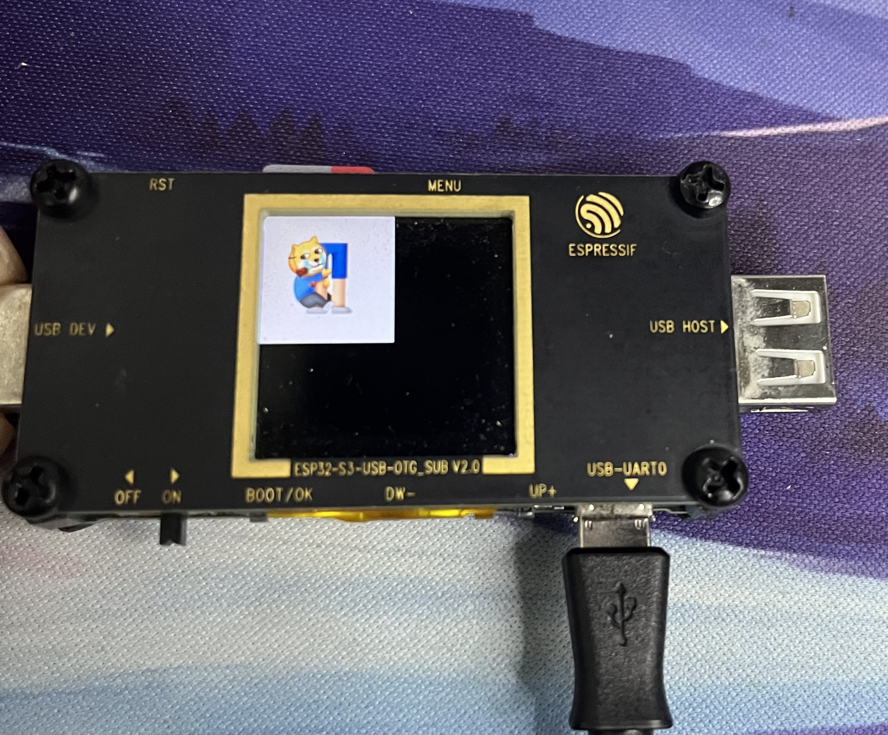

# esp_jpeg组件解析图片

基于esp_jpeg组件解析sd卡中的jpg图片

开发环境：
* ESP32-S3
* 1.4 inch ST7789屏幕
* ESP IDF Master版本

### 1.添加esp_jpeg组件：
组件地址：[esp_jpg](https://components.espressif.com/components/espressif/esp_jpeg)
```shell
idf.py add-dependency "espressif/esp_jpeg^1.0.5~2"
```

执行如下命令更新组件并且编译
```shell
idf.py set-target esp32s3
idf.py build
```

### 2.添加sd卡组件
sd卡的驱动可以参考idf仓库中的example, [sd卡参考驱动](https://github.com/espressif/esp-idf/tree/master/examples/storage/sd_card/sdmmc)

参考官方驱动，添加sd card驱动，我的组件目录如下：
```shell
├── CMakeLists.txt
├── include
│   └── sd_card.h
└── sd_card.c
```

#### 2.1 CMakeLists.txt
```CMAKE
idf_component_register(SRCS "sd_card.c"
                    INCLUDE_DIRS "include"
                    REQUIRES driver fatfs)
```

#### 2.2 sd_card.c

我这里多了一个扫描更目录下文件的功能

```c
#include <stdio.h>
#include "esp_log.h"
#include "sd_card.h"
#include "string.h"
#include "dirent.h"

static const char *TAG = "SD_CARD";

esp_err_t sd_read_file(const char *path)
{
    ESP_LOGI(TAG, "Reading file %s", path);
    FILE *f = fopen(path, "r");
    if (f == NULL)
    {
        ESP_LOGE(TAG, "Failed to open file for reading");
        return ESP_FAIL;
    }
    char line[128];
    fgets(line, sizeof(line), f);
    fclose(f);

    // strip newline
    char *pos = strchr(line, '\n');
    if (pos)
    {
        *pos = '\0';
    }
    ESP_LOGI(TAG, "Read from file: '%s'", line);

    return ESP_OK;
}

esp_err_t sd_card_init(sd_card_config_t config, char *mount_path)
{
    esp_err_t ret = ESP_FAIL;
    esp_vfs_fat_sdmmc_mount_config_t mount_config = {
        .format_if_mount_failed = false,
        .allocation_unit_size = 16 * 1024,
        .max_files = 5,
    };

    ESP_LOGI(TAG, "Initializing sd card");
    sdmmc_card_t *card;
    sdmmc_host_t host = SDMMC_HOST_DEFAULT();
    sdmmc_slot_config_t slot_config = SDMMC_SLOT_CONFIG_DEFAULT();
    slot_config.width = 4;
    slot_config.clk = config.clk;
    slot_config.cmd = config.cmd;
    slot_config.d0 = config.d0;
    slot_config.d1 = config.d1;
    slot_config.d2 = config.d2;
    slot_config.d3 = config.d3;
    slot_config.flags |= SDMMC_SLOT_FLAG_INTERNAL_PULLUP;

    ESP_LOGI(TAG, "Mount filesystem");

    ret = esp_vfs_fat_sdmmc_mount(mount_path, &host, &slot_config, &mount_config, &card);

    if (ret != ESP_OK)
    {
        return ESP_FAIL;
    }
    ESP_LOGI(TAG, "Filesystem mounted");
    sdmmc_card_print_info(stdout, card);

    /*!< scan files */
    DIR *dir = opendir(mount_path);
    if (!dir)
    {
        return ESP_FAIL;
    }
    struct dirent *entry;
    while ((entry = readdir(dir)) != NULL)
    {
        ESP_LOGI(TAG, "%s has file:%s", mount_path, entry->d_name);
    }
    return ret;
}
```

#### 2.3 sd_card.h
```c
#pragma once

#include "driver/sdmmc_host.h"
#include "esp_vfs_fat.h"
#include "sdmmc_cmd.h"

typedef struct
{
    gpio_num_t clk;
    gpio_num_t d0;
    gpio_num_t d1;
    gpio_num_t d2;
    gpio_num_t d3;
    gpio_num_t cmd;
} sd_card_config_t;

esp_err_t sd_card_init(sd_card_config_t config, char *mount_path);
esp_err_t sd_read_file(const char *path);
```

### 3.解析jpg图片
首先将图片保存到sd卡中，我这里的测试图片如下，在sd卡中的命名为bilibili.jpg


一些文件读写函数如open，read等需要添加如下头文件
```c
#include "unistd.h"
#include "sys/stat.h"
#include <fcntl.h>
#include <dirent.h>
```

#### 3.1尝试获取文件大小
这一步主要是获取文件大小
```c
    struct stat st;
    const char *filename = "/sdcard/bilibili.jpg";                                                            /*!< filename */
    if (stat(filename, &st) == 0)
    {
        ESP_LOGI(TAG, "File %s size is %ld\n", filename, st.st_size);
        uint32_t filesize = (uint32_t)st.st_size;                                                             /*!< read image file size */
        char *file_buf = heap_caps_malloc(filesize + 1, MALLOC_CAP_DMA);

        if (file_buf == NULL)
        {
            return;
        }
    }else{
        ESP_LOGI(TAG,"Read %s size fail",filename);
    }
```

#### 3.2打开文件并调用esp_jpeg_decode
```c
uint8_t *file_buffer = NULL; /*!< decode image buffer */
size_t file_buffer_size = 0; /*!< decode image buffer size */

int f = open(filename, O_RDONLY);
if (f > 0)
{
    read(f, file_buf, filesize);
    ESP_LOGI(TAG, "Decode jpg");
    file_buffer_size = 240 * 240 * sizeof(uint16_t);
    file_buffer = heap_caps_calloc(file_buffer_size, 1, MALLOC_CAP_DEFAULT);                          /*!< create out image buffer */
    esp_jpeg_image_cfg_t jpeg_cfg = {
        .indata = (uint8_t *)file_buf,
        .indata_size = filesize,
        .outbuf = file_buffer,
        .outbuf_size = file_buffer_size,
        .out_format = JPEG_IMAGE_FORMAT_RGB565,
        .out_scale = JPEG_IMAGE_SCALE_1_4,
        .flags = {
            .swap_color_bytes = 1,
        },
    };

    esp_jpeg_image_output_t outimage;
    esp_jpeg_decode(&jpeg_cfg, &outimage);
    ESP_LOGI(TAG, "%s size: %d x %d", filename, outimage.width, outimage.height);
}

```

#### 3.3绘制
调用之前初始化的st7789驱动即可
```c
esp_lcd_panel_draw_bitmap(lcd_panel, 0, 0, 0 + outimage.height, 0 + outimage.width, file_buffer); /*!< Write to lcd */
```

#### 3.4完整调用代码
```c
#include <stdlib.h>
#include "esp_log.h"
#include "freertos/FreeRTOS.h"
#include "freertos/task.h"
#include "driver/gpio.h"
#include "esp_check.h"
#include "hid_device_mouse.h"
#include "hid_device_audio_ctrl.h"
#include "sd_card.h"
#include "st7789.h"
#include "esp_lvgl_port.h"
#include "ui.h"
#include "unistd.h"
#include "sys/stat.h"
#include <fcntl.h>
#include <dirent.h>
#include "jpeg_decoder.h"

#define APP_BUTTON (GPIO_NUM_0) // Use BOOT signal by default
static const char *TAG = "ESP_USB_OTG";
lv_disp_t *lvgl_disp = NULL;

lcd_config_t lcd_config = {
    .spi_host_device = SPI3_HOST,
    .dc = GPIO_NUM_4,
    .cs = GPIO_NUM_5,
    .sclk = GPIO_NUM_6,
    .mosi = GPIO_NUM_7,
    .rst = GPIO_NUM_8,
    .lcd_bits_per_pixel = 16,
    .lcd_color_space = LCD_RGB_ELEMENT_ORDER_RGB,
    .lcd_height_res = 240,
    .lcd_vertical_res = 240,
    .lcd_draw_buffer_height = 50,
};

sd_card_config_t sd_card_config = {
    .clk = GPIO_NUM_36,
    .cmd = GPIO_NUM_35,
    .d0 = GPIO_NUM_37,
    .d1 = GPIO_NUM_38,
    .d2 = GPIO_NUM_33,
    .d3 = GPIO_NUM_34,
};

uint8_t *file_buffer = NULL; /*!< decode image buffer */
size_t file_buffer_size = 0; /*!< decode image buffer size */

void app_main(void)
{
    ESP_ERROR_CHECK(sd_card_init(sd_card_config, "/sdcard"));

    lcd_init(lcd_config);
    lcd_fullclean(lcd_panel, lcd_config, rgb565(0, 0, 0));

    struct stat st;
    const char *filename = "/sdcard/bilibili.jpg";                                                            /*!< filename */
    if (stat(filename, &st) == 0)
    {
        ESP_LOGI(TAG, "File %s size is %ld\n", filename, st.st_size);
        uint32_t filesize = (uint32_t)st.st_size;                                                             /*!< read image file size */
        char *file_buf = heap_caps_malloc(filesize + 1, MALLOC_CAP_DMA);

        if (file_buf == NULL)
        {
            return;
        }

        int f = open(filename, O_RDONLY);
        if (f > 0)
        {
            read(f, file_buf, filesize);
            ESP_LOGI(TAG, "Decode jpg");
            file_buffer_size = 240 * 240 * sizeof(uint16_t);
            file_buffer = heap_caps_calloc(file_buffer_size, 1, MALLOC_CAP_DEFAULT);                          /*!< create out image buffer */
            esp_jpeg_image_cfg_t jpeg_cfg = {
                .indata = (uint8_t *)file_buf,
                .indata_size = filesize,
                .outbuf = file_buffer,
                .outbuf_size = file_buffer_size,
                .out_format = JPEG_IMAGE_FORMAT_RGB565,
                .out_scale = JPEG_IMAGE_SCALE_1_4,
                .flags = {
                    .swap_color_bytes = 1,
                },
            };

            esp_jpeg_image_output_t outimage;
            esp_jpeg_decode(&jpeg_cfg, &outimage);
            ESP_LOGI(TAG, "%s size: %d x %d", filename, outimage.width, outimage.height);

            esp_lcd_panel_draw_bitmap(lcd_panel, 0, 0, 0 + outimage.height, 0 + outimage.width, file_buffer); /*!< Write to lcd */
            free(file_buffer);
            close(f);
        }
        else
        {
            ESP_LOGI(TAG, "Open %s fail", filename);
        }

        free(file_buf);
    }
    else
    {
        ESP_LOGI(TAG, "Read Size Fail");
        return;
    }
}
```



### 4.工程地址
[https://github.com/YanKE01/esp_usb_otg/tree/esp_jpeg_decode](https://github.com/YanKE01/esp_usb_otg/tree/esp_jpeg_decode)