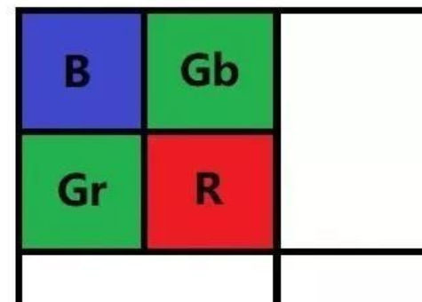
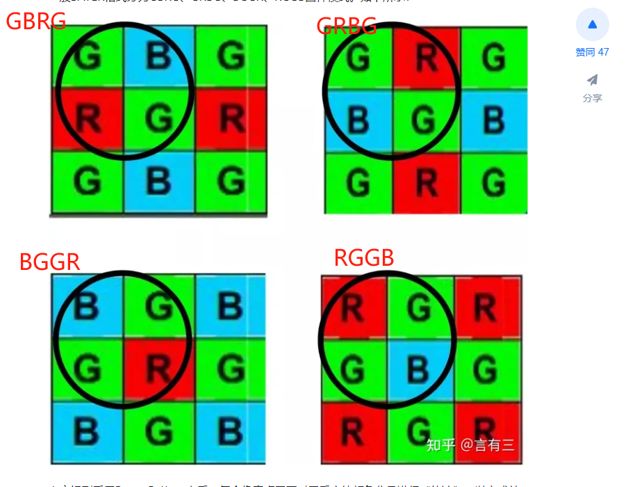
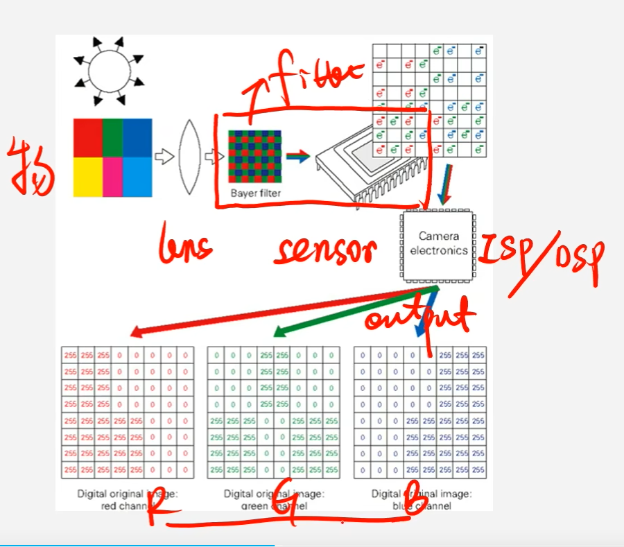
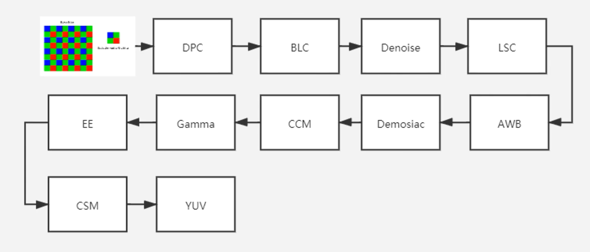
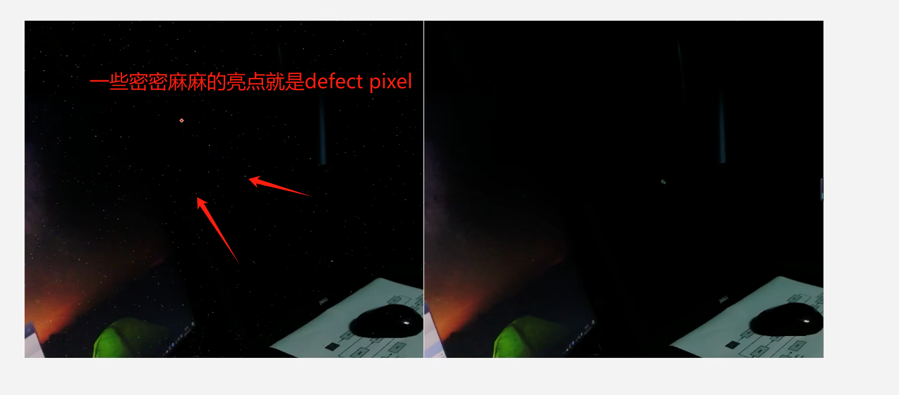
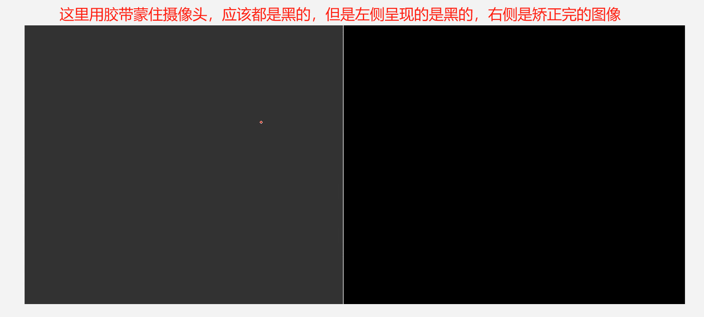
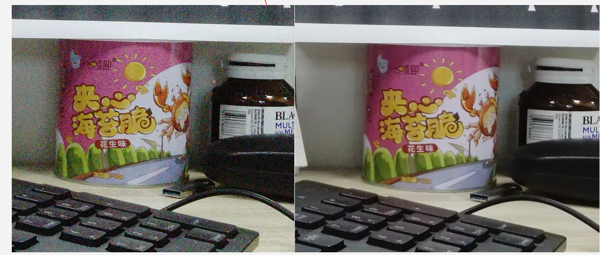
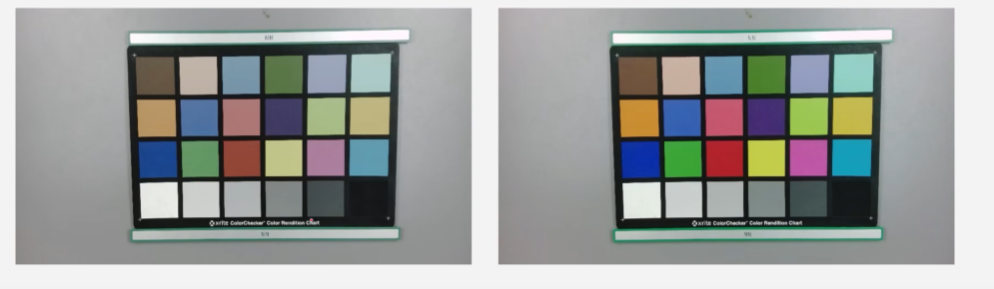
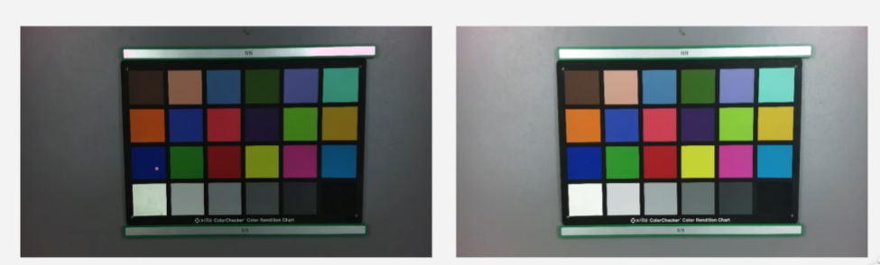

# 01 ISP PIPELINE

### BAYER
bayer格式和RGB格式的区别在于：RGB的一个像素是包含三个通道的（RGB），bayer格式的话每一个像素只有一个通道，要么就是R或者G或者B。

换句话说，就是RGB是一个三通道的，Bayer是一个单通道的。

在byer格式中，四个像素组成的域为一个基本单位，构成了整个图片。每个单元由两个绿色感光像素GR和GB，红色感光R，蓝色感光B组成。

一般BAYER格式分为GBRG、GRBG、BGGR、RGGB四种模式。如下所示：

## ISP PIPELINE

ISP的输入是sensor做完AD转换的数字信号。

基本的模型：

* DPC: defect pixel correction：坏点检测，有可能是一些亮点或暗点，看情况。

* BLC：black level correction：黑电平矫正。sensor的一些暗电流导致图像可能黑的不黑。

* Denoise/NR：降噪

* LSS：lens shading correction: 镜头衰减矫正

* AWV：auto white balance，白平衡

* Demosiac: 去马赛克，从bayer到rgb的转换

* CCM：color correction matrix，色彩矩阵矫正

* Gamma:对颜色亮度有有影响

* EE：Edge enhance，边缘增强