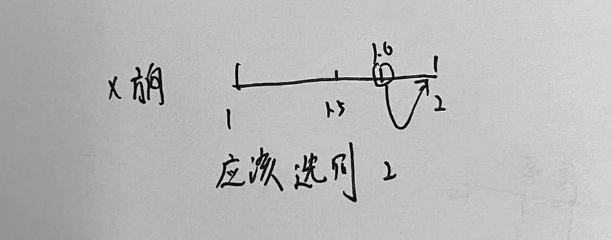

# 03 Interpolation插值


matlab中的坐标：水平方向为y，竖直方向为x

## 领域插值法

首先，对于一个图A，我们按照一定比例M变换为B，则对于B中的点(x,y)，他在A中的位置应该是(x/M,y/M)，注意要四舍五入。

问题就出现在四舍五入上。假设我们放大了3倍，当前的像素点为（5,5），那他在原图的位置应该是5/3=1.66。



知道这个之后，我们其实可以把5先取模3，再除以3，这样我们就能得到0.667，此时，我们的坐标就来到0和1之间，那0.6在0.5的右侧，我们就应该选择右侧的点。

```matlab
detaX = rem(i, magnification) / magnification;
floorX = floor(i / magnification) + 1;
detaY = rem(j, magnification) / magnification;
floorY = floor(j / magnification) + 1;
if detaX < 0.5 && detaY < 0.5
    newImage(i, j) = expandImage(floorX, floorY);
elseif detaX < 0.5 && detaY >= 0.5
    newImage(i, j) = expandImage(floorX, floorY + 1);
elseif detaX >= 0.5 && detaY < 0.5
    newImage(i, j) = expandImage(floorX + 1, floorY);
else
    newImage(i, j) = expandImage(floorX + 1, floorY + 1);
end
```

这个时候，我们在看这个代码，floorx和floory就是对应在原图的点，detax就是我们要判断选择左边的点还是右边的点。detay也是。