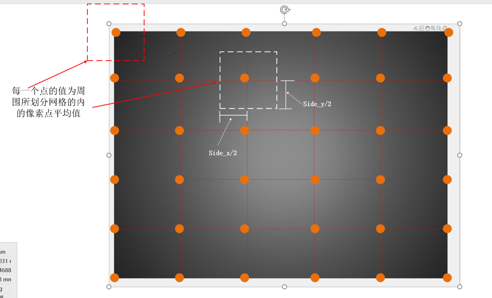

# 04 LSC

在均匀光下采集一张灰色的图片，用作矫正。

## 方法1：最大值矫正

首先，我们把每一个像素值的亮度全部读出来，并且把每一个像素的亮度值都调整到最大亮度值的80%。这样的话，我们每一个像素值都一个gain值，因此，在存储上的负担会大很多。

## 方法2：网格划分法

matlab line用法：
```txt
line([起点横坐标，终点横坐标],[起点纵坐标，终点纵坐标])
```

我们按照网格划分后，我们先求每一个在side_x和side_y这个边界下的亮度平均值，存储在image_point里面



我们目标的值image_point这个数组的中间值，所以gain=中间值 / 每一个image_point的值。

我们已知顶点的情况下，使用双线性插值法计算中间的像素值。
