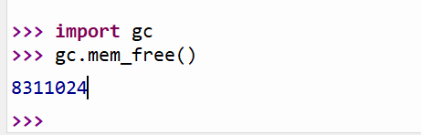
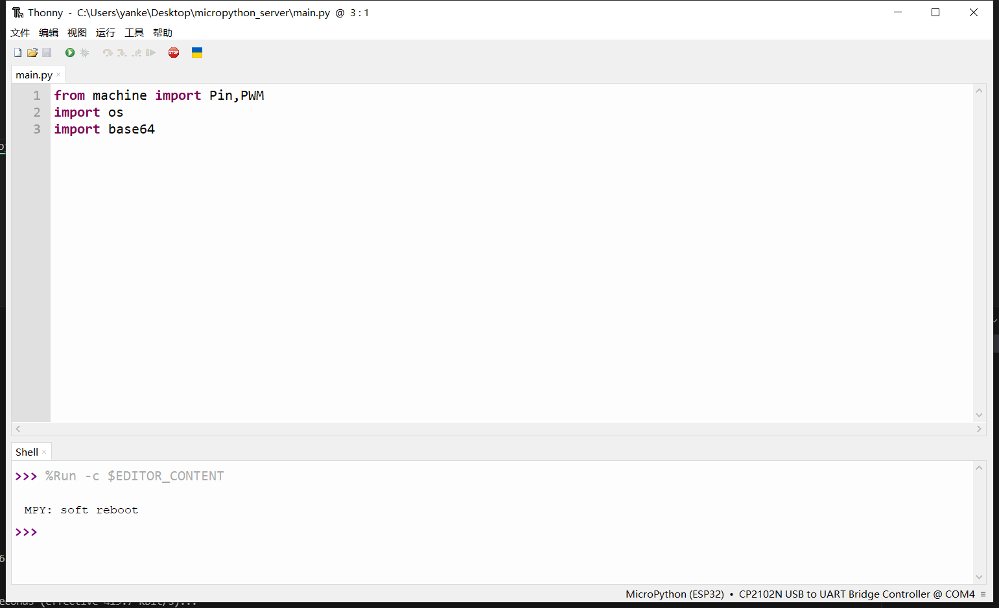

# ESP32 Micropython调研

# ESP32芯片支持情况

在最新的micropython仓库中，支持如下ESP32芯片

* ESP32
* ESP32-S2
* ESP32-S3
* ESP32-C3

外设支持情况：

* GPIO
* UART
* PWM
* ADC
* SPI
* I2C
* RTC
* RMT
* TOUCH
* TIMER
* NETWOEKING
  * WLAN
  * LAN


# 是否支持PSRAM

**支持开启PSRAM**。若需要使用PSRAM，需要修改SDK。步骤如下

1. 导入ESP-IDF环境，本文采用ESP-IDF V5.1

2. clone micropython仓库
```shell
git clone https://github.com/micropython/micropython
```

3. 尝试是否能够编译默认设置
```shell
cd micropython
make -C mpy-cross
cd ports/esp32
make submodules
make
```

4. 编译ESP32-S3 N8R8 (开启PSRAM)
```shell
make BOARD=ESP32_GENERIC_S3 BOARD_VARIANT=SPIRAM_OCT
```

```shell
➜  esp32 git:(master) /home/yanke/.espressif/python_env/idf5.1_py3.10_env/bin/python ../../../../esp/esp-idf-51/esp-idf/components/esptool_py/esptool/esptool.py -p /dev/ttyUSB0 -b 460800 --before default_reset --after no_reset --chip esp32s3  write_flash --flash_mode dio --flash_size 8MB --flash_freq 80m 0x0 build-ESP32_GENERIC_S3-SPIRAM_OCT/bootloader/bootloader.bin 0x8000 build-ESP32_GENERIC_S3-SPIRAM_OCT/partition_table/partition-table.bin 0x10000 build-ESP32_GENERIC_S3-SPIRAM_OCT/micropython.bin 
```

5. 如何在micropython上查看RAM情况

```python
import gc
gc.mem_free()
```



# Micropython和Python的解释器区别与包支持情况

micropython包含python标准库的一小部分，去除了很多不适用于嵌入式系统的模块和功能。因此，PC上的PIP包不一定可以在micropython上跑。micropython官方提供的可用包：

[micropython-lib](https://github.com/micropython/micropython-lib/tree/master)


当前 micropython-lib上适配的包：
* python-stdlib：Python 标准库中模块的兼容版本。[python-stdlib](https://github.com/micropython/micropython-lib/tree/master/python-stdlib)
* python-ecosys：可以被pip索引的包（功能缺失）。[python-ecosys](https://github.com/micropython/micropython-lib/tree/master/python-ecosys)
* micropython：micropython的特定包，包含一些外设等嵌入式设备的库。[micropython](https://github.com/micropython/micropython-lib/tree/master/micropython)


官方提供了一些安装方法，比如

```python
>>> import mip
>>> mip.install("package-name")
```

```shell
$ mpremote connect /dev/ttyUSB0 mip install package-name
```

```shell
$ mpremote connect /dev/ttyUSB0 cp python-stdlib/base64/base64.py :/lib
```

但上述方法有网络限制，且我没安装成功过。


但是我**没安装成功过**。下面提供一种编译SDK是添加包的方案：

修改mpconfigboard.cmake，路径如下：

```shell
ports/esp32/boards/ESP32_GENERIC_S3/mpconfigboard.cmake
```

增加manifest_release

```cmake
set(IDF_TARGET esp32s3)

set(SDKCONFIG_DEFAULTS
    boards/sdkconfig.base
    ${SDKCONFIG_IDF_VERSION_SPECIFIC}
    boards/sdkconfig.usb
    boards/sdkconfig.ble
    boards/sdkconfig.spiram_sx
    boards/ESP32_GENERIC_S3/sdkconfig.board
)

if(NOT MICROPY_FROZEN_MANIFEST)
    set(MICROPY_FROZEN_MANIFEST /home/yanke/project/micropython/ports/esp32/boards/manifest_release.py)
endif() 

```

添加我们自己的manifest_release.py，路径如下：

```shell
ports/esp32/boards/manifest_release.py
```

添加需要的包

```shell
include("manifest.py")

freeze("/home/yanke/project/micropython-lib/python-stdlib/base64", "base64.py")
```

再次编译SDK

```shell
➜  esp32 git:(master) ✗ make BOARD=ESP32_GENERIC_S3 BOARD_VARIANT=SPIRAM_OCT
```

运行测试

