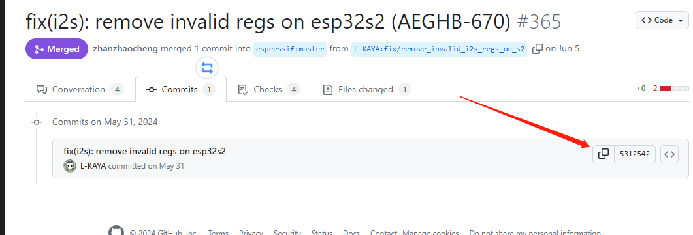
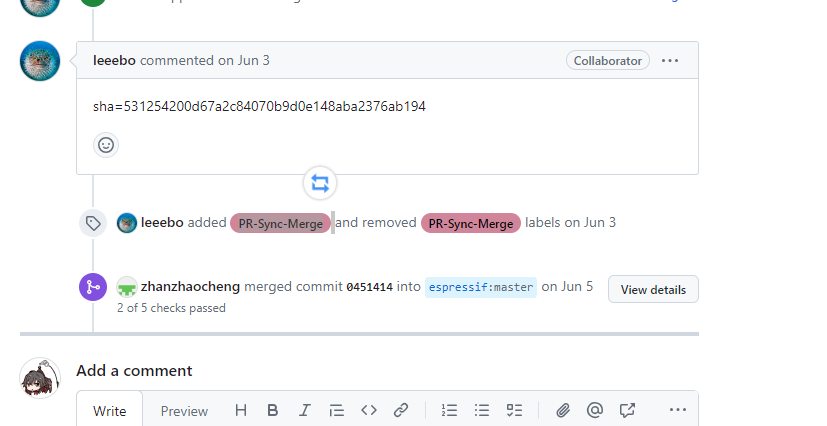

# 合并外部github请求

首先，在comment里面写 sha= xxx。 xxx是合并请求中的commit号。



```shell
sha=531254200d67a2c84070b9d0e148aba2376ab194
```

然后加上标签：PR-Sync-Merge 



可以参考：https://github.com/espressif/esp-iot-solution/pull/365