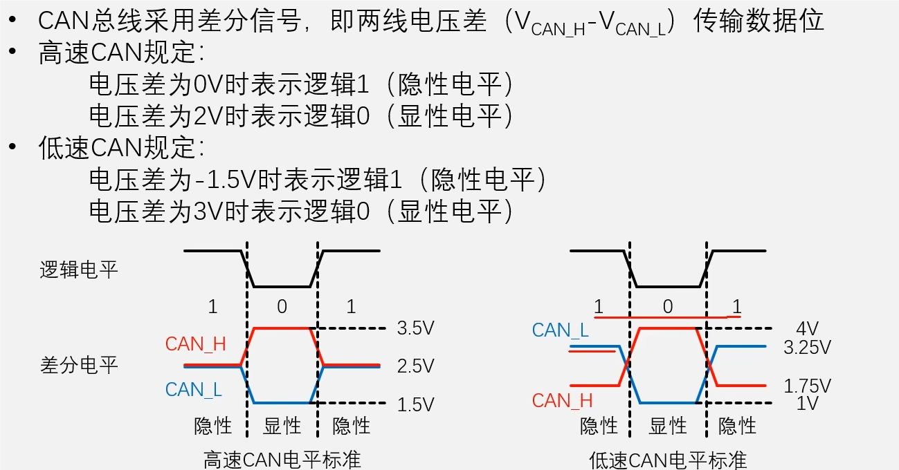
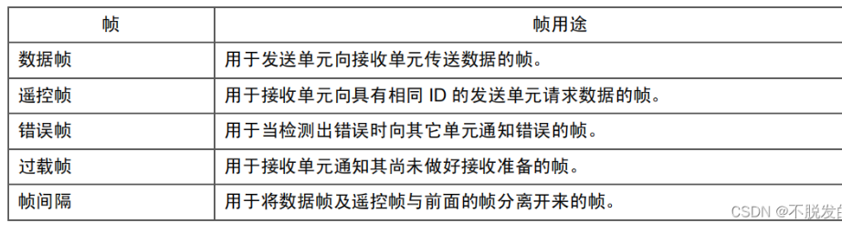
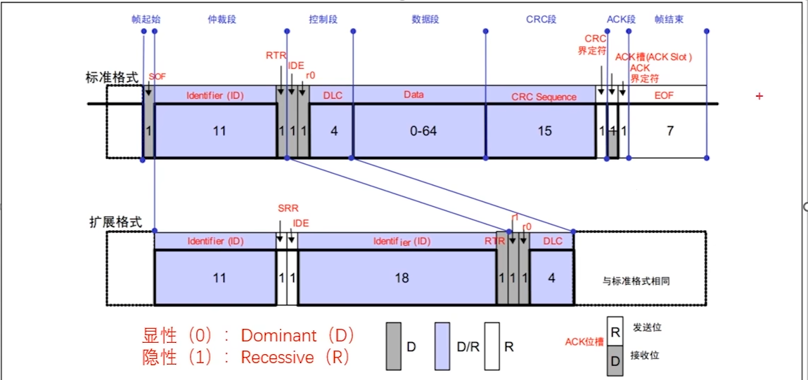

# CAN

## 1.高速CAN与低速CAN的区别

* 低速CAN是开环总线，可以挂载20个节点
* 高速CAN是闭环总线，终端有120欧姆的电阻，用于阻抗匹配，可以挂载30个节点

## 2.CAN特点

* 多主控制，每一个设备都可以主动发送数据
* 添加设备不会影响原来总线的状态
* 连接节点多，具有错误检测、错误通知、错误恢复的功能

## 3.CAN的物理层特性

CAN使用**差分信号**传输，判断CAN_H和CAN_L之间的电位差来判断总线电平。
* 显性电平：逻辑0，具有优先权
* 隐性电平：逻辑1

## 4.CAN协议层

CAN以帧的形式通讯。

### 1.数据帧

注意：这张图里面的数字都是bit，不是字节。

* SOF:帧起始，用于同步总线上节点的单个显性位（0）。

* ID,用于区分报文消息。同时多个设备发送的时候，**ID**小的优先发送，**ID**大的等待下次空闲在发送。
* RTR，远程请求标志位，用于区分数据帧还是遥控帧。数据帧必须是显性0，遥控帧必须是隐性1 。

ID和RTR组成了仲裁段。如果ID都一样，那么数据帧的优先级大于遥控帧。

为什么扩展格式的SRR一直是隐性1，而不是显性0？SRR存在的意义是什么？
SRR：保证标准数据帧的优先级高于扩展数据帧

* IDE，用于区分标准格式还是扩展格式，标准格式是显性0，扩展格式是隐性1，用于保证标准遥控帧的优先级高于扩展遥控帧。
* R0，保留位
* DLC,数据段长度，也就是字节数量。
* DATA,数据，最大64个位，8个字节
* CRC校验，15个位

ACK槽，当发送方发完数据，总线回归到隐性1的状态，接收方收到数据后，接收方会在ACK界定槽把总线拉倒显性0。

我们可以到在ACK槽前面有一个CRC界定符，这个是发送发必须发隐性1，也可以理解成提前释放总线。

ACK槽后面是ACK界定符，这个是隐性1的状态，也就是接收方必须释放掉总线。

#### 分析为何RTR、SRR、IDE中间的仲裁关系

##### 1.RTR
对于数据帧而言，RTR为0；对于遥控帧而言，RTR为1。在标准帧的结构中，仲裁段的结果越小，则优先级越高，所以数据帧的优先级是高于遥控帧的。

##### 2.SRR
SRR在扩展帧中一直是1。对于标准数据帧而言，第12位是0；而对于扩展帧而言，第12位一直是1。所以标准格式帧一定是优先于扩展格式帧的。

##### 3.IDE

保证标准遥控帧的优先级高于扩展遥控帧。