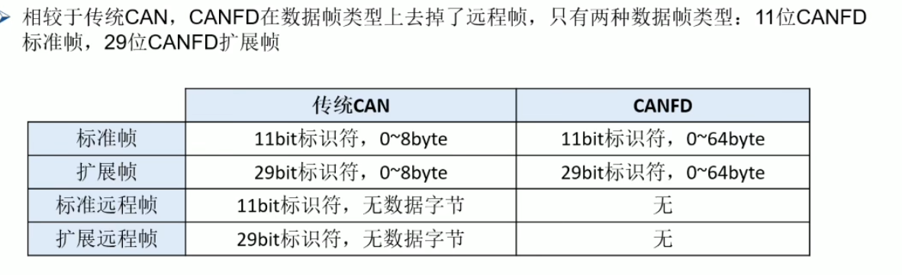
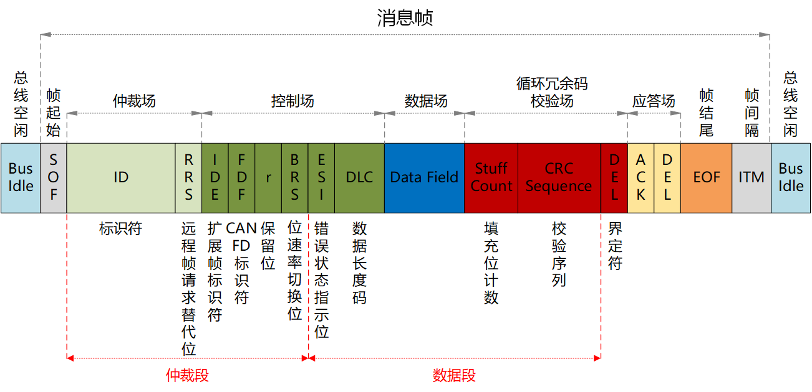
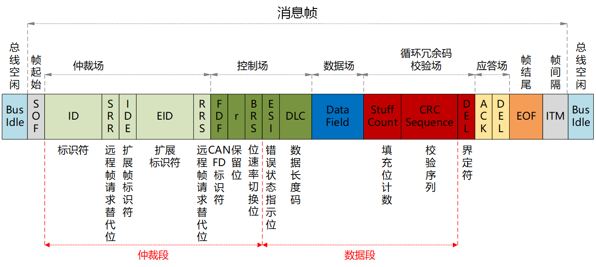
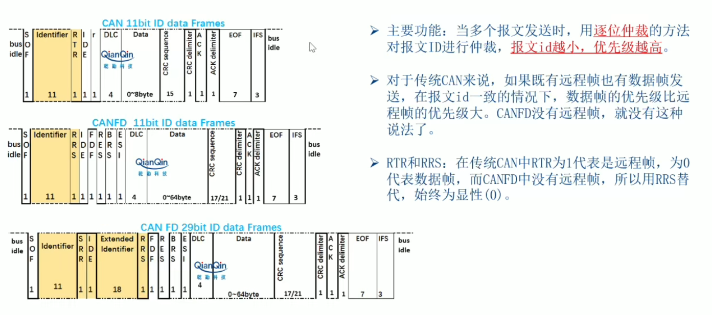
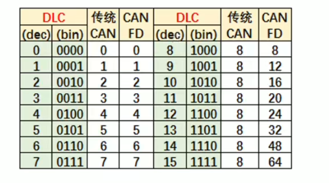
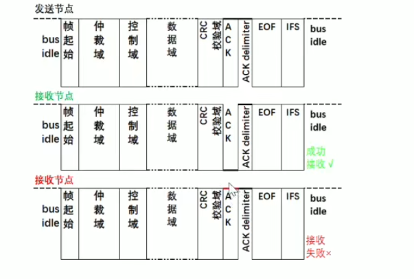

# CAN FD

## CAN-FD 与 CAN的区别
* 速率与传输字节的增加。 传统CAN一般是最高 1Mbps与 8个字节。CAN-FD 最高 5Mbps 与 64个字节。   
* 采用改进的 CRC 与 受保护的填充位计算器，降低了未被检测到的错误风险。

## 帧类型

**CAN-FD是没有遥控帧的**。只有11bit标识符的标准帧与29bit标识符的遥控帧。

### CANFD标准帧

### CANFD扩展帧

## CAN与CANFD帧类型对比

### 1.仲裁域

传统的CAN的仲裁域：
* 标准帧：11个bit的ID加上一个RTR，其中RTR是用于判断数据帧还是遥控帧的
* 扩展帧：29个bit的ID、一个RTR、SRR和IDE

对于CAN-FD而言，是没有遥控帧的，所以用RSS替代，一直是显性0。

### 2.控制域

传统CAN的控制域：
* 标准帧：IDE（区分标准帧还是扩展帧），r0为保留位。

CAN-FD增加了如下内容：
1. FDF，始终为隐性1，代表这条消息是CAN-FD的消息。
2. RES: 保留位，为新协议做准备
3. BRS：速率切换位
   1. 如果是显性0的话，表明数据段的位速率与仲裁段保持一致
   2. 如果是隐性1的话，表明数据段的位速率要高于仲裁段。
4. ESI：错误状态位
   1. 隐性1的话，说明就发送节点处于被动错误状态。
   2. 显性0的话，发送节点处于主动错误状态。
5. DLC：数据长度：

### 3.CRC域

对于CAN还是CAN-FD而言，CRC域一直都是CRC序列和CRC界定符组成。

区别在于CAN-FD的CRC算法和CAN有所区别，不是重要了解的范围。

### 4.ACK域

CAN与CAN-FD都是由ACK槽和ACK界定符组成的。

### 5.EOF帧结尾

如果算上ACK界定符，则ACK界定符、EOF和IPS为连续的11个隐性1才代表总线空闲。