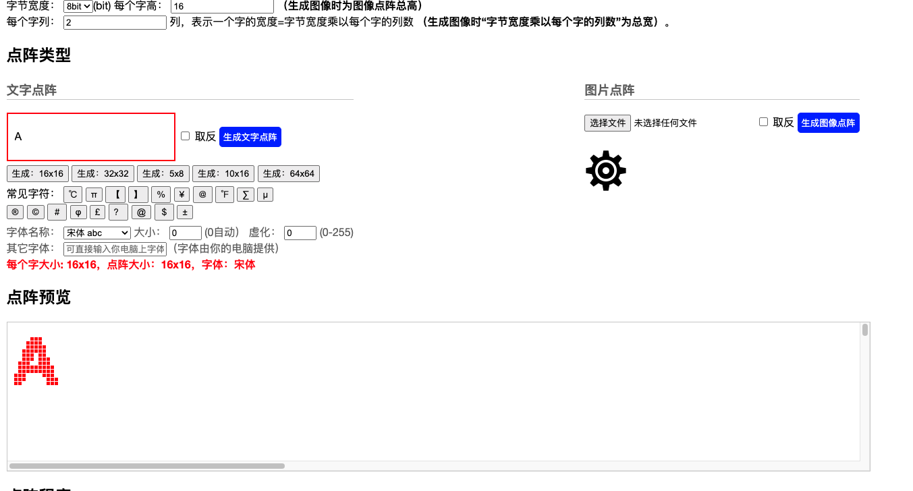
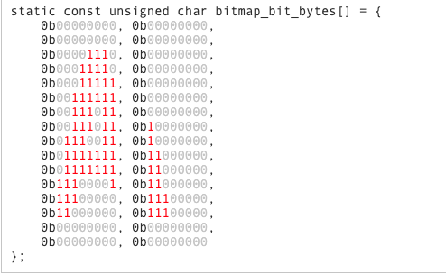
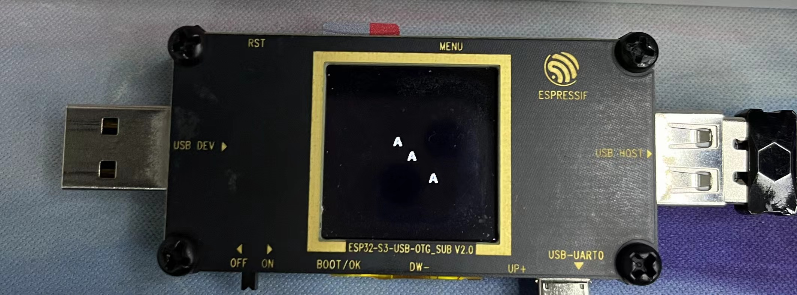

# esp_lcd绘制字符

本文所使用的软硬件:
* idf master
* st7789 1.4 inch
* esp_lcd 驱动


### 1.字符取模
在绘制之前，需要对字符进行取模，本文以字符A为例：

打开绘制工具：[单片机-LCD-LED-OLED中文点阵生成软件
](https://www.zhetao.com/fontarray.html)

以字高为16，字列为2为例，设置软件：


生成字库：
```c
列0：{0x00, 0x00, 0x0e, 0x1e, 0x1f, 0x3f, 0x3b, 0x3b, 0x73, 0x7f, 0x7f, 0xe1, 0xe0, 0xc0, 0x00, 0x00}
列1：{0x00, 0x00, 0x00, 0x00, 0x00, 0x00, 0x00, 0x80, 0x80, 0xc0, 0xc0, 0xc0, 0xe0, 0xe0, 0x00, 0x00}

static const unsigned char bitmap_bytes[] = {
    0x00, 0x00, 
    0x00, 0x00, 
    0x0e, 0x00, 
    0x1e, 0x00, 
    0x1f, 0x00, 
    0x3f, 0x00, 
    0x3b, 0x00, 
    0x3b, 0x80, 
    0x73, 0x80, 
    0x7f, 0xc0, 
    0x7f, 0xc0, 
    0xe1, 0xc0, 
    0xe0, 0xe0, 
    0xc0, 0xe0, 
    0x00, 0x00, 
    0x00, 0x00
};

static const unsigned char bitmap_bit_bytes[] = {
    0b00000000, 0b00000000, 
    0b00000000, 0b00000000, 
    0b00001110, 0b00000000, 
    0b00011110, 0b00000000, 
    0b00011111, 0b00000000, 
    0b00111111, 0b00000000, 
    0b00111011, 0b00000000, 
    0b00111011, 0b10000000, 
    0b01110011, 0b10000000, 
    0b01111111, 0b11000000, 
    0b01111111, 0b11000000, 
    0b11100001, 0b11000000, 
    0b11100000, 0b11100000, 
    0b11000000, 0b11100000, 
    0b00000000, 0b00000000, 
    0b00000000, 0b00000000
};
```

这样我们就知道哪里需要绘制像素，哪里不要绘制像素。

下面这张图可能更为清晰



### 2.单个点绘制方式：

首先，先写单点绘制的函数
```c
uint16_t POINT_COLOR = swap_hex(rgb565(255, 255, 255)); // 画笔颜色
uint16_t BACK_COLOR = swap_hex(rgb565(0, 0, 0));        // 背景色

void lcd_draw_point(int x, int y)
{
    esp_lcd_panel_draw_bitmap(lcd_panel, x, y, x + 1, y + 1, &POINT_COLOR);
}

```

接下来，按照字模位置，进行上色
```c
void app_main(void)
{
    // Initialize button that will trigger HID reports
    const gpio_config_t boot_button_config = {
        .pin_bit_mask = BIT64(APP_BUTTON),
        .mode = GPIO_MODE_INPUT,
        .intr_type = GPIO_INTR_DISABLE,
        .pull_up_en = true,
        .pull_down_en = false,
    };
    ESP_ERROR_CHECK(gpio_config(&boot_button_config));

    ESP_ERROR_CHECK(lcd_init(lcd_config));
    lcd_fullclean(lcd_panel, lcd_config, rgb565(0, 0, 0));
    for (int i = 0; i < 16; i++)
    {
        //i代表行
        for (int j = 0; j < 2; j++)
        {
            // 第j列
            for (int k = 0; k < 8; k++)
            {
                //先获取高位
                if (temp & 0x80)
                {   
                    //如果为1，表明需要绘制
                    lcd_draw_point(100 + j * 8 + k, 100 + i);
                }
                temp <<= 1;
            }
        }
    }
}
```

可以看到，这段代码的核心就是将每一个uint8_t的数据按照其二进制的0与1判断时候绘制点

### 3.buffer绘制的方式
buffer绘制的方式和我们之前的博客中提到的刷屏差不多，都是按照一列的方式来刷。

首先，创建一个buffer，在需要绘制的地方保存颜色
```c
void app_main(void)
{
    ESP_ERROR_CHECK(lcd_init(lcd_config));
    lcd_fullclean(lcd_panel, lcd_config, rgb565(0, 0, 0));
    uint16_t buffer[16][2 * 8]; //创建buffer
    memset(buffer, BACK_COLOR, sizeof(buffer));
    for (int i = 0; i < 16; i++)
    {
        for (int j = 0; j < 2; j++)
        {
            // 第j列
            uint8_t temp = bitmap_bytes[i * 2 + j];
            for (int k = 0; k < 8; k++)
            {
                if (temp & 0x80)
                {
                    buffer[j * 8 + k][i] = POINT_COLOR; //保存颜色
                    lcd_draw_point(100 + j * 8 + k, 100 + i);
                }
                else
                {
                    buffer[j * 8 + k][i] = BACK_COLOR; 
                }
                temp <<= 1;
            }
        }
    }

    for (int i = 0; i < 16; i++)
    {
        //按照一行的方式刷buffer
        esp_lcd_panel_draw_bitmap(lcd_panel, 150 + i, 150, 150 + i + 1, 150 + 16, &buffer[i]);
    }
}

```


### 4.测试结果

