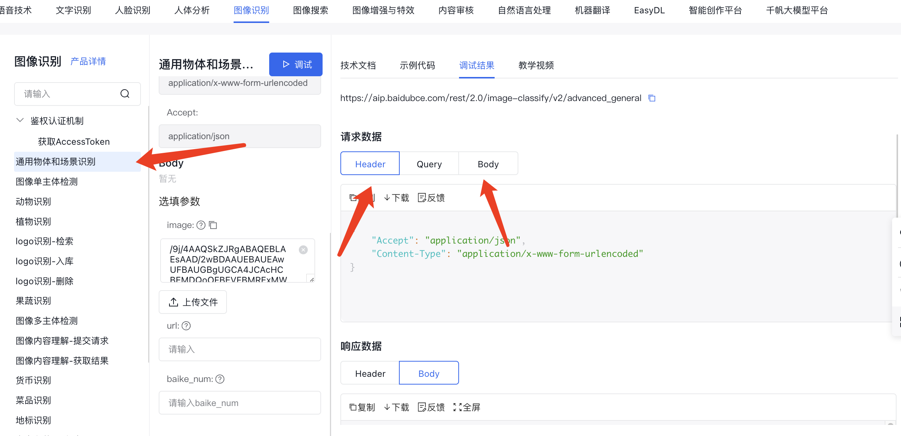
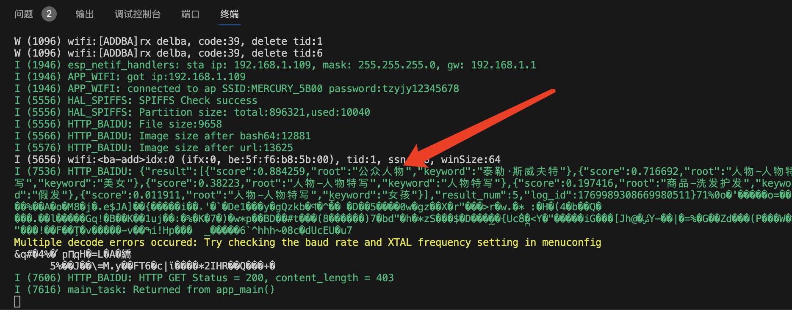

# 百度图像识别

测试环境：
* esp32-s3
* esp idf 5.1

首先，先配置sdk，可以写入到sdkconfig.defaults
```shell
CONFIG_IDF_TARGET="esp32s3"
CONFIG_IDF_TARGET_ESP32S3=y

CONFIG_PARTITION_TABLE_CUSTOM=y
CONFIG_PARTITION_TABLE_CUSTOM_FILENAME="partitions.csv"
CONFIG_PARTITION_TABLE_FILENAME="partitions.csv"

CONFIG_ESP_TLS_INSECURE=y
CONFIG_ESP_TLS_SKIP_SERVER_CERT_VERIFY=y
```

这里关闭了认证，并且建了分区表来存放我们待识别的图片。

### 1.百度控制台调试
#### 1.获取token


#### 2.在线调试，看下传输过程



主要关注如下内容：

header:
```xml
{
    "Accept": "application/json",
    "Content-Type": "application/x-www-form-urlencoded"
}
```

body:
```xml
image=%2F9j%2F4AAQSkZJRgABAQEBLAEsAAD%2F2wBDAAUEBAUEAwUFBAUGBgUGCA4JCAcHCBEMDQoO...
```

其中imge图像要先base64编码，在url编码


### 2.esp32调试

我们这里主要参考esp http client的代码

#### 1.base64编码
esp-idf中已经有base64编码的代码，我们include一下即可
```c
#include "mbedtls/base64.h"

int mbedtls_base64_encode(unsigned char *dst, size_t dlen, size_t *olen,
                          const unsigned char *src, size_t slen)
```

#### 2.url编码
这个要自己实现一下
```c
int url_encode(const unsigned char *src, size_t slen, size_t *olen, unsigned char *dst, size_t dlen)
{
    size_t i, j = 0;

    // clac encoed size
    for (i = 0; i < slen; i++)
    {
        if ((src[i] >= 'A' && src[i] <= 'Z') ||
            (src[i] >= 'a' && src[i] <= 'z') ||
            (src[i] >= '0' && src[i] <= '9') ||
            src[i] == '-' || src[i] == '_' || src[i] == '.' || src[i] == '~')
        {
            j++;
        }
        else if (src[i] == ' ')
        {
            j++;
        }
        else
        {
            j += 3; // length of %xx is three
        }
    }

    // check buffer size
    if (dlen < j + 1)
    {
        *olen = j + 1; // reytun need size
        return -1;
    }

    // url encode
    for (i = 0, j = 0; i < slen; i++)
    {
        if ((src[i] >= 'A' && src[i] <= 'Z') ||
            (src[i] >= 'a' && src[i] <= 'z') ||
            (src[i] >= '0' && src[i] <= '9') ||
            src[i] == '-' || src[i] == '_' || src[i] == '.' || src[i] == '~')
        {
            dst[j++] = src[i];
        }
        else if (src[i] == ' ')
        {
            dst[j++] = '+';
        }
        else
        {
            dst[j++] = '%';
            dst[j++] = "0123456789ABCDEF"[src[i] >> 4];
            dst[j++] = "0123456789ABCDEF"[src[i] & 0x0F];
        }
    }

    // add end
    dst[j] = '\0';

    // return size
    *olen = j;

    return 0;
}
```

#### 3.添加http client的调用
```c
 char post_url[1024] = {0};
    esp_http_client_config_t config = {
        .method = HTTP_METHOD_POST,
        .event_handler = app_http_baidu_event_handler,
        .buffer_size = 4 * 1024,
    };
    sprintf(post_url, "%s?access_token=%s", base_url, access_token);
    config.url = post_url;
    esp_http_client_handle_t client = esp_http_client_init(&config);
    esp_http_client_set_method(client, HTTP_METHOD_POST);
    esp_http_client_set_post_field(client, img_params, strlen(img_params)); //填入url编码后的图像数据
    esp_http_client_set_header(client, "Content-Type", "application/x-www-form-urlencoded");
    esp_err_t err = esp_http_client_perform(client);
    if (err == ESP_OK)
    {
        ESP_LOGI(TAG, "HTTP GET Status = %d, content_length = %d", esp_http_client_get_status_code(client), (int)esp_http_client_get_content_length(client));
    }
    else
    {
        ESP_LOGI(TAG, "HTTP GET request failed: %s", esp_err_to_name(err));
    }
    esp_http_client_cleanup(client);
```


#### 4.整体代码
```c
#include "app_baidu.h"
#include "mbedtls/base64.h"
#include "esp_http_client.h"
#include "esp_log.h"
#include "esp_heap_caps.h"
#include "string.h"

static const char *TAG = "HTTP_BAIDU";

char access_token[256] = "xxxx"; //更换自己的token
char base_url[256] = "https://aip.baidubce.com/rest/2.0/image-classify/v2/advanced_general";

esp_err_t app_http_baidu_event_handler(esp_http_client_event_t *evt)
{
    if (evt->event_id == HTTP_EVENT_ON_DATA)
    {
        ESP_LOGI(TAG, "%s",(char *)evt->data);
    }

    return ESP_OK;
}

int url_encode(const unsigned char *src, size_t slen, size_t *olen, unsigned char *dst, size_t dlen)
{
    size_t i, j = 0;

    // clac encoed size
    for (i = 0; i < slen; i++)
    {
        if ((src[i] >= 'A' && src[i] <= 'Z') ||
            (src[i] >= 'a' && src[i] <= 'z') ||
            (src[i] >= '0' && src[i] <= '9') ||
            src[i] == '-' || src[i] == '_' || src[i] == '.' || src[i] == '~')
        {
            j++;
        }
        else if (src[i] == ' ')
        {
            j++;
        }
        else
        {
            j += 3; // length of %xx is three
        }
    }

    // check buffer size
    if (dlen < j + 1)
    {
        *olen = j + 1; // reytun need size
        return -1;
    }

    // url encode
    for (i = 0, j = 0; i < slen; i++)
    {
        if ((src[i] >= 'A' && src[i] <= 'Z') ||
            (src[i] >= 'a' && src[i] <= 'z') ||
            (src[i] >= '0' && src[i] <= '9') ||
            src[i] == '-' || src[i] == '_' || src[i] == '.' || src[i] == '~')
        {
            dst[j++] = src[i];
        }
        else if (src[i] == ' ')
        {
            dst[j++] = '+';
        }
        else
        {
            dst[j++] = '%';
            dst[j++] = "0123456789ABCDEF"[src[i] >> 4];
            dst[j++] = "0123456789ABCDEF"[src[i] & 0x0F];
        }
    }

    // add end
    dst[j] = '\0';

    // return size
    *olen = j;

    return 0;
}

// base64 encode: http://www.yzcopen.com/img/imgbase64
// url encode: https://www.jyshare.com/front-end/695/?
void app_baidu_classification(char *img_buf, int file_size)
{
    char *img_base64 = NULL;
    char *img_params = NULL;
    char *img_base64_url = NULL;
    char *img_params_format = "image=%s";
    size_t img_base64_size = 0;
    size_t img_base64_url_size = 0;

    // base64 encode
    mbedtls_base64_encode(NULL, 0, &img_base64_size, (const unsigned char *)img_buf, file_size);
    ESP_LOGI(TAG, "Image size after bash64:%zu", img_base64_size);

    img_base64 = heap_caps_calloc(1, img_base64_size + 1, MALLOC_CAP_DMA);
    if (img_base64 == NULL)
    {
        ESP_LOGI(TAG, "Memory image bash64 allocation failed");
        return;
    }
    mbedtls_base64_encode((unsigned char *)img_base64, img_base64_size + 1, &img_base64_size, (const unsigned char *)img_buf, file_size);

    // url encode
    url_encode((const unsigned char *)img_base64, img_base64_size, &img_base64_url_size, NULL, 0);
    ESP_LOGI(TAG, "Image size after url:%zu", img_base64_url_size);

    img_base64_url = heap_caps_calloc(1, img_base64_url_size + 1, MALLOC_CAP_DMA);
    if (img_base64_url == NULL)
    {
        ESP_LOGI(TAG, "Memory image bash64 url allocation failed");
        free(img_base64);
        return;
    }
    url_encode((const unsigned char *)img_base64, img_base64_size, &img_base64_url_size, (unsigned char *)img_base64_url, img_base64_url_size + 1);

    // set data params
    img_params = heap_caps_calloc(1, img_base64_url_size + 1 + strlen(img_params_format), MALLOC_CAP_DMA);
    if (img_params == NULL)
    {
        ESP_LOGI(TAG, "Memory image params allocation failed");
        free(img_base64);
        free(img_base64_url);
        return;
    }

    sprintf(img_params, img_params_format, img_base64_url);

    // http client setting

    char post_url[1024] = {0};
    esp_http_client_config_t config = {
        .method = HTTP_METHOD_POST,
        .event_handler = app_http_baidu_event_handler,
        .buffer_size = 4 * 1024,
    };
    sprintf(post_url, "%s?access_token=%s", base_url, access_token);
    config.url = post_url;
    esp_http_client_handle_t client = esp_http_client_init(&config);
    esp_http_client_set_method(client, HTTP_METHOD_POST);
    esp_http_client_set_post_field(client, img_params, strlen(img_params));
    esp_http_client_set_header(client, "Content-Type", "application/x-www-form-urlencoded");
    esp_err_t err = esp_http_client_perform(client);
    if (err == ESP_OK)
    {
        ESP_LOGI(TAG, "HTTP GET Status = %d, content_length = %d", esp_http_client_get_status_code(client), (int)esp_http_client_get_content_length(client));
    }
    else
    {
        ESP_LOGI(TAG, "HTTP GET request failed: %s", esp_err_to_name(err));
    }
    esp_http_client_cleanup(client);

    free(img_base64);
    free(img_base64_url);
    free(img_params);
}

```


### 3.实验效果
拿了一张泰勒的图来识别




