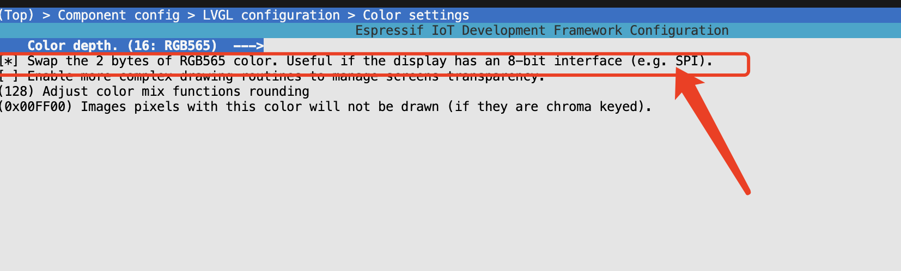
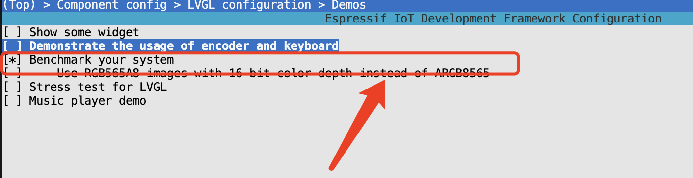
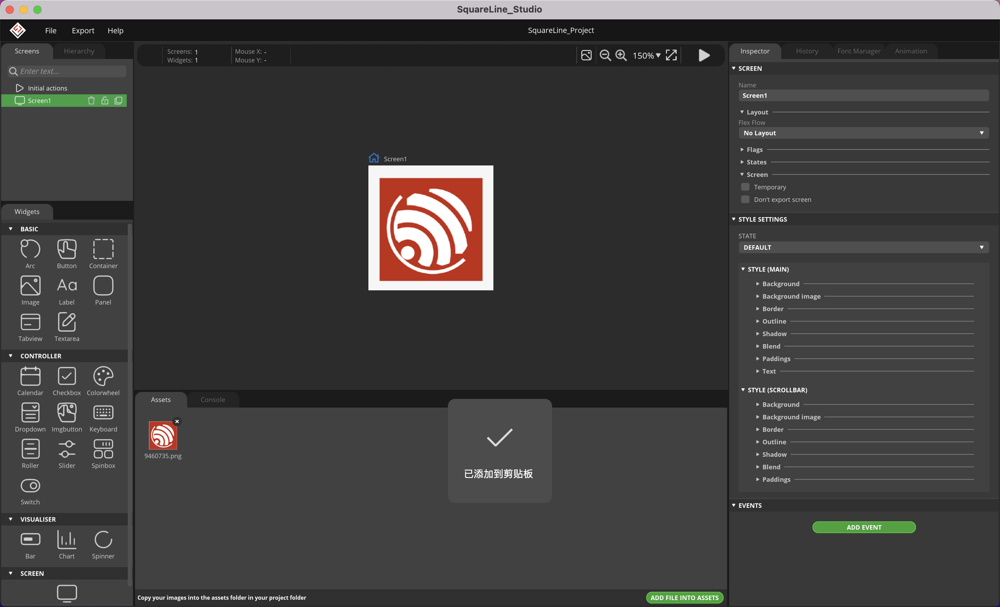
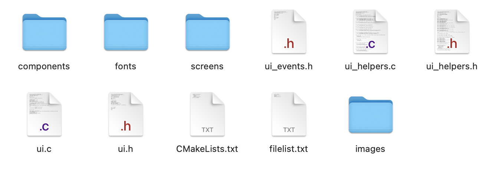
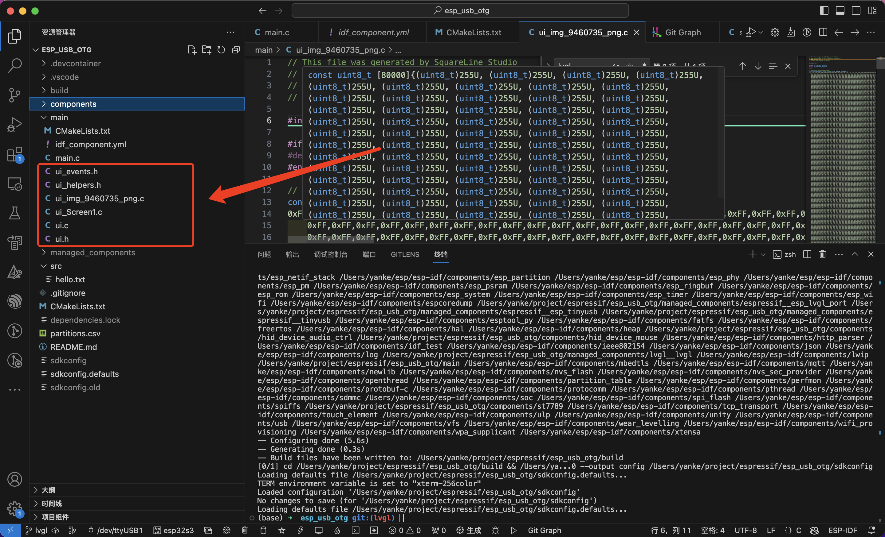

# ST7789 and lvgl

基于1.3inch st7789屏幕实现lvgl驱动

### 1.添加组件
https://components.espressif.com/

```shell
idf.py add-dependency "lvgl/lvgl^8.3.10"
idf.py add-dependency "espressif/esp_lvgl_port^1.4.0"
```

添加完后的idf_component.yml文件

```yml
## IDF Component Manager Manifest File
dependencies:
  lvgl/lvgl: "^8.3.10"
  espressif/esp_lvgl_port: "^1.4.0"
  espressif/esp_tinyusb: "^1.4.2~2"
  ## Required IDF version
  idf:
    version: ">=4.1.0"
  # # Put list of dependencies here
  # # For components maintained by Espressif:
  # component: "~1.0.0"
  # # For 3rd party components:
  # username/component: ">=1.0.0,<2.0.0"
  # username2/component2:
  #   version: "~1.0.0"
  #   # For transient dependencies `public` flag can be set.
  #   # `public` flag doesn't have an effect dependencies of the `main` component.
  #   # All dependencies of `main` are public by default.
  #   public: true

```


### 2.添加st7789屏幕驱动
在esp-idf的仓库中，已经提供了esp-lcd组件与st7789的驱动，我们基于创建st7789组件
```shell
.
├── CMakeLists.txt
├── include
│   └── st7789.h
└── st7789.c
```

#### 2.1 st7789.c
```c
#include <stdio.h>
#include "st7789.h"
#include "esp_log.h"
#include "esp_check.h"

static const char *TAG = "LCD";

esp_lcd_panel_io_handle_t lcd_io = NULL;
esp_lcd_panel_handle_t lcd_panel = NULL;

esp_err_t lcd_init(lcd_config_t lcd_config)
{
    esp_err_t ret = ESP_FAIL;
    /*!< backlight */
    gpio_config_t bk_gpio_config = {
        .mode = GPIO_MODE_OUTPUT,
        .pin_bit_mask = 1ULL << lcd_config.backlight,
    };
    ESP_ERROR_CHECK(gpio_config(&bk_gpio_config));

    ESP_LOGI(TAG, "Initialize SPI bus");
    const spi_bus_config_t buscfg = {
        .sclk_io_num = lcd_config.sclk,
        .mosi_io_num = lcd_config.mosi,
        .miso_io_num = GPIO_NUM_NC,
        .quadwp_io_num = GPIO_NUM_NC,
        .quadhd_io_num = GPIO_NUM_NC,
        .max_transfer_sz = lcd_config.lcd_height_res * lcd_config.lcd_draw_buffer_height * sizeof(uint16_t),
    };

    ESP_RETURN_ON_ERROR(spi_bus_initialize(lcd_config.spi_host_device, &buscfg, SPI_DMA_CH_AUTO), TAG, "SPI init failed");

    ESP_LOGI(TAG, "Install panel IO");
    const esp_lcd_panel_io_spi_config_t io_config = {
        .dc_gpio_num = lcd_config.dc,
        .cs_gpio_num = lcd_config.cs,
        .pclk_hz = 40 * 1000 * 1000,
        .lcd_cmd_bits = 8,
        .lcd_param_bits = 8,
        .spi_mode = 0,
        .trans_queue_depth = 10,
    };

    ESP_GOTO_ON_ERROR(esp_lcd_new_panel_io_spi((esp_lcd_spi_bus_handle_t)lcd_config.spi_host_device, &io_config, &lcd_io), err, TAG, "New panel IO failed");

    ESP_LOGI(TAG, "Install LCD driver");
    const esp_lcd_panel_dev_config_t panel_config = {
        .reset_gpio_num = lcd_config.rst,
        .color_space = LCD_RGB_ELEMENT_ORDER_RGB,
        .bits_per_pixel = 16,
    };
    ESP_GOTO_ON_ERROR(esp_lcd_new_panel_st7789(lcd_io, &panel_config, &lcd_panel), err, TAG, "New panel failed");

    esp_lcd_panel_reset(lcd_panel);
    esp_lcd_panel_init(lcd_panel);
    esp_lcd_panel_mirror(lcd_panel, false, false);
    esp_lcd_panel_disp_on_off(lcd_panel, true);
    esp_lcd_panel_invert_color(lcd_panel,true);

    ESP_ERROR_CHECK(gpio_set_level(lcd_config.backlight, 1)); //背光按照自己的电路来

    return ret;

err:
    if (lcd_panel)
    {
        esp_lcd_panel_del(lcd_panel);
    }
    if (lcd_io)
    {
        esp_lcd_panel_io_del(lcd_io);
    }
    spi_bus_free(lcd_config.spi_host_device);
    return ret;
}
```

注意事项：
* 需要把invert_color置为true: esp_lcd_panel_invert_color(lcd_panel,true);
* 设置颜色为RGB格式：color_space = LCD_RGB_ELEMENT_ORDER_RGB

#### 2.2 st7789.h
```c
#pragma once
#include "driver/gpio.h"
#include "driver/spi_master.h"
#include "esp_lcd_panel_io.h"
#include "esp_lcd_panel_vendor.h"
#include "esp_lcd_panel_ops.h"

typedef struct
{
    uint16_t lcd_height_res;
    uint16_t lcd_vertical_res;
    uint16_t lcd_draw_buffer_height;
    uint16_t lcd_bits_per_pixel;
    esp_lcd_color_space_t lcd_color_space;
    spi_host_device_t spi_host_device;
    gpio_num_t backlight;
    gpio_num_t sclk;
    gpio_num_t mosi;
    gpio_num_t dc;
    gpio_num_t cs;
    gpio_num_t rst;
} lcd_config_t;

extern esp_lcd_panel_io_handle_t lcd_io;
extern esp_lcd_panel_handle_t lcd_panel;

esp_err_t lcd_init(lcd_config_t lcd_config);
```

#### 2.3 CMakeLists.txt
```cmake
idf_component_register(SRCS "st7789.c"
                    INCLUDE_DIRS "include"
                    REQUIRES driver esp_lcd)
```

### 3.添加lvgl相关
```c
lv_disp_t *lvgl_disp = NULL;

esp_err_t lvgl_init()
{
    const lvgl_port_cfg_t lvgl_cfg = {
        .task_priority = 4,       /* LVGL task priority */
        .task_stack = 4096,       /* LVGL task stack size */
        .task_affinity = -1,      /* LVGL task pinned to core (-1 is no affinity) */
        .task_max_sleep_ms = 500, /* Maximum sleep in LVGL task */
        .timer_period_ms = 5      /* LVGL timer tick period in ms */
    };
    ESP_RETURN_ON_ERROR(lvgl_port_init(&lvgl_cfg), TAG, "LVGL port initialization failed");

    /* Add LCD screen */
    ESP_LOGI(TAG, "Add LCD screen");
    const lvgl_port_display_cfg_t disp_cfg = {
        .io_handle = lcd_io,
        .panel_handle = lcd_panel,
        .buffer_size = lcd_config.lcd_height_res * lcd_config.lcd_draw_buffer_height * sizeof(uint16_t),
        .double_buffer = 1,
        .hres = lcd_config.lcd_height_res,
        .vres = lcd_config.lcd_vertical_res,
        .monochrome = false,
        /* Rotation values must be same as used in esp_lcd for initial settings of the screen */
        .rotation = {
            .swap_xy = false,
            .mirror_x = false,
            .mirror_y = false,
        },
        .flags = {
            .buff_dma = true,
        }};

    lvgl_disp = lvgl_port_add_disp(&disp_cfg);
    return ESP_OK;
}
```


### 4.整体调用
```c
lcd_config_t lcd_config = {
    .spi_host_device = SPI3_HOST,
    .dc = GPIO_NUM_4,
    .cs = GPIO_NUM_5,
    .sclk = GPIO_NUM_6,
    .mosi = GPIO_NUM_7,
    .rst = GPIO_NUM_8,
    .lcd_bits_per_pixel = 16,
    .lcd_color_space = ESP_LCD_COLOR_SPACE_BGR,
    .lcd_height_res = 240,
    .lcd_vertical_res = 240,
    .lcd_draw_buffer_height = 50,
};

void app_main(void)
{
    lcd_init(lcd_config);
    lvgl_init();

    ui_init();

}
```

### 遇到的问题

#### 1.颜色不对

打开menuconfig，配置LV_COLOR_16_SWAP
```shell
idf.py menuconfig
```


#### 2.如何编译demo并且测试
打开memuconfig，配置demo


main.c的程序稍作修改
```c

...
#include "demos/benchmark/lv_demo_benchmark.h"
...

void app_main()
{
    lcd_init(lcd_config);
    lvgl_init();
    lv_demo_benchmark();
}

```

#### 3.如何使用squareline studio
当我们画完界面后，导出UI文件


会得到如下文件


我们将这些工程放到main文件下


然后调用函数即可，函数名字在ui.h中
```c
// This file was generated by SquareLine Studio
// SquareLine Studio version: SquareLine Studio 1.3.4
// LVGL version: 8.3.6
// Project name: SquareLine_Project

#ifndef _SQUARELINE_PROJECT_UI_H
#define _SQUARELINE_PROJECT_UI_H

#ifdef __cplusplus
extern "C" {
#endif

    #include "lvgl.h"

#include "ui_helpers.h"
#include "ui_events.h"
// SCREEN: ui_Screen1
void ui_Screen1_screen_init(void);
extern lv_obj_t *ui_Screen1;
extern lv_obj_t *ui_Image1;
extern lv_obj_t *ui____initial_actions0;

LV_IMG_DECLARE( ui_img_9460735_png);   // assets/9460735.png


void ui_init(void);

#ifdef __cplusplus
} /*extern "C"*/
#endif

#endif
```

可以看到我这边就是ui.h，然后修改main函数即可

```c
void app_main()
{
    lcd_init(lcd_config);
    lvgl_init();
    ui_init();
}

```

#### 4.如何使用esp_lcd_panel_draw_bitmap

```c
#define rgb565(r, g, b) (((r & 0xF8) << 8) | ((g & 0xFC) << 3) | (b >> 3))
#define swap_hex(hex) ((((hex) & 0xFF) << 8) | (((hex) >> 8) & 0xFF))


void lcd_fullclean(esp_lcd_panel_handle_t lcd_pandel, lcd_config_t lcd_config, uint16_t color)
{
    uint16_t *buffer = heap_caps_malloc(lcd_config.lcd_height_res * sizeof(uint16_t), MALLOC_CAP_INTERNAL);

    for (int i = 0; i < lcd_config.lcd_height_res; i++)
    {
        buffer[i] = swap_hex(color);
    }
    for (int i = 0; i < lcd_config.lcd_vertical_res; i++)
    {
        esp_lcd_panel_draw_bitmap(lcd_pandel, 0, i, lcd_config.lcd_height_res + 1, i + 1, buffer);
    }

    heap_caps_free(buffer);
}

lcd_fullclean(lcd_panel, lcd_config, rgb565(0, 0, 0));
```

### 工程
https://github.com/YanKE01/esp_usb_otg/tree/lvgl