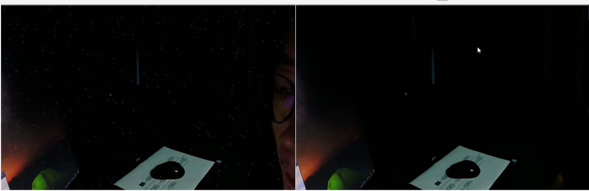
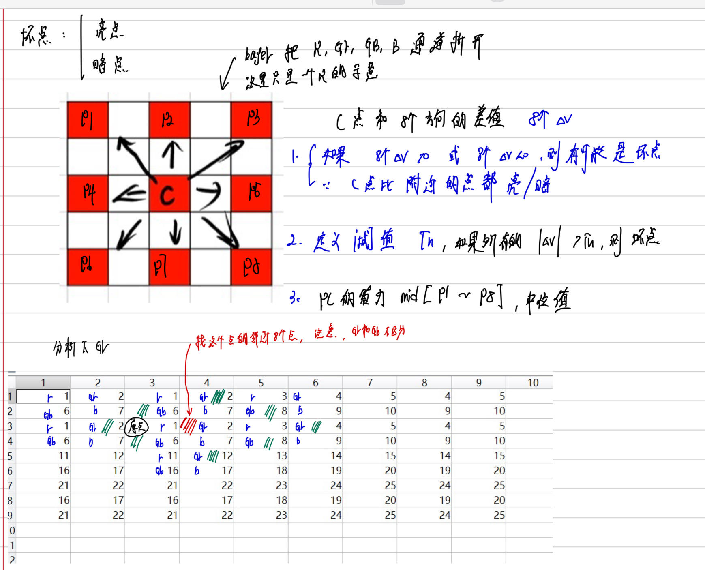

# 05 DPC坏点检测

DPC的作用就是将坏点修复，效果如下：

## 矫正法

* offline矫正：sensor原厂在生产的时候，就标定了坏点的位置，可以直接查表对坏点校准。
* online矫正：用算法去排查那些点是坏点，然后去矫正。

### PINTO算法

首先，我们矫正的bayer图片，我们这里以RGGB举例，过程如下：

需要注意的是，如果找gr周围的8点gr点，这个时候gb也是算在里面的。

