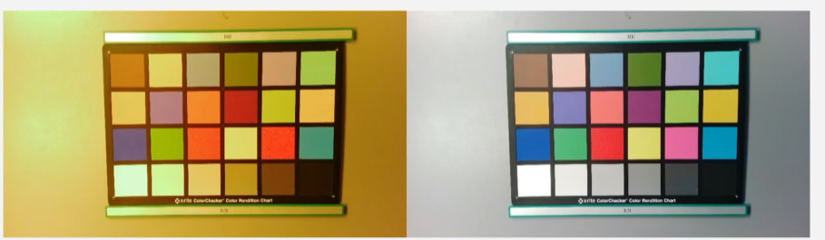

# 06 AWB

awb主要是将偏色给矫正回来，效果如下：

## 1.产生原因

### 色温：

有一定温度的黑体的辐射光光谱特性

### 颜色恒常性
当光源的颜色发生变化时，人对物体表面的颜色知觉区域稳定。比如白T恤在钨丝灯下，我们人的神经还是会把他矫正为白T恤

### 白平衡
CMOS不具备人眼的色彩恒定性，需要将人眼看起来白色的物体进行色彩还原，使其在照片上呈现为白色。

## 矫正方法

