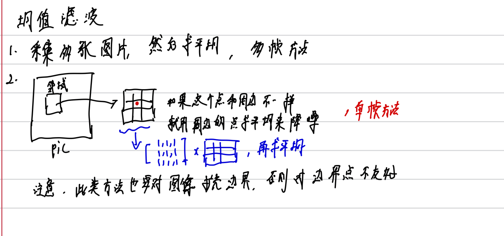
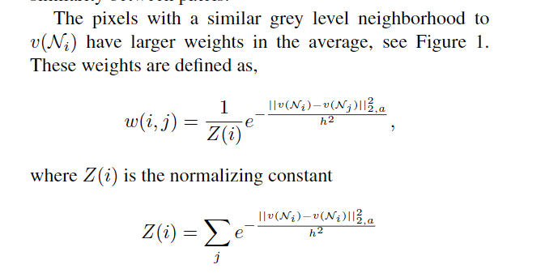
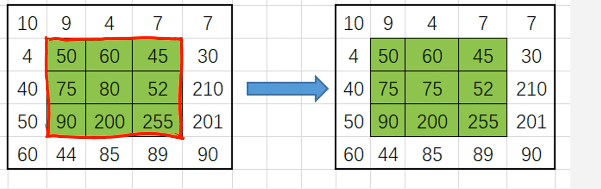
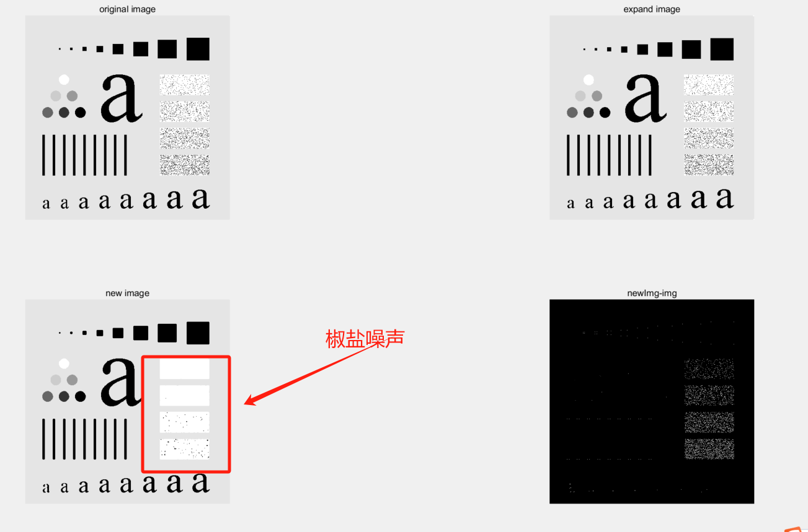
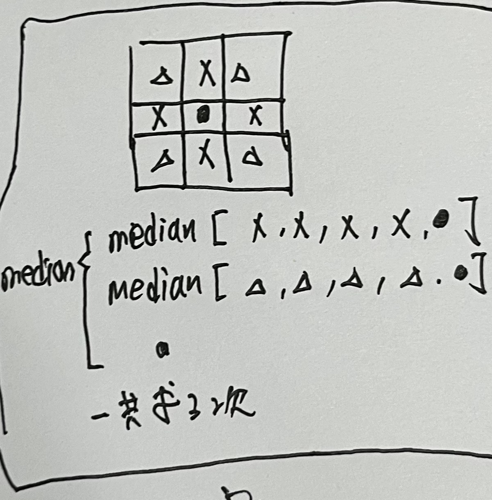
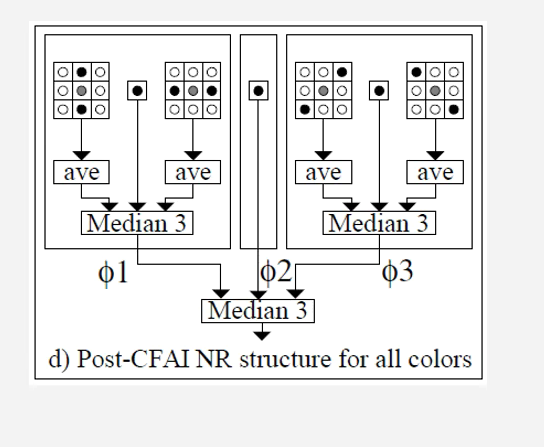
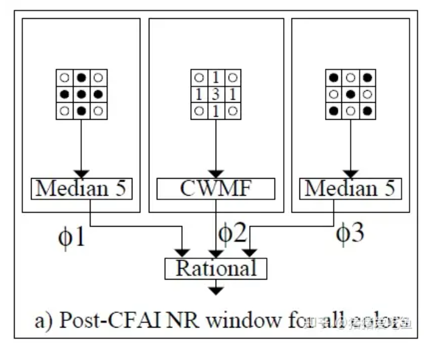
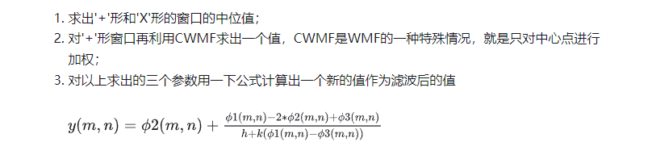

# 08 降噪

## 均值降噪

均值滤波没有办法很好保护图像的细节，在去噪的过程中破坏了细节，所以均值降噪对高斯噪声效果较好，但对椒盐噪声效果较差。



核心代码如下，基本上就是求平均

```matlab
% 这里的i,j相对原图在expand图中的位置
for i=2:height+1
    for j= 2:width+1
        %先获取3*3的元素
        img_roi = [expand_img(i-1,j-1) expand_img(i-1,j) expand_img(i-1,j+1);
                   expand_img(i,j-1) expand_img(i,j) expand_img(i,j+1);
                   expand_img(i+1,j-1) expand_img(i+1,j) expand_img(i+1,j+1)];
        new_img(i-1,j-1) = sum(sum(img_roi.*mean_kernel))/9;
    end
end
```

##

## NLM

首先NLM的权重计算如下：



过程中是将每一个点的权重+当前点*最大权重，过程如下：

```matlab
for r = swmin: swmax
    for s = shmin: shmax
        if(r==i1 && s==j1)
            continue;
        end
    W2 = img_expand(r-ds:r+ds,s-ds:s+ds); % the window is to be compared with current window
    num = num+1;
    Dist2 = sum(sum(sqrt((W1-W2).*(W1-W2)))); %计算l2范数，本质上就是各个元素的平方之和再开根号
    w = exp(-Dist2/h2);   % the weight of the compared window
    if(w > wmax)
        wmax = w;
    end
    sweight = sweight + w;  % 权重求和，计算Z
    average = average + w*img_expand(r,s);
    end
end

fprintf('num of win: %d\n', num);
average = average + wmax*img_expand(i1,j1); %之前的点+最大值赋值给当前权重
sweight = sweight+wmax; ; %之前的点+最大值赋值给当前权重
DenoisedImg(i,j) = average/sweight; %归一化
```


## 中值滤波

中值滤波是一种非线性方法，对平滑脉冲噪声非常有效。对校验噪声效果较好，对高斯噪声效果较差。



可以看到，在3*3的滤波器中，中间点的值由滤波器中的中位值代替。



```matlab
for i=2:height+1
    for j= 2:width+1
        %先获取3*3的元素
        img_roi = [expand_img(i-1,j-1) expand_img(i-1,j) expand_img(i-1,j+1) ...
                   expand_img(i,j-1) expand_img(i,j) expand_img(i,j+1) ...
                   expand_img(i+1,j-1) expand_img(i+1,j) expand_img(i+1,j+1)];
        order_list = sort(img_roi);
        new_img(i-1,j-1) = median(order_list);
    end
end
```

### 多级中值混合 mmf



### 多级中值与平均值混合 mmhf



```matlab
for i=1:height
    for j=1:width
        roi = img_expand(i:i+2,j:j+2);
        
        % 第一部分中值，水平均值+竖直均值+中间点
        mean_v = mean(mean(roi(:,2)));
        mean_h = mean(mean(roi(2,:)));
        middle_1 = median(median([mean_v,roi(2,2),mean_h]));

        % 第二部分中值，45度均值+135均值+中间点
        mean_45 = mean(mean([roi(1,3),roi(2,2),roi(3,1)]));
        mean_135 = mean(mean([roi(1,1),roi(2,2),roi(3,3)]));
        middle_2 = median(median([mean_45,roi(2,2),mean_135]));

        new_img(i,j) = median(median([middle_1,roi(2,2),middle_2]));
    end
end
```

### 中值有理混合滤波





注意，其中的h和k是超参数，是需要我们自己设置的。