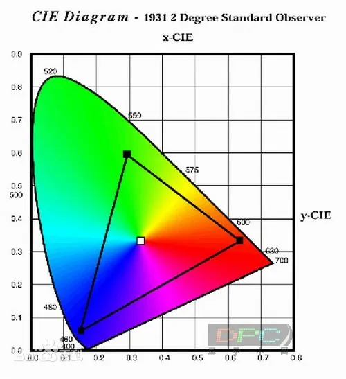
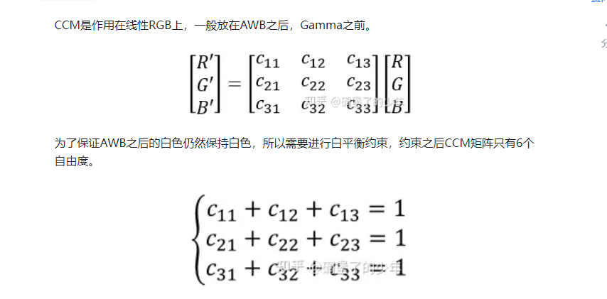
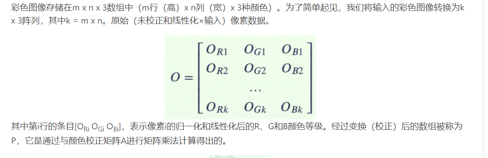
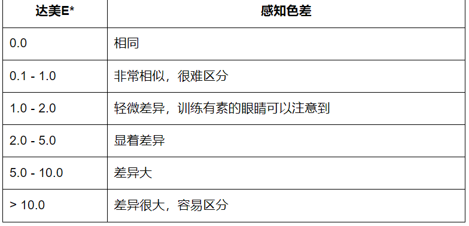

# meccm算法解读

# 前置知识

## 颜色空间

### SRGB

SRGB是CIE1931 XYZ颜色空间中的一小部分，那这个CIE1931 XYZ颜色空间是我们人眼全部能够全部感知的色彩。



### CIE LAB

一种颜色空间，类似于这样：


### Gamma变换
对图像的灰度值进行非线性操作，使得输出图像的灰度值与输入图像的灰度值呈指数关系。

Srgb是rgb经过gamma矫正后的数据


### 不同光照强度下的24色卡对应的lab
不同光源对应下的24色卡怎么校准呢？

目前我觉得是我们可以在不同的光源下去拍摄，但是校准的目标都是d65下的24色卡标准值。

做一些色彩空间的转换，可以使用skimage

```shell
pip install scikit-image
```


# CCM

CCM的约束条件是每一行的元素值加起来为1



做CCM变换乘上一个系数的原因是：像素值是结果归一化和线性化后的数据。



## Delta-E和Delta-C

$$
\Delta E=\sqrt{(L_{2}^{*} - L_{1}^{*})^{2} +(a_{2}^{*} - a_{1}^{*})^{2}+(b_{2}^{*} - b_{1}^{*})^{2}} 
$$



$$
\Delta E=\sqrt{(a_{2}^{*} - a_{1}^{*})^{2}+(b_{2}^{*} - b_{1}^{*})^{2}} 
$$


## Ref
https://ww2.mathworks.cn/help/images/ref/lin2rgb.html

https://kb.colorspace.com.cn/kb/2024/02/01/imatest%e8%bd%af%e4%bb%b6%e7%94%9f%e6%88%90%e8%89%b2%e5%bd%a9%e6%a0%a1%e6%ad%a3%e7%9f%a9%e9%98%b5color-correction-matrixccm/