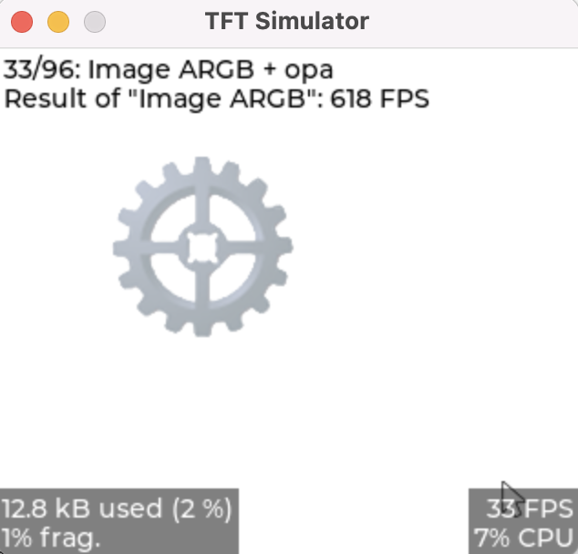

# 如何在MACOS下使用lvgl模拟器


## 1.安装必要环境
```shell
brew install sdl2
```

查看sdl2安装位置：
```shell
(base) ➜  ~ brew list sdl2
/opt/homebrew/Cellar/sdl2/2.30.1/bin/sdl2-config
/opt/homebrew/Cellar/sdl2/2.30.1/include/SDL2/ (78 files)
/opt/homebrew/Cellar/sdl2/2.30.1/lib/libSDL2-2.0.0.dylib    
/opt/homebrew/Cellar/sdl2/2.30.1/lib/cmake/ (2 files)
/opt/homebrew/Cellar/sdl2/2.30.1/lib/pkgconfig/sdl2.pc
/opt/homebrew/Cellar/sdl2/2.30.1/lib/ (4 other files)
/opt/homebrew/Cellar/sdl2/2.30.1/share/aclocal/sdl2.m4
(base) ➜  ~ 
```

## 2.模拟器配置

### 2.1 克隆仓库
仓库地址为：[https://github.com/lvgl/lv_port_pc_vscode](https://github.com/lvgl/lv_port_pc_vscode)

```shell
git clone --recursive https://github.com/lvgl/lv_port_pc_vscode
```

### 2.2 修改makefile
打开根目录下的Makefile:

将lv_driver修改为sdl2
```makefile
#LV_DRIVER          := X11
LV_DRIVER          := SDL2
```

修改INC和LDIBS,链接SDL2
```
INC 				:= -I./ui/simulator/inc/ -I./ -I./lvgl/ -I/opt/homebrew/Cellar/sdl2/2.30.1/include
LDLIBS	 			:= -lm -L /opt/homebrew/Cellar/sdl2/2.30.1/lib -l SDL2
```

### 2.3编译与运行
```shell
(base) ➜  lv_port_pc_vscode git:(master) ✗ make -j12 && ./build/bin/demo
```
