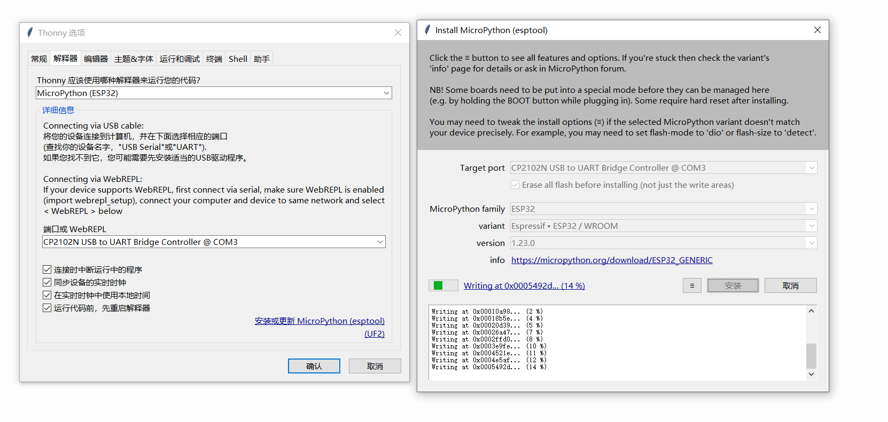
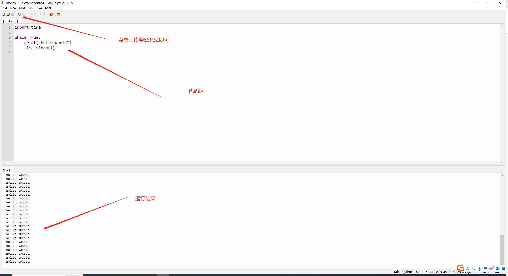

# ESP32使用micropython

## 1.下载固件

[ESP32固件](https://micropython.org/download/ESP32_GENERIC/)，下滑到最底部有固件bin。

这一步也可以先安装thonny，里面也提供了安装与擦除



## 2.清除与下载

```shell
esptool.py --chip esp32 --port /dev/tty.SLAB_USBtoUART erase_flash
esptool.py --chip esp32 --port /dev/tty.SLAB_USBtoUART write_flash -z 0x1000 firmware.bin
```

## 3.测试

打开mobaxterm或者其他工具，选择端口与波特率115200


## 4.安装ide

安装[thonny](https://thonny.org/)


## 5.other

thonny的代码补全是ctrl+space，一般与输入法冲突，可以把tab补全加上。菜单栏：工具-》选项


### 1.配置解释器

菜单栏点击运行-> 配置解释器





# Ref
官方文档：https://docs.micropython.org/en/latest/esp32/quickref.html#installing-micropython

星瞳：https://docs.singtown.com/micropython/zh/latest/esp32/esp32/tutorial/intro.html

micropython ide介绍：https://randomnerdtutorials.com/micropython-ides-esp32-esp8266/

thonny使用：https://blog.csdn.net/Little_Carter/article/details/128597071