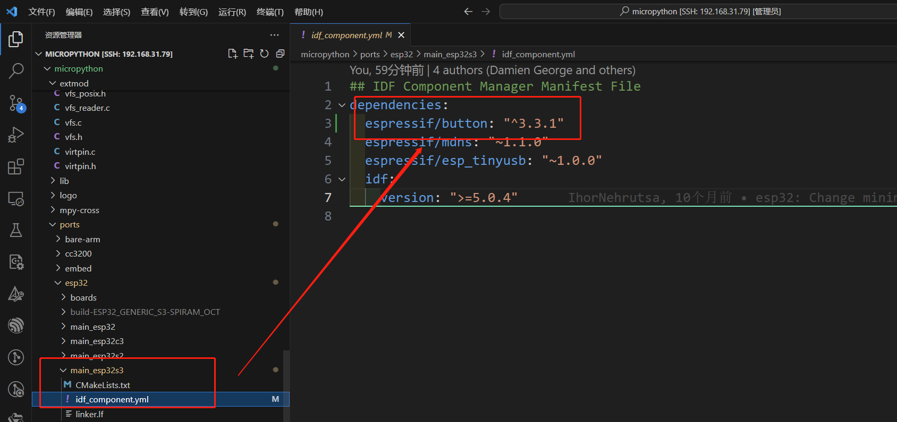
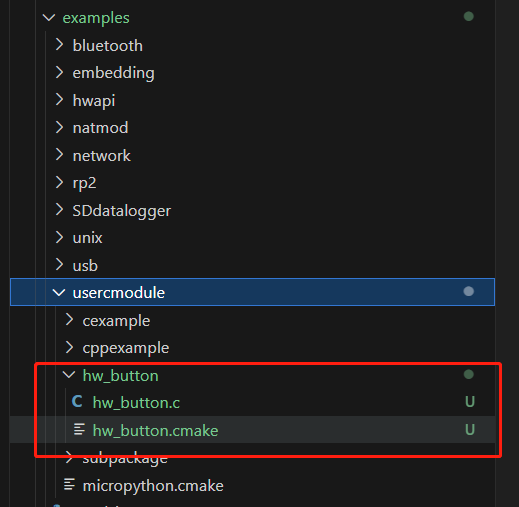
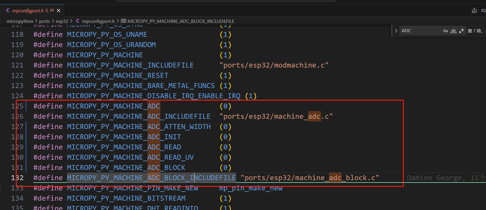
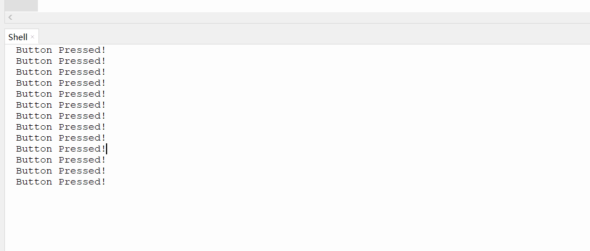

# 如何在micropython中添加包管理器组件

## 1.添加组件：

在 `ports/esp32`中可以看到一些关于esp32的文件夹：
```shell
main_esp32
main_esp32s3
...
```

选择对应的芯片，我这里是S3，所以选择的`main_esp32s3`，进入该目录，添加组件：

```shell
cd main_esp32s3
idf.py add-dependency "espressif/button^3.3.1"
```




## 2.添加模块代码

参考之前在micropython中添加c库的代码，依旧在`micropython/examples/usercmodule`中添加button代码：




hw_button.c:
```shell
#include "py/runtime.h"
#include "py/mphal.h"
#include "driver/gpio.h"
#include "iot_button.h"

static button_handle_t g_btn;
static mp_obj_t python_callback = mp_const_none;

static void button_press_down_cb(void *arg, void *data)
{
    if (python_callback != mp_const_none)
    {
        mp_sched_schedule(python_callback, mp_const_none);
    }
}

static mp_obj_t hw_button_register_callback(mp_obj_t callback)
{
    python_callback = callback;
    return mp_const_none;
}

static MP_DEFINE_CONST_FUN_OBJ_1(hw_button_register_callback_obj, hw_button_register_callback);

void hw_button_init(int num)
{
    button_config_t cfg = {
        .type = BUTTON_TYPE_GPIO,
        .long_press_time = 1000,
        .short_press_time = 500,
        .gpio_button_config = {
            .gpio_num = num,
            .active_level = 0,
        },
    };

    g_btn = iot_button_create(&cfg);

    iot_button_register_cb(g_btn, BUTTON_PRESS_DOWN, button_press_down_cb, NULL);
}

static mp_obj_t hw_button_init_py(mp_obj_t pin_num)
{
    hw_button_init(mp_obj_get_int(pin_num));
    return mp_const_none;
}

static MP_DEFINE_CONST_FUN_OBJ_1(hw_button_init_py_obj, hw_button_init_py);

// 模块方法列表
static const mp_rom_map_elem_t hw_button_module_globals_table[] = {
    { MP_OBJ_NEW_QSTR(MP_QSTR___name__), MP_OBJ_NEW_QSTR(MP_QSTR_hw_button) },
    { MP_ROM_QSTR(MP_QSTR_init), MP_ROM_PTR(&hw_button_init_py_obj) },
    { MP_ROM_QSTR(MP_QSTR_register_callback), MP_ROM_PTR(&hw_button_register_callback_obj) },
};
static MP_DEFINE_CONST_DICT(hw_button_module_globals, hw_button_module_globals_table);


// Define module object.
const mp_obj_module_t hw_button_module = {
    .base = { &mp_type_module },
    .globals = (mp_obj_dict_t *)&hw_button_module_globals,
};

// Register the module to make it available in Python.
MP_REGISTER_MODULE(MP_QSTR_hw_button, hw_button_module);
```

hw_button.cmake:

```cmake
add_library(hw_button INTERFACE)

target_sources(hw_button INTERFACE
    ${CMAKE_CURRENT_LIST_DIR}/hw_button.c
)

target_include_directories(hw_button INTERFACE
    ${CMAKE_CURRENT_LIST_DIR}
)
target_link_libraries(usermod INTERFACE hw_button)
```


## 3.编译代码

需要注意的是，button组件用的adc和micropython的adc版本冲突，如果不取消micropython的adc会出现运行错误：

```shell
ADC: CONFLICT! driver_ng is not allowed to be used with the legacy driver
```

所以要取消micropython的adc。

在`micropython/ports/esp32/mpconfigport.h`中找到adc的宏，直接置为0，关闭machine_adc:




然后正常编译代码：

```shell
➜  esp32 git:(master) ✗ make BOARD=ESP32_GENERIC_S3 BOARD_VARIANT=SPIRAM_OCT USER_C_MODULES=/home/yanke/project/micropython/micropython/examples/usercmodule/hw_button/hw_button.cmake
```


## 4.micropython运行测试

```python
import hw_button

def on_button_press(arg):
    print("Button Pressed!")

hw_button.init(0)

# 注册回调函数
hw_button.register_callback(on_button_press)
```

