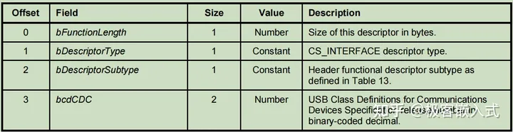
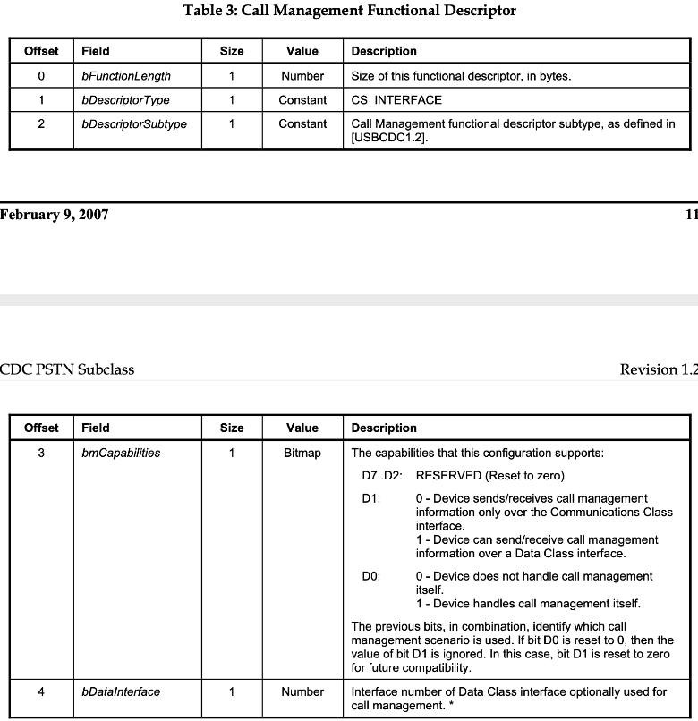
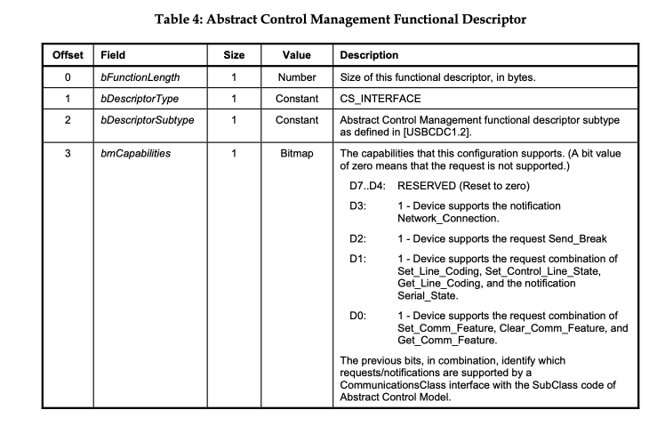
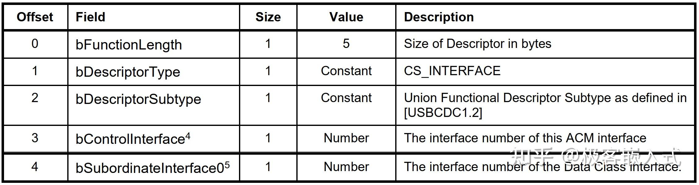

# USB CDC

## 基本概念
1. CDC: 通讯设备类
2. ACM：抽象控制模型
3. NCM：网络控制模型

USB CDC ACM需要的描述符：
* 标准设备描述符
* 标准配置描述符
* 接口关联描述符
* CDC头功能描述符
* CDC 联合功能描述符
* 呼叫管理功能描述符
* 抽象控制管理功能描述符
* CDC 类通信接口的标准接口描述符
* 中断 IN 端点的标准端点描述符
* CDC 类数据接口的标准接口描述符
* Bulk IN 和 Bulk OUT 端点的标准端点描述符

需要完成两个接口描述符 cdc_control与cdc_data，以及接口关联描述符iad
* cdc_control
  * class: 0x02
  * subclass:
    * Abstract Control Model：0x02
  * 目录：usbcdc11的4.4章节
* cdc_data
  * class：0x0a

解释一下，因为我们这里有两个接口描述符，如果将他们合并的话，需要用接口关联描述符IAD

接口关联描述符的定义可以看：https://www.usbzh.com/article/detail-712.html
```c
typedef struct _USBInterfaceAssociationDescriptor {
    BYTE  bLength:                  0x08        //描述符大小
    BYTE  bDescriptorType:          0x0B        //IAD描述符类型
    BYTE  bFirstInterface:          0x00        //起始接口
    BYTE  bInterfaceCount:          0x02        //接口数
    BYTE  bFunctionClass:           0x0E        //类型代码
    BYTE  bFunctionSubClass:        0x03        //子类型代码
    BYTE  bFunctionProtocol:        0x00        //协议代码
    BYTE  iFunction:                0x04        //描述字符串索引
}
```

对于tinyusb，他的一些描述符都存放在
```c
TUD_CDC_DESCRIPTOR(ITF_NUM_CDC, STRID_CDC_INTERFACE, 0x80 | EPNUM_0_CDC_NOTIF, 8, EPNUM_0_CDC, 0x80 | EPNUM_0_CDC, CFG_TUD_CDC_EP_BUFSIZE),
```

CDC类中，不具备HID描述符和报告描述符，而是功能描述符（类特殊接口描述符），用来描述接口功能。


## 描述符解析

### 1.设备描述符
```c
const tusb_desc_device_t usb_cdc_device_descriptor = {
    .bLength = sizeof(tusb_desc_device_t),
    .bDescriptorType = 0X01,    // Device
    .bcdUSB = 0x0200,           // Usb 2.0
    .bDeviceClass = 0x02,       // Communications and CDC Control
    .bDeviceSubClass = 0x00,    // None
    .bDeviceProtocol = 0x00,    // None
    .bMaxPacketSize0 = 64,      // 端点0最大包大小
    .idVendor = 0x303A,         // 厂商编号
    .idProduct = 0x4002,        // 产品编号
    .bcdDevice = 0x100,         // 出厂编号
    .iManufacturer = 0x01,      // 厂商字符串索引
    .iProduct = 0x02,           // 产品字符串索引
    .iSerialNumber = 0x03,      // 序列号字符串索引
    .bNumConfigurations = 0x01, // 配置描述符数量为1
};
```

### 2.配置描述符

### 1.联合描述符
* bFunctionClass：参考defined class codes，这里是cdc，就是0x02
* bFunctionSubClass：参考PSTN120的4.2章节，这里选择ACM，0x02
* bFunctionProtocol：没有协议，写0x00，如果是AT的话是0x01

### 2. Header descriptor
所有的功能描述符都有一个Header 描述符
在USBCDC11.pdf中的5.2.3.1

* bFunctionLength 1字节，表示该描述符的长度
* bDescriptorType 1字节，表示该描述符的类型，固定为0x24 (CS_INTERFACE的编码,类特殊)
* bDescriptorSubtype 1字节，表示描述符子类型， 在USBCDC11.PDF的table 25,header的是0x00
* bcdCDC 2字节，表示USBCDC规范的版本，如USBCDC1.2，就是0x0120

### 3.Call Management Functional Descriptor 
呼叫管理功能描述符

* bDescriptorSubtype： 在USBCDC11.PDF的table 25，call描述符是0x01
* bmCapabilities：描述设备的能力，只有最低两位D0和D1有意义，其余为保留值0。
* bDataInterface 1字节，表示选择用来做调用管理的数据类接口编号。

bDataInterface这个应该就是下面的cdc_data接口描述符的编号了，我猜的，有待验证。

### 4. Abstract Control Management Functional Descriptor


tinyusb里做serial device的时候，bmCapabilities写的0x02，就是D0=0,D1=1，D2~7都是0

D0 为1 时表示支持 SET_COMM_FEATURE、CLEAR_COMM_FEATURE、GET_COMM_FEATURE请求；

D1 为1 时表示支持 SET_LINE_CODING、SET_CONTROL_LINE_STATE、GET_LINE_CODING请求和SERIAL_STATE通知。

D2 为 1时表示支持SEND_BREAK。

D3 为1 时表示支持NETWORK_CONNECTION通知。

这些我还不理解，暂时放一下，按照tusb的来，在USB PSTN120的6.3，属于特定请求。

### 5.Union Functional Descriptor
Union Functional Descriptor 至少有5个字节，描述了一组接口之间的关系，这些接口中一个作为主接口，其余的作为从接口，可以有多个从接口。



* bControlInterface 1字节，主接口编号
* bSubordinateInterface 1字节，从接口编号

### 6.数据端点描述符

### 7.CDC data接口描述符

### 8.out端点描述符

### 9.in端点描述符
