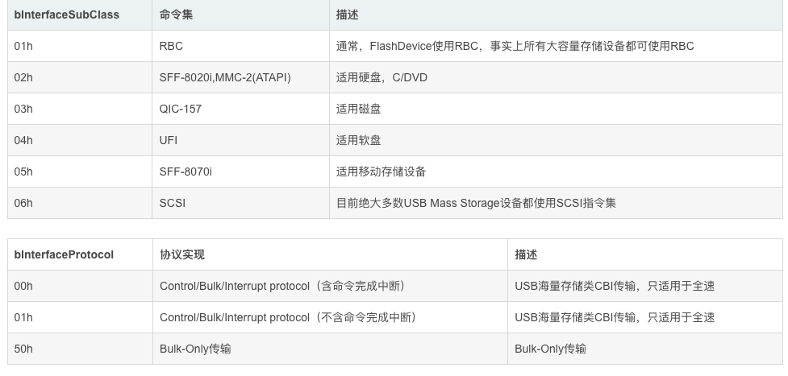

# USB MSC

### sdk配置
如果要使用tinyusb的msc，需要打开其config，写到sdkdefaults就行
```shell
CONFIG_TINYUSB_MSC_ENABLED=y
```

### USB MSC描述符
对于USB MSC而言，包括设备描述符，字符串描述符，配置描述符。这些每一个usb都有。

对于配置描述符而言，因为不是HID设备，所有USB MSC只包括了配置描述符、接口描述符、两个端点描述符（in 和 out）
```c
const uint8_t usb_msc_configuration[] = {
    // 配置描述符
    0x09,                               // 配置描述符的字节数
    0x02,                               // 配置描述符的编号类型为2
    U16_TO_U8S_LE(9 + 1 * (9 + 7 + 7)), // 所有描述符的大小的总和 配置描述符、2个端点描述符 in 和 out
    1,                                  // 接口数量，这里只有1个
    1,                                  // 配置描述符数量，这里只有1个
    0,                                  // 当前配置描述符的索引，只有1个，所以是0
    0xA0,                               // 供电模式选择，支持自动唤醒
    0x32,                               // 最大电流，这里是最大电流/2的结果，我们写的是100，所以这里是50

    // 接口描述符
    0x09, // 接口描述符长度为9个字节
    0x04, // 接口描述符类型,接口描述符是4
    0x00, // 接口编号，从0开始
    0x00, // 备用接口编号，从0开始
    2,    // 端点数为2，一个in和一个out
    0x08, // 接口类型 还是看那个class code那个文档 Base Class 08h (Mass Storage)
    0x06, // subclass为SCSI命令集
    0x50, // protocol为Bulk-Only Transport
    0,    // 接口字符串的索引值为0，即为无字符串

    // 端点描述符 out
    0x07,              // 端点描述符的长度为7个字节
    0x05,              // 端点描述符的类型为0x05
    0x01,              // 端点地址，我们这里为输出，0 000 0001,端点号为1，输出
    0x02,              // 批量传输 00 00 00 10
    U16_TO_U8S_LE(64), // 最大包长度，我们这里设置的为64，也可以是512
    0,                 // 端点查询时间为0

    // 端点描述符 in
    0x07,
    0x05,
    0x81,              // 端点地址，我们这里输入 1 000 0001,端点号为1，输入
    0x02,              // 批量传输
    U16_TO_U8S_LE(64), // 最大包长度，我们这里设置的为64，也可以是512
    0,                 // 端点查询时间为0
};
```
其中关于接口描述符中的class subclass 与 protocol的组合是区分存存储方案的，具体可以看下面：

对于大容量存储而言，他的接口描述符中的class code为0x08,subclass和protocol如下

我们这里使用的是SCSI命令集与BOT协议，BOT是USB大容量数据存储的基础协议，用于主机与USB设备之间进行大容量数据传输。


### 如何与sdmmc驱动关联？
tinyusb提供了函数，我们直接把sdmmc_card_t传过去
```c
esp_err_t usb_msc_init(sdmmc_card_t **card)
{
    esp_err_t ret = ESP_FAIL;
    tinyusb_msc_sdmmc_config_t config_sdmmc = {
        .card = *card,
        .callback_mount_changed = usb_msc_mount_changed_cb,
        .mount_config.max_files = 5, // 最大文件打开数量
    };

    ret = tinyusb_msc_storage_init_sdmmc(&config_sdmmc);
    ret = tinyusb_msc_register_callback(TINYUSB_MSC_EVENT_MOUNT_CHANGED, usb_msc_mount_changed_cb); /* Other way to register the callback i.e. registering using separate API. If the callback had been already registered, it will be overwritten. */

    if (ret != ESP_OK)
    {
        return ret;
    }

    // config descriptor
    const tinyusb_config_t tusb_cfg = {
        .device_descriptor = &usb_msc_device_descriptor,
        .string_descriptor = usb_msc_string_descriptor,
        .string_descriptor_count = sizeof(usb_msc_string_descriptor) / sizeof(usb_msc_string_descriptor[0]),
        .external_phy = false,
        .configuration_descriptor = usb_msc_configuration,
    };

    ret = tinyusb_driver_install(&tusb_cfg);

    if (ret != ESP_OK)
    {
        return ret;
    }
    return ret;
}
```


### 其他
如果tinyusb把hid的config开着的话，还是回调函数的，就放在那边即可。