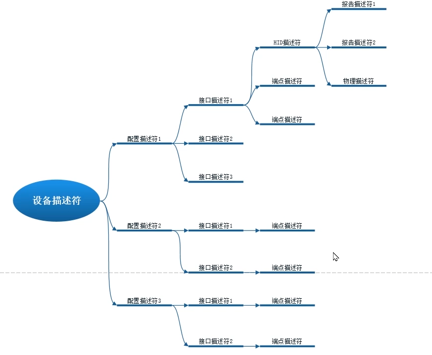
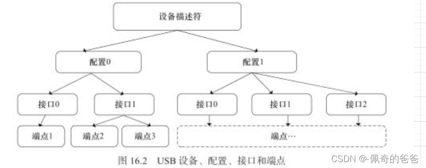
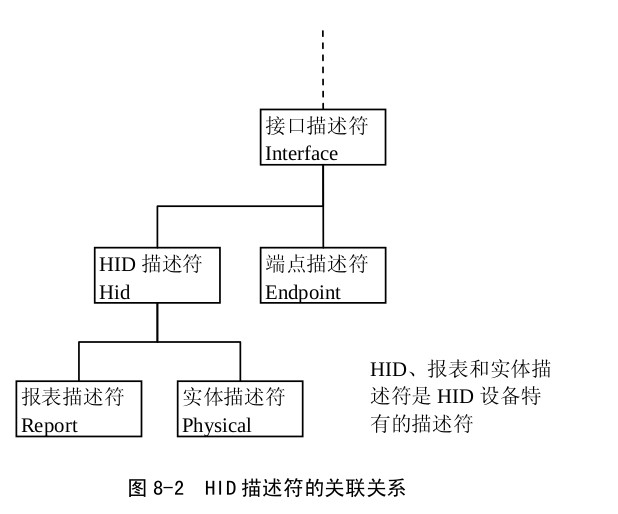
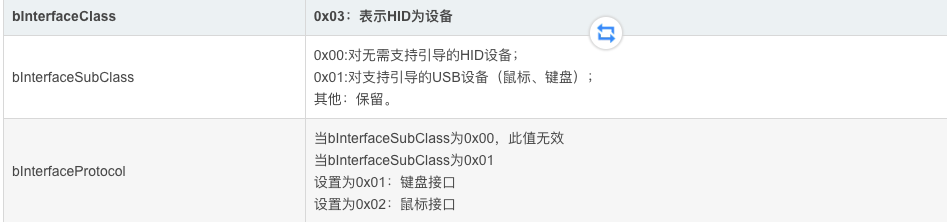
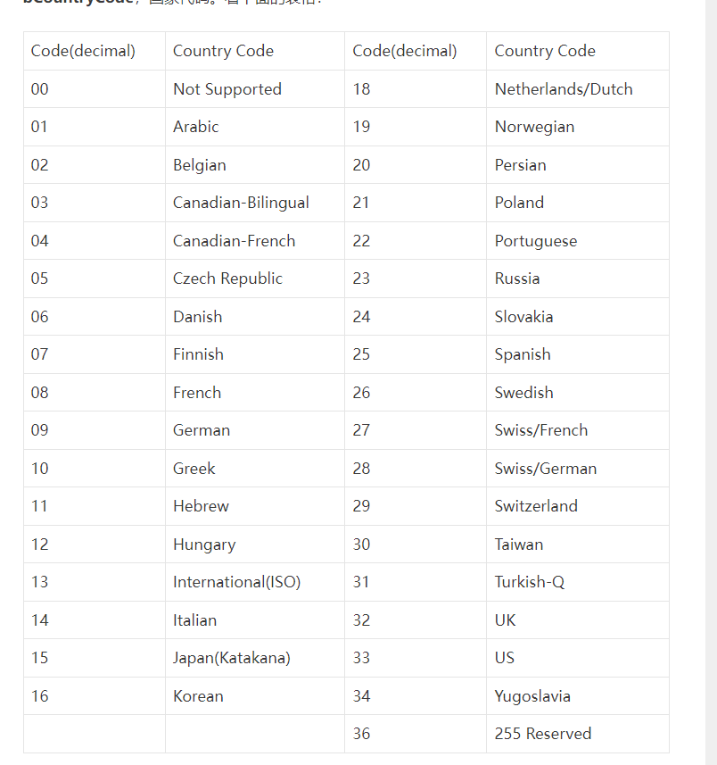
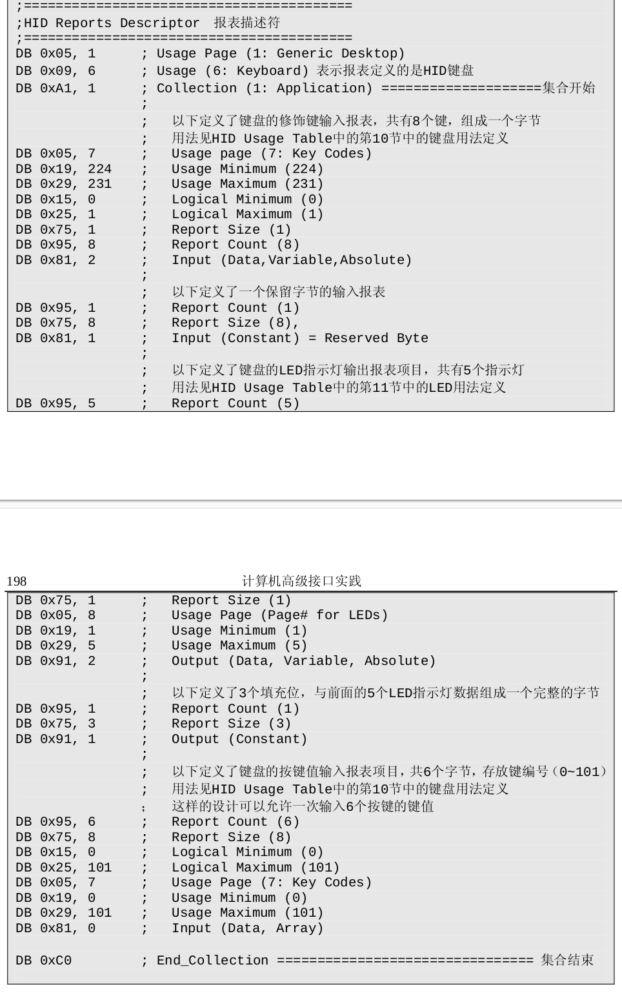

# USB HID 知识学习




### 设备描述符
在tinyusb中，如果你不写设备描述符是可以的，他会默认给你一个，我们也可以自己写，设备描述符的定义可以看usb2.0中文版中5.6.1小节
我这里以mouse的device descriptor为例
```c
tusb_desc_device_t hid_device_mouse_device_descriptor = {
    .bLength = sizeof(hid_device_mouse_device_descriptor), // 设备描述符的字节大小数
    .bDescriptorType = 0x01,                               // DEVICE
    .bcdUSB = 0x0200,                                      // USB2.0
    .bDeviceClass = 0x00,                                  // Class代码 0x00
    .bDeviceSubClass = 0x00,                               // Subclass代码 0x00
    .bDeviceProtocol = 0x00,                               // Protocol代码 0x000, class、subclass与protocol组成了base class
    .bMaxPacketSize0 = CFG_TUD_ENDPOINT0_SIZE,             // 端点0的最大包大小
    .idVendor = 0x303A,                                    // 厂商编号
    .idProduct = 0x4002,                                   // 设备变换
    .bcdDevice = 0x100,                                    // 设备出厂编号
    .iManufacturer = 0x01,                                 // 厂商字符串索引，字符串描述符中的第一个（个数从0开始）
    .iProduct = 0x02,                                      // 产品字符串索引，字符串描述符中的第二个
    .iSerialNumber = 0x03,                                 // 序列号字符串索引，字符串索引中的第三个
    .bNumConfigurations = 0x01,                            // 配置描述符就1个
};
```

注意，如果bDeviceClass=0x00表明在接口描述符中定义，在设备描述符中不处理。

### 配置描述符

```c
TUD_CONFIG_DESCRIPTOR(1, 1, 0, TUSB_DESC_TOTAL_LEN, TUSB_DESC_CONFIG_ATT_REMOTE_WAKEUP, 100)

#define TUD_CONFIG_DESCRIPTOR(config_num, _itfcount, _stridx, _total_len, _attribute, _power_ma) \
  9, TUSB_DESC_CONFIGURATION, U16_TO_U8S_LE(_total_len), _itfcount, config_num, _stridx, TU_BIT(7) | _attribute, (_power_ma)/2
```
* bLength: 字节数大小为9，默认
* wTotalLength：配置描述符+(接口描述符+HID描述符+端点描述符)*接口数。其中端点描述符的大小为7,接口描述符的大小为9,HID描述符的大小为9
* bmAttributes： 在协议栈里面第7位一直是1,所以TU_BIT(7),此外TUSB_DESC_CONFIG_ATT_REMOTE_WAKEUP为TU_BIT(5),表示支持唤醒。TU_BIT表示把哪一个位置起来

其中一个配置描述符可以有多个接口描述符，一个接口描述符又可以有多个端点描述符.


所以我们看到在配置描述符后面又加了其他描述符。我们也可以参考[stm32配置](https://www.iotword.com/12954.html)
```c
static const uint8_t hid_configuration_descriptor[] = {
    // Configuration number, interface count, string index, total length, attribute, power in mA
    //配置描述符
    TUD_CONFIG_DESCRIPTOR(1, 1, 0, TUSB_DESC_TOTAL_LEN, TUSB_DESC_CONFIG_ATT_REMOTE_WAKEUP, 100),

    // Interface number, string index, boot protocol, report descriptor len, EP In address, size & polling interval
    TUD_HID_DESCRIPTOR(0, 4, false, sizeof(hid_report_descriptor), 0x81, 16, 10),
};
```
对于HID设备，接口描述符下面有一个HID名描述符和端点描述符。


这和我们展开TUD_HID_DESCRIPTOR看到的是一样的
```h
#define TUD_HID_DESCRIPTOR(_itfnum, _stridx, _boot_protocol, _report_desc_len, _epin, _epsize, _ep_interval) \
  /* 接口描述符 */\
  9, TUSB_DESC_INTERFACE, _itfnum, 0, 1, TUSB_CLASS_HID, (uint8_t)((_boot_protocol) ? (uint8_t)HID_SUBCLASS_BOOT : 0), _boot_protocol, _stridx,\
  /* HID描述符 */\
  9, HID_DESC_TYPE_HID, U16_TO_U8S_LE(0x0111), 0, 1, HID_DESC_TYPE_REPORT, U16_TO_U8S_LE(_report_desc_len),\
  /* 端点描述符 */\
  7, TUSB_DESC_ENDPOINT, _epin, TUSB_XFER_INTERRUPT, U16_TO_U8S_LE(_epsize), _ep_interval
```


### 字符串描述符
tinyusb中的最大字符串长度描述符为8。
hid example中的例子是
```c
const char* hid_string_descriptor[5] = {
    // array of pointer to string descriptors
    (char[]){0x09, 0x04},  // 0: is supported language is English (0x0409)
    "TinyUSB",             // 1: Manufacturer
    "TinyUSB Device",      // 2: Product
    "123456",              // 3: Serials, should use chip ID
    "Example HID interface",  // 4: HID
};
```
为什么要这么写，可以参考esp_tinyusb源代码，
```c
const char *descriptor_str_kconfig[] = {
    // array of pointer to string descriptors
    (char[]){0x09, 0x04},                // 0: is supported language is English (0x0409)
    CONFIG_TINYUSB_DESC_MANUFACTURER_STRING, // 1: Manufacturer
    CONFIG_TINYUSB_DESC_PRODUCT_STRING,      // 2: Product
    CONFIG_TINYUSB_DESC_SERIAL_STRING,       // 3: Serials, should use chip ID

#if CONFIG_TINYUSB_CDC_ENABLED
    CONFIG_TINYUSB_DESC_CDC_STRING,          // 4: CDC Interface
#else
    "",
#endif

#if CONFIG_TINYUSB_MSC_ENABLED
    CONFIG_TINYUSB_DESC_MSC_STRING,          // 5: MSC Interface
#else
    "",
#endif

#if CONFIG_TINYUSB_NET_MODE_ECM_RNDIS || CONFIG_TINYUSB_NET_MODE_NCM
    "USB net",                               // 6. NET Interface
    "",                                      // 7. MAC
#endif
    NULL                                     // NULL: Must be last. Indicates end of array
};
```


### 接口描述符
* bInterfaceClass：类型代码，可以参考[类型代码](https://www.usb.org/defined-class-codes)

对于subclass和protocol而言，没有没确的说明，但是鼠标和键盘是有的


bCountryCode，注意表格里面是10进制，写的时候写16进制



### 端点描述符
* bEndpointAddress：端点地址。D0~D3—:端点号；D4~D6—保留；D7-传输方向，1 表示输入，0 表示输出
0x81：10000001，端点号为1,输入

* bmAttributes：端点属性，tinyusb的描述只包含了D1-D0的属性
```c
/// defined base on USB Specs Endpoint's bmAttributes
typedef enum
{
  TUSB_XFER_CONTROL = 0 , //控制传输
  TUSB_XFER_ISOCHRONOUS , //同步传输
  TUSB_XFER_BULK        , //批量传输
  TUSB_XFER_INTERRUPT     //中断传输
}tusb_xfer_type_t;
```

### HID描述符
* bDescriptorType：HID描述符附属的描述符类型，有报表或者实体。报表是0x22，实体是0x23

### 报表描述符
在tinyusb中封装了一些：TUD_HID_REPORT_DESC_KEYBOARD、TUD_HID_REPORT_DESC_MOUSE

这和展开宏定义看到的是一样的
```h
#define TUD_HID_REPORT_DESC_KEYBOARD(...) \
  HID_USAGE_PAGE ( HID_USAGE_PAGE_DESKTOP     )                    ,\
  HID_USAGE      ( HID_USAGE_DESKTOP_KEYBOARD )                    ,\
  HID_COLLECTION ( HID_COLLECTION_APPLICATION )                    ,\
    /* Report ID if any */\
    __VA_ARGS__ \
    /* 8 bits Modifier Keys (Shift, Control, Alt) */ \
    HID_USAGE_PAGE ( HID_USAGE_PAGE_KEYBOARD )                     ,\
      HID_USAGE_MIN    ( 224                                    )  ,\
      HID_USAGE_MAX    ( 231                                    )  ,\
      HID_LOGICAL_MIN  ( 0                                      )  ,\
      HID_LOGICAL_MAX  ( 1                                      )  ,\
      HID_REPORT_COUNT ( 8                                      )  ,\
      HID_REPORT_SIZE  ( 1                                      )  ,\
      HID_INPUT        ( HID_DATA | HID_VARIABLE | HID_ABSOLUTE )  ,\
      /* 8 bit reserved */ \
      HID_REPORT_COUNT ( 1                                      )  ,\
      HID_REPORT_SIZE  ( 8                                      )  ,\
      HID_INPUT        ( HID_CONSTANT                           )  ,\
    /* Output 5-bit LED Indicator Kana | Compose | ScrollLock | CapsLock | NumLock */ \
    HID_USAGE_PAGE  ( HID_USAGE_PAGE_LED                   )       ,\
      HID_USAGE_MIN    ( 1                                       ) ,\
      HID_USAGE_MAX    ( 5                                       ) ,\
      HID_REPORT_COUNT ( 5                                       ) ,\
      HID_REPORT_SIZE  ( 1                                       ) ,\
      HID_OUTPUT       ( HID_DATA | HID_VARIABLE | HID_ABSOLUTE  ) ,\
      /* led padding */ \
      HID_REPORT_COUNT ( 1                                       ) ,\
      HID_REPORT_SIZE  ( 3                                       ) ,\
      HID_OUTPUT       ( HID_CONSTANT                            ) ,\
    /* 6-byte Keycodes */ \
    HID_USAGE_PAGE ( HID_USAGE_PAGE_KEYBOARD )                     ,\
      HID_USAGE_MIN    ( 0                                   )     ,\
      HID_USAGE_MAX_N  ( 255, 2                              )     ,\
      HID_LOGICAL_MIN  ( 0                                   )     ,\
      HID_LOGICAL_MAX_N( 255, 2                              )     ,\
      HID_REPORT_COUNT ( 6                                   )     ,\
      HID_REPORT_SIZE  ( 8                                   )     ,\
      HID_INPUT        ( HID_DATA | HID_ARRAY | HID_ABSOLUTE )     ,\
  HID_COLLECTION_END \
```


## Ref
https://www.cnblogs.com/AlwaysOnLines/p/3848461.html