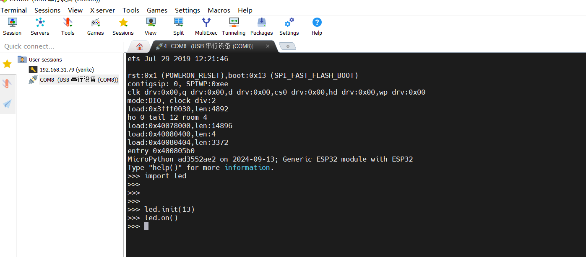

# 如何在micropython中添加C库


## 1.编写c驱动

选择一个目录：`examples/usercmodule`，建立对应的驱动文件`hw_led`：

```shell
.
├── cexample
│   ├── examplemodule.c
│   ├── micropython.cmake
│   └── micropython.mk
├── cppexample
│   ├── example.cpp
│   ├── examplemodule.c
│   ├── examplemodule.h
│   ├── micropython.cmake
│   └── micropython.mk
├── hw_led
│   ├── hw_led.c
│   └── hw_led.cmake
├── micropython.cmake
└── subpackage
    ├── micropython.cmake
    ├── micropython.mk
    ├── modexamplepackage.c
    ├── qstrdefsexamplepackage.h
    └── README.md
```

照着`usercmodule`里面的`micropython.cmake`添加编译脚本：

```cmake
add_library(hw_led INTERFACE)

target_sources(hw_led INTERFACE
    ${CMAKE_CURRENT_LIST_DIR}/hw_led.c
)

target_include_directories(hw_led INTERFACE
    ${CMAKE_CURRENT_LIST_DIR}
)
target_link_libraries(usermod INTERFACE hw_led)
```

编写led驱动程序，包括初始化，开关。

```c
#include "py/runtime.h"
#include "py/mphal.h"
#include "driver/gpio.h"

static int gpio_num = -1;

void hw_led_init(int num)
{
    gpio_config_t io_conf = {
        .mode = GPIO_MODE_OUTPUT,
        .intr_type = GPIO_INTR_DISABLE,
        .pin_bit_mask = (1ULL << num),
        .pull_down_en = GPIO_PULLDOWN_DISABLE,
        .pull_up_en = GPIO_PULLUP_DISABLE,
    };
    gpio_num = num;
    gpio_config(&io_conf);
}

void hw_led_on(void)
{
    gpio_set_level(gpio_num, 1);
}

void hw_led_off(void)
{
    gpio_set_level(gpio_num, 0);
}

static mp_obj_t led_init_func(mp_obj_t num)
{
    int num_int = mp_obj_get_int(num);
    hw_led_init(num_int);
    return mp_const_none;
}

static MP_DEFINE_CONST_FUN_OBJ_1(led_init_obj, led_init_func);

static mp_obj_t led_on_func(void)
{
    hw_led_on();
    return mp_const_none;
}
static MP_DEFINE_CONST_FUN_OBJ_0(led_on_obj, led_on_func);

static mp_obj_t led_off_func(void)
{
    hw_led_off();
    return mp_const_none;
}
static MP_DEFINE_CONST_FUN_OBJ_0(led_off_obj, led_off_func);


static const mp_rom_map_elem_t led_module_globals_table[] = {
    { MP_OBJ_NEW_QSTR(MP_QSTR___name__), MP_OBJ_NEW_QSTR(MP_QSTR_led) },
    { MP_ROM_QSTR(MP_QSTR_init), MP_ROM_PTR(&led_init_obj) },
    { MP_ROM_QSTR(MP_QSTR_on)  , MP_ROM_PTR(&led_on_obj)   },
    { MP_ROM_QSTR(MP_QSTR_off) , MP_ROM_PTR(&led_off_obj)  },
};
static MP_DEFINE_CONST_DICT(led_module_globals, led_module_globals_table);


// Define module object.
const mp_obj_module_t led_module = {
    .base = { &mp_type_module },
    .globals = (mp_obj_dict_t *)&led_module_globals,
};

// Register the module to make it available in Python.
MP_REGISTER_MODULE(MP_QSTR_led, led_module);
```

有几个值得注意的地方：
1. `MP_DEFINE_CONST_FUN_OBJ_1`：代表函数只有一个形参。如果是`MP_DEFINE_CONST_FUN_OBJ_0`，就代表没有形参。
2. `MP_QSTR_led`：代表我们的模块名字叫led。


## 2.编译与烧录：

首先进入esp32的目录中：
```shell
/home/yanke/project/micropython/micropython/ports/esp32
```

编译代码：
```shell
➜  esp32 git:(master) ✗ make USER_C_MODULES=../../../examples/usercmodule/hw_led/hw_led.cmake
```

注意这里一定是三个../。或者使用绝对路径，因为编译命令并不是在当前目录。

烧录代码：
```c
 python -m esptool --chip esp32 -b 460800 --before default_reset --after hard_reset write_flash --flash_mode dio --flash_size 4MB --flash_freq 40m 0x1000 build-ESP32_GENERIC/bootloader/bootloader.bin 0x8000 build-ESP32_GENERIC/partition_table/partition-table.bin 0x10000 build-ESP32_GENERIC/micropython.bin
```

这个编译指令会直接指定`/dev/ttyUSB0`。

## 3.测试

