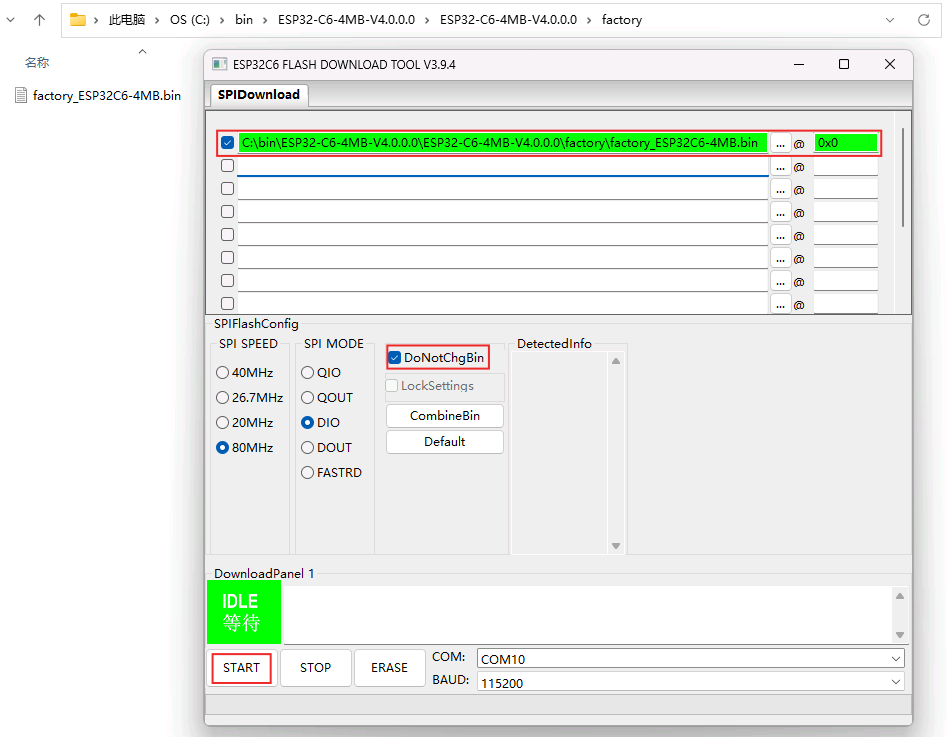
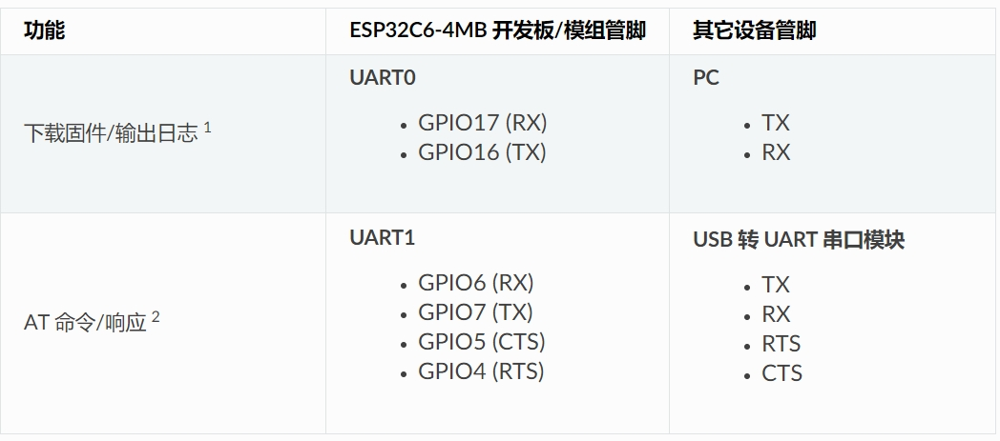
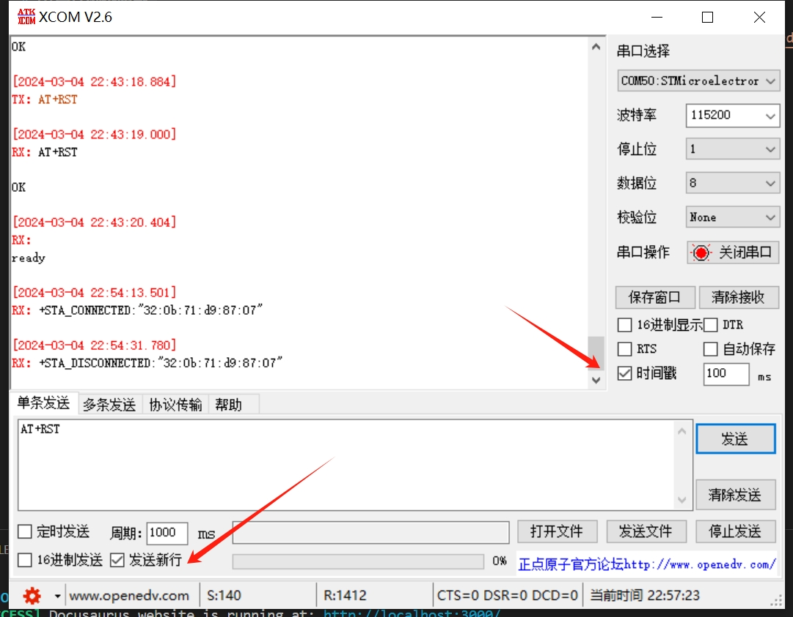

# AT固件烧录测试

AT文档地址 [https://docs.espressif.com/projects/esp-at/zh_CN/latest/esp32c6/Get_Started/Hardware_connection.html](https://docs.espressif.com/projects/esp-at/zh_CN/latest/esp32c6/Get_Started/Hardware_connection.html)

烧录使用factory固件即可

注意的是，AT固件的下载和操作不是一个uart口，需要注意。

串口配置如下：

## 其他

### 1.串口工具
我这里使用的是欧拉电子的下载器，只要接上GND TX RX就可以正常通讯了。