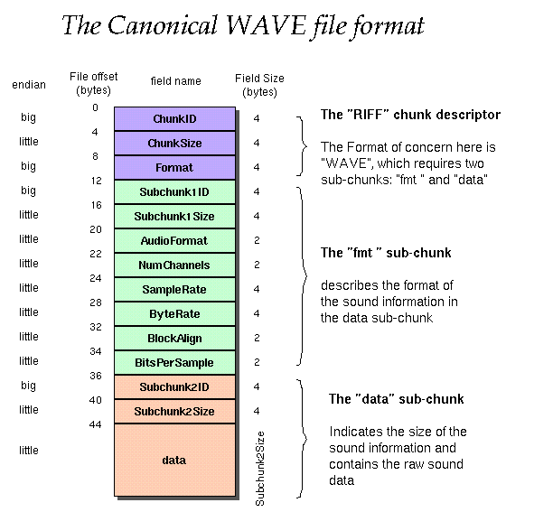

# WAV格式

最近需要保存wav格式的音频，在此记录一下

首先wav的音频格式如下：



我们可以看到他一共有三大块，RIFF块，FMT块和数据块

### RIFF块
```c
struct {
    char chunk_id[4];  //大写字符串RIFF，
    uint32_t chunk_size; //从下一个字段首地址开始到文件末尾的总字节数。该字段的数值加 8 为当前文件的实际长度。
    char chunk_format[4]; //写WAVE
} descriptor_chunk; /*!< Canonical WAVE format starts with the RIFF header */
```


### FMT块
```c
struct {
    char subchunk_id[4]; //小写字符串fmt
    uint32_t subchunk_size; //其数值不确定,取决于编码格式。如果是PCM的话为16
    uint16_t audio_format; //PCM为1
    uint16_t num_of_channels; //单声道为1，立体声或双声道为2
    uint32_t sample_rate; //每个声道单位时间采样次数。常用的采样频率有 11025, 22050 和 44100 kHz。
    uint32_t byte_rate; //该数值为:声道数×采样频率×每样本的数据位数/8。播放软件利用此值可以估计缓冲区的大小。
    uint16_t block_align; //采样帧大小。该数值为:声道数×位数/8。播放软件需要一次处理多个该值大小的字节数据,用该数值调整缓冲区。
    uint16_t bits_per_sample; //采样位数
} fmt_chunk; /*!< The "fmt " subchunk describes the sound data's format */
```

### 数据块
```c
struct {
    char subchunk_id[4]; /*!< Contains the letters "data" */
    uint32_t subchunk_size; /*!< ==采样率 * 通道数 * 每个样本的数据位数 / 8 */
    int16_t data[0]; /*!< Holds raw audio data */
} data_chunk; /*!< The "data" subchunk contains the size of the data and the actual sound */
```

完整的代码可以参考
```c
/*
 * SPDX-FileCopyrightText: 2022 Espressif Systems (Shanghai) CO LTD
 *
 * SPDX-License-Identifier: Unlicense OR CC0-1.0
 */
#pragma once

#include <stdint.h>

#ifdef __cplusplus
extern "C" {
#endif

/**
 * @brief Header structure for WAV file with only one data chunk
 *
 * @note See this for reference: http://soundfile.sapp.org/doc/WaveFormat/
 *
 * @note Assignment to variables in this struct directly is only possible for little endian architectures
 *       (including Xtensa & RISC-V)
 */
typedef struct {
    struct {
        char chunk_id[4]; /*!< Contains the letters "RIFF" in ASCII form */
        uint32_t chunk_size; /*!< This is the size of the rest of the chunk following this number */
        char chunk_format[4]; /*!< Contains the letters "WAVE" */
    } descriptor_chunk; /*!< Canonical WAVE format starts with the RIFF header */
    struct {
        char subchunk_id[4]; /*!< Contains the letters "fmt " */
        uint32_t subchunk_size; /*!< This is the size of the rest of the Subchunk which follows this number */
        uint16_t audio_format; /*!< PCM = 1, values other than 1 indicate some form of compression */
        uint16_t num_of_channels; /*!< Mono = 1, Stereo = 2, etc. */
        uint32_t sample_rate; /*!< 8000, 44100, etc. */
        uint32_t byte_rate; /*!< ==SampleRate * NumChannels * BitsPerSample s/ 8 */
        uint16_t block_align; /*!< ==NumChannels * BitsPerSample / 8 */
        uint16_t bits_per_sample; /*!< 8 bits = 8, 16 bits = 16, etc. */
    } fmt_chunk; /*!< The "fmt " subchunk describes the sound data's format */
    struct {
        char subchunk_id[4]; /*!< Contains the letters "data" */
        uint32_t subchunk_size; /*!< ==NumSamples * NumChannels * BitsPerSample / 8 */
        int16_t data[0]; /*!< Holds raw audio data */
    } data_chunk; /*!< The "data" subchunk contains the size of the data and the actual sound */
} wav_header_t;

/**
 * @brief Default header for PCM format WAV files
 *
 */
#define WAV_HEADER_PCM_DEFAULT(wav_sample_size, wav_sample_bits, wav_sample_rate, wav_channel_num) { \
    .descriptor_chunk = { \
        .chunk_id = {'R', 'I', 'F', 'F'}, \
        .chunk_size = (wav_sample_size) + sizeof(wav_header_t) - 8, \
        .chunk_format = {'W', 'A', 'V', 'E'} \
    }, \
    .fmt_chunk = { \
        .subchunk_id = {'f', 'm', 't', ' '}, \
        .subchunk_size = 16, /* 16 for PCM */ \
        .audio_format = 1, /* 1 for PCM */ \
        .num_of_channels = (wav_channel_num), \
        .sample_rate = (wav_sample_rate), \
        .byte_rate = (wav_sample_bits) * (wav_sample_rate) * (wav_channel_num) / 8, \
        .block_align = (wav_sample_bits) * (wav_channel_num) / 8, \
        .bits_per_sample = (wav_sample_bits)\
    }, \
    .data_chunk = { \
        .subchunk_id = {'d', 'a', 't', 'a'}, \
        .subchunk_size = (wav_sample_size) \
    } \
}

#ifdef __cplusplus
}
#endif
```