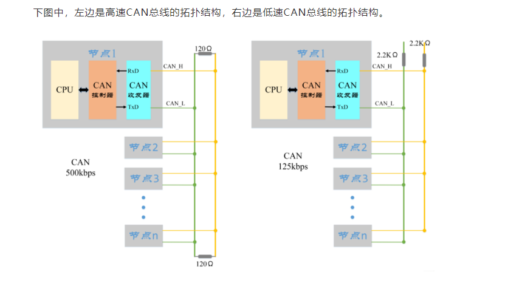

# 1.CAN基础知识

## 1.高速CAN与低速CAN的区别

* 低速CAN是开环总线，可以挂载20个节点
* 高速CAN是闭环总线，终端有120欧姆的电阻，用于阻抗匹配，可以挂载30个节点

## 2.CAN特点

* 多主控制，每一个设备都可以主动发送数据
* 添加设备不会影响原来总线的状态
* 连接节点多，具有错误检测、错误通知、错误恢复的功能

## 3.CAN的物理层特性

CAN使用**差分信号**传输，判断CAN_H和CAN_L之间的电位差来判断总线电平。
* 显性电平：逻辑0，具有优先权
* 隐性电平：逻辑1

