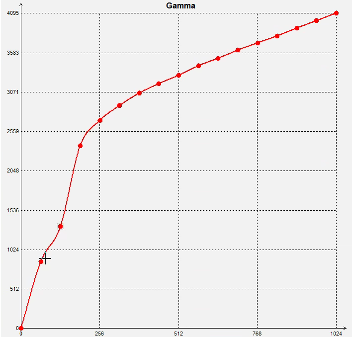
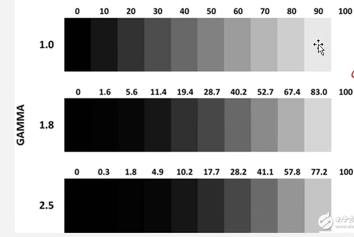
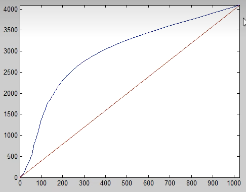

# 07 GAMMA矫正

gamma矫正的作用是调整对比度、动态范围，画面不会出现朦胧的感觉。增大暗部细节。

整个流程是调节gamma曲线，然后看动态范围条是否满足需求，一般来说，动态范围条的阶数会比较高。

查看动态范围条是否满足需求。

## 产生原因

* CRT显示属性的原因
* 人眼视觉属性：人眼对暗区的变化敏感，ISP需要提高暗区的细节。

## 矫正方法：

### 1.查表法

建立了一张输入像素与输出像素的关联，但是消耗内存。 此类方法用的最多。

