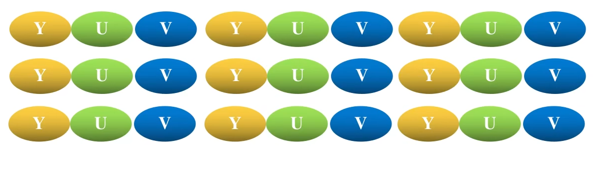
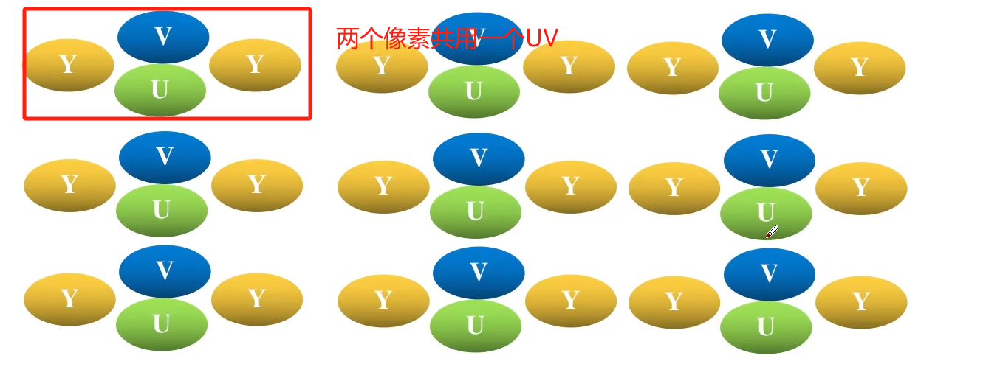
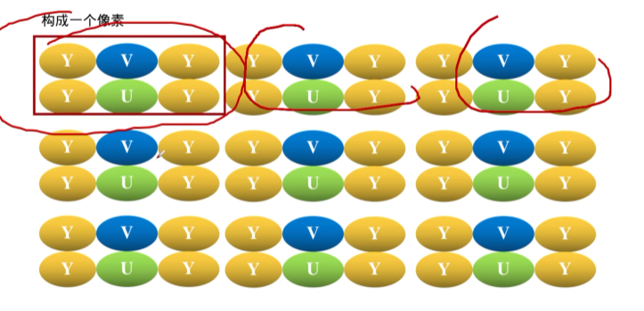

# 颜色格式

## YUV格式

Y代表亮度，UV用于描述图像的色彩信息。如果没有了UV分量，只有Y，那就是黑白图像。

### YUV444

每一个像素在转换的过程中都有对应的YUV，无损转换。在一个3*3的图像中，转换后的格式如下

### YUV422

两个Y共用一个UV。相较于YUV444而言，是有损转换。在一个3*6的图像中，转换后的格式如下

### YUV420
四个Y共用一个UV。在一个6*6的图像中，转换后的格式如下；
