# ISP 工具调研

## P4 ISP Pipeline所支持的功能
* bayer降噪
* 去马赛克
* CCM
* gmma
* rgb2yuv、yuv2rgb
* 对比度/色相/饱和度/亮度
* AE、AF、AWB
* HIST

## 现有PC工具调研：

ISP工具功能实现：

* 在线调试
  * 寄存器与算法参数调整
  * 曲线可视化调整
  * AWB矫正、CCM矫正 ...
  * ...
* ISP工具标定

### 晶视智能
#### 调试工具概览

* 软件平台：QT5
* 连接板卡：
  * 使用网线两端分别接入PC和板端的网络端口。
  * 使用网线将板端网络端口接到路由器的本地端口（ LAN口） 
  * 如果PC使用无线网络，则按照无线热点的接入方法将PC接入到当前路由器的无线热点；如果使用有线网络，则同样地使用网线连接PC网络端口和路由器的本地端口 （ LAN口）。

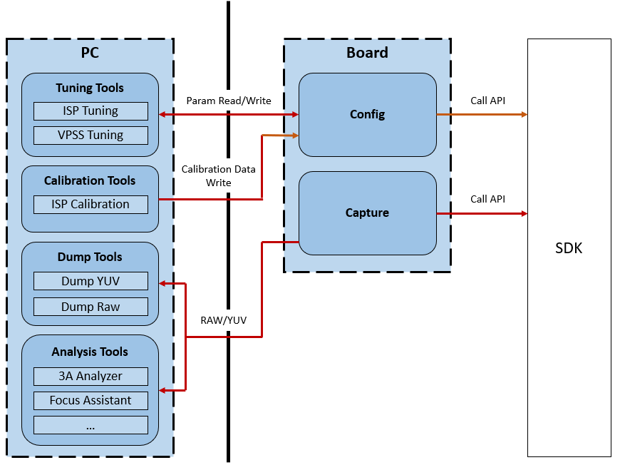

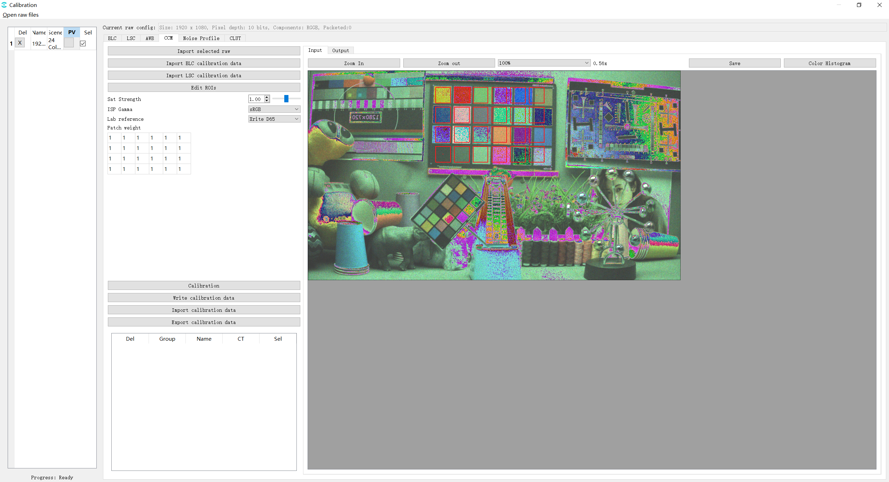

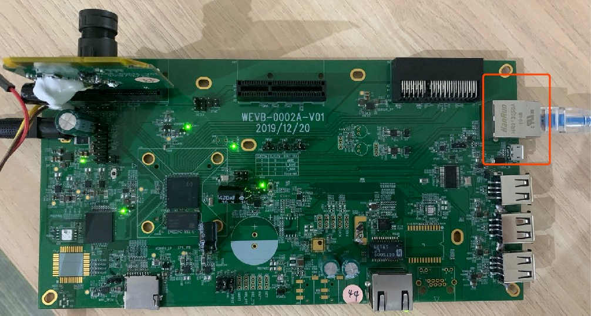

#### 文档

[CviPQ Tool使用文档](https://doc.sophgo.com/cvitek-develop-docs/master/docs_latest_release/CV180x_CV181x/zh/01.software/ISP/PQ_Tools_User_Guide/build/html/1_disclaimer.html)

#### 使用说明

未连接板卡状态下，可以使用calibration模块实现对RAW图的BLC、LSC、AWB等模块的校准。

### 海思ISP

#### 调试工具概览

* 连接板卡：网络

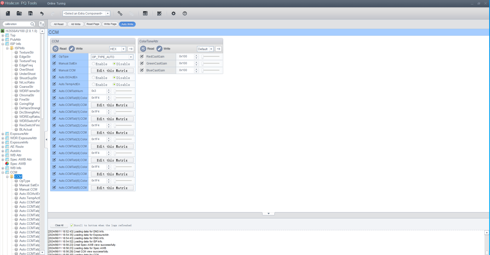

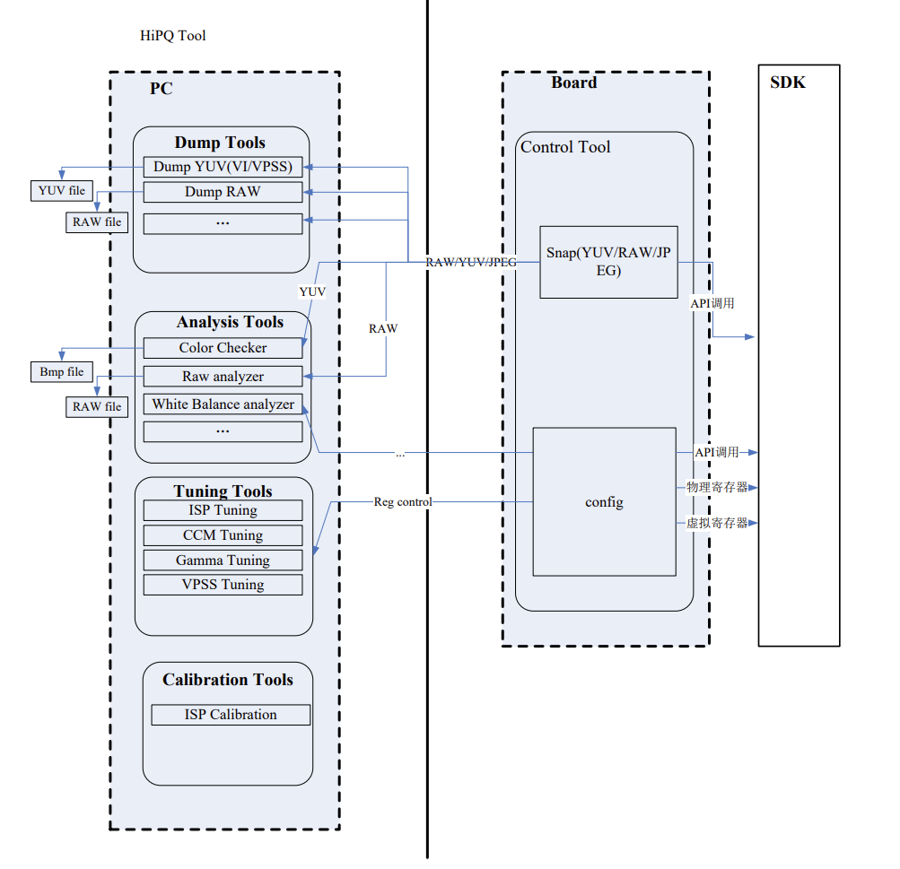

### 使用说明

### kendryte

#### 调试工具概览

* 连接板卡：图像调优过程只通过TCP Socket实现。

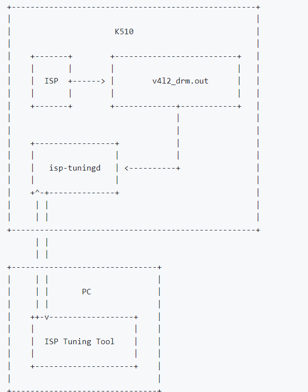

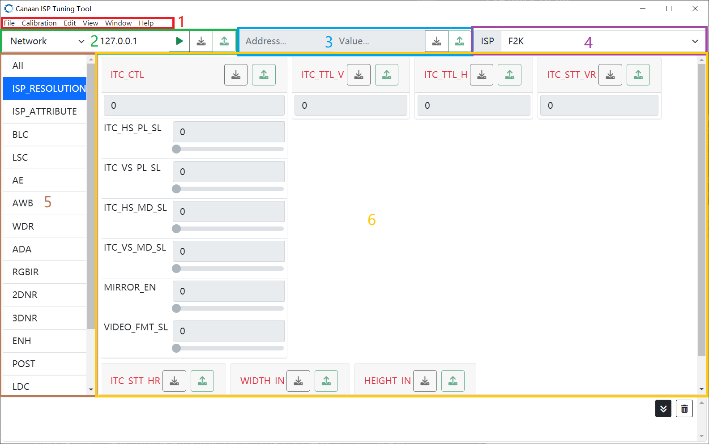

#### 介绍文档

[k510 ISP Tuning Tool](https://gitee.com/kendryte/k510_docs/blob/dev/zh/K510_ISP_Tuning_Tool_Guides.md)

### PC调研工具总结：

* 连接板卡方式：网络
* 配置信息：json、xml保存配置信息
* 支持对单独的raw文件进行pipeline算法验证分析
* 获取图像统计信息

## P4 ISP上位机设计

参考原型：[cvipqtool](https://doc.sophgo.com/cvitek-develop-docs/master/docs_latest_release/CV180x_CV181x/zh/01.software/ISP/PQ_Tools_User_Guide/build/html/3_Interface_and_Function_Description.html#)

设计架构：

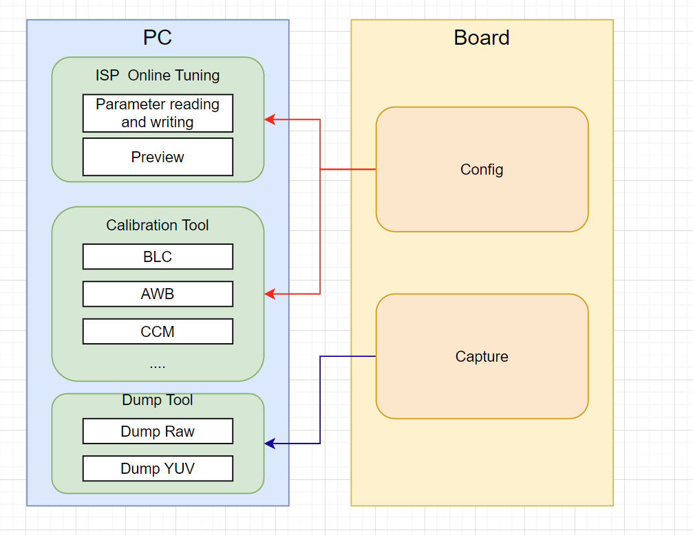

### 界面设计

#### 1.参数调试界面设计

* 读取底层配置参数
* 手动配置各ISP功能参数

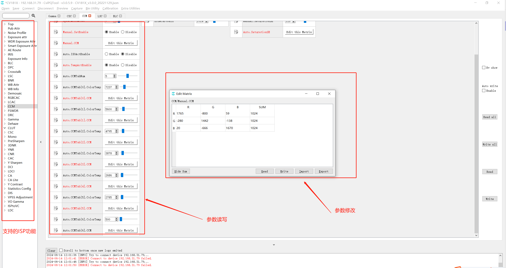

点击这些模块的可调试项，在工作右侧的调试区域会显示其模块对应的调试页面，提供用户调节参数

#### 2.校准界面设计

标定功能参考文档：[图像调优](https://doc.sophgo.com/cvitek-develop-docs/master/docs_latest_release/CV180x_CV181x/zh/01.software/ISP/ISP_Tuning_Guide/build/html/5_Module_Function.html)

支持标准的图像处理功能，包括坏点校正、镜头阴影校正、自动曝光、自动白平衡、自动对焦、Demosaic等基本功能。

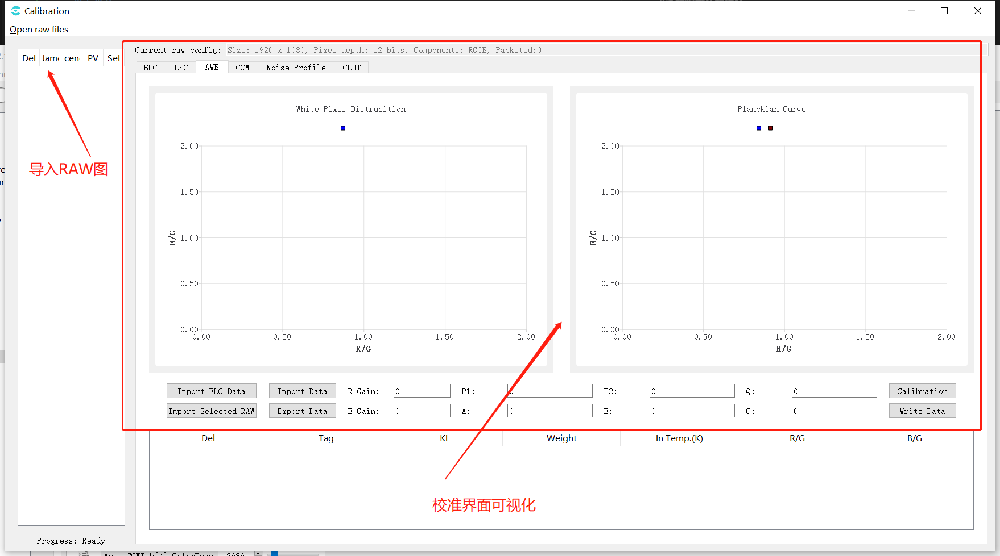

### 3.抓拍工具 dump tool

抓取板端图像文件，支持预览，并保存raw图像及其他格式文件。

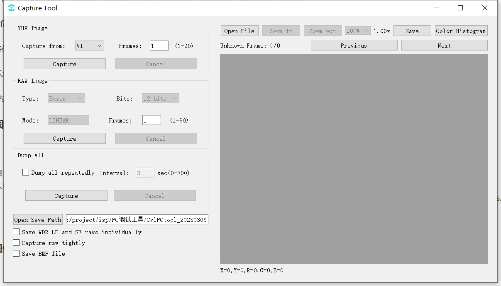

### 4.3A分析工具

查看AE AWB统计数据：

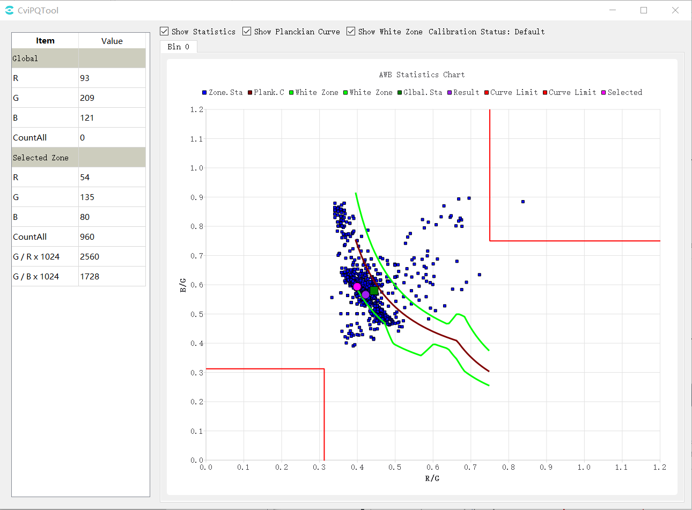