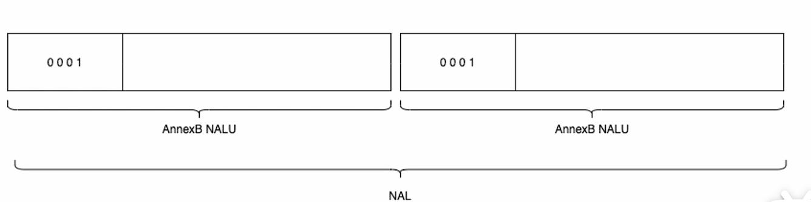
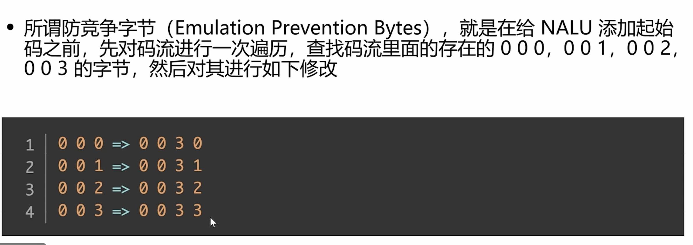
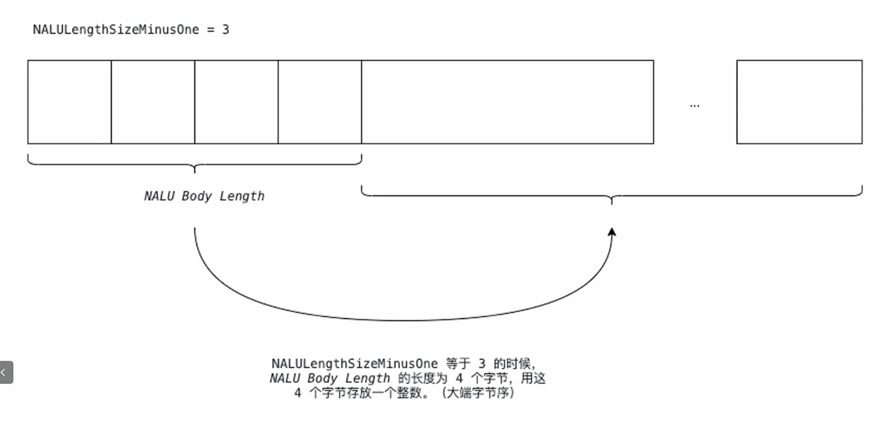

# H264基本知识

H264的码流是由Nalu组成的，换句话说，nalu是h264的基本单元。同时，h264的裸流是只包含图像本身，没有音频、时间戳之类的东西，所以没法直接播放。

## H264的封装格式

### ANNEX-B

在每一个nalu前面加上了0001，用于划分，也称作起始码。值得注意的是，有些地方的起始码是0001，有些是001.

但是有一个问题，起始码虽然是0001，但是码流里面也会有可能出现0001，那就会造成错误的分割，所以，防竞争字节序就出来。

#### 防竞争字节序

在添加起始码的时候，先对nalu里面的内容遍历，并且替换掉一部分。

### AVCC

AVCC主要用在mp4容器中。avcc是在nalu前面加上了几个字节，这几个字节构成了一个大整数（大端），这个大整数就代表了整个nalu的长度，也称作nalu body length。

#### SPS和PPS

他们是两个特殊的nalu。他们没有存放图像的数据，而是存放一些重要的参数。在annex-b里面是当普通的nalu处理，但是在avcc里面是当特殊nalu去处理的。

#### NaluLengthSizeMinusOne
这个字段是2个bit，可存放的数据大小为0~3。他是nalulength-1的结果。假设NaluLengthSizeMinusOne为3，那么nalulength就是为4，则在nalu的前四个字节就代表了整个nalu的长度，注意哈，整个nalu的长度是不包括前面这四个字节的。

