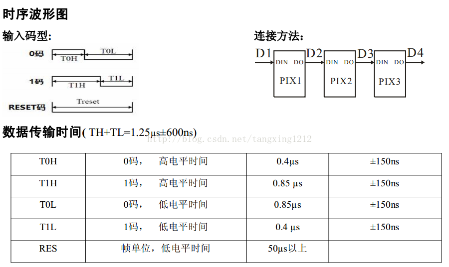

# WS2812 RMT

## WS2812 时序相关




## RMT发送一个24bit的颜色数据

对于这种0码和1码分别有对应高低电平时间的场景下，RMT非常适合。

首先，我们需要根据RMT的01码和reset来设置rmt的编码

```c
static const rmt_symbol_word_t ws2812_zero = {
    .level0 = 1,
    .duration0 = 4, /*!< 0.4us */
    .level1 = 0,
    .duration1 = 9, /*!< 0.9us */
};

static const rmt_symbol_word_t ws2812_one = {
    .level0 = 1,
    .duration0 = 9, /*!< 0.9us */
    .level1 = 0,
    .duration1 = 3, /*!< 0.4us */
};

static const rmt_symbol_word_t ws2812_reset = {
    .level0 = 0,
    .duration0 = 250, /*!< 25us */
    .level1 = 0,
    .duration1 = 250, /*!< 25us */
};
```

注意在RMT TX的配置中，resolution_hz设置的是 10*1000*1000  = 10MHZ，对应的一个tick为0.1us，在上面的`rmt_symbol_word_t`中的`duration0`的单位为1个tick。

接下来，我们需要设置编码的回调`encoder_callback`，这样我们在调用`rmt_transmit`的时候，数据就会进入到`encoder_callback`中：

```c
static size_t encoder_callback(const void *data, size_t data_size,
                               size_t symbols_written, size_t symbols_free,
                               rmt_symbol_word_t *symbols, bool *done, void *arg)
{
    if (symbols_free < 8) {
        return 0; /*!< 最少需要 8个符号位组成一个字节 */
    }
    printf("symbols_written:%d,data_size:%d\n", symbols_written, data_size);

    size_t data_pos = symbols_written / 8; /*!< 当断当前是第几个字节，假设我传入的是{0xFF, 0x00, 0x00}，data_size就是3，每写一个字节，symbols_written+8 */
    uint8_t *data_bytes = (uint8_t *)data;

    if (data_pos < data_size) {
        size_t symbol_pos = 0;
        for (int bitmask = 0x80; bitmask != 0; bitmask >>= 1) {
            if (data_bytes[data_pos] & bitmask) {
                symbols[symbol_pos++] = ws2812_one;
            } else {
                symbols[symbol_pos++] = ws2812_zero;
            }
        }

        return symbol_pos;
    } else {
        symbols[0] = ws2812_reset;
        *done = 1;
        return 1;
    }
}
```

在这个编码回调中 symbol是以bit为单位的，假设我发送的data为`{0xFF, 0x00, 0x00}`，那在进入回调的时候，每次的data_size都是3，每次发送一个字节，发送完`symbols_written`+8，视为传输完成一个字节。


## 如果有多个灯珠，如何发送数据？

