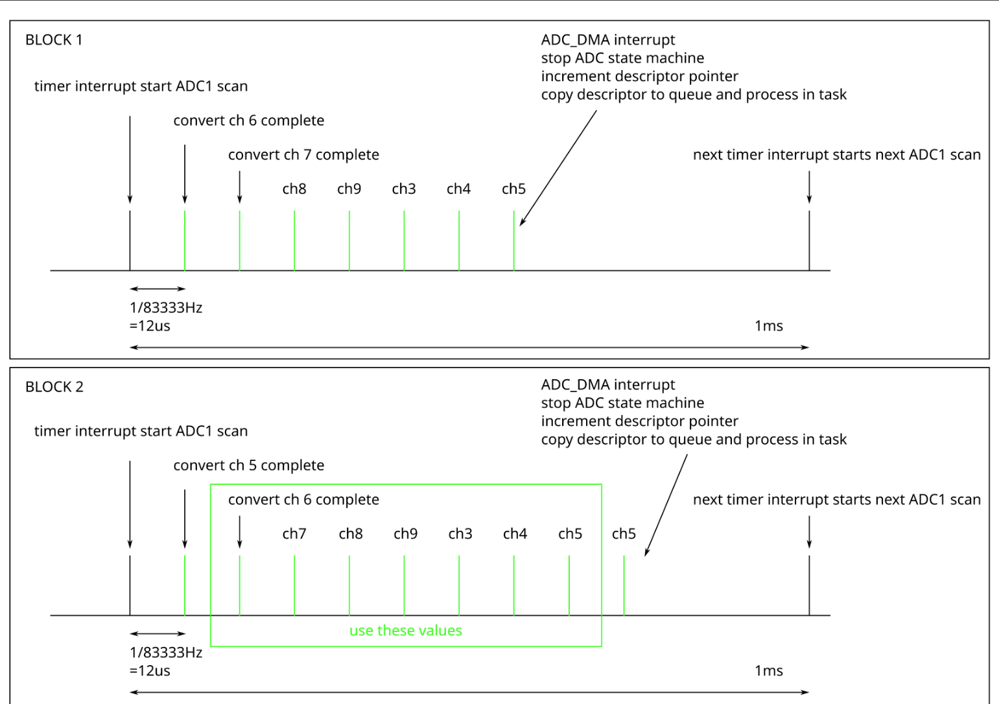

# ADC定时扫描

## 问题描述

```txt
案例 208997 + 案例 208947

我们对 ESP32S3 ADC 有一个疑问。

我们想要得到什么（见附件中的 BLOCK 1）？
有一个 1kHz 的定时器中断
中断启动 ADC 采样
需要以最大采样率扫描 7 个通道
7 个采样完成时触发 ADC_DMA 中断，停止 ADC 和 DMA，将转换结果从中断发送到队列中
在任务中处理数据
当 1kHz 中断再次发生时，重新开始扫描 7 个通道
我们实际得到的结果
DMA 存储器中的第一个样本始终为零。数据手册指出，这可能是因为只有在第一个 ADC 定时器进程完成后才开始采样。我们的理解是，DMA 在初始定时器超时结束时获得一个 “零 ”采样。这个 “零 ”数据将整个 32 位字设置为零。
例如，如果扫描了 7 个通道（预计 28 字节），那么在看似随机的时间间隔内，返回的 DMA 缓冲区长度为 24 字节，即没有最后一个样本。
列表中的第一个通道会被列表中最后一个通道的数据随机填充。这一点尚未得到证实，但我们怀疑这与第 2 点有关，即有一些残余状态/采样遗留下来，最终被转入第一个采样中。
我们的 “解决方案 ”见附件中的 BLOCK 2：
在要扫描的通道前后填充虚假读数，然后将其丢弃。具体做法是将我们最后要扫描的通道作为第一个、最后一个和倒数第二个扫描通道。第一次和最后一次扫描将被丢弃。这样就解决了最后一次扫描被丢弃以及最后一次扫描与第一次扫描交叉的问题。
设置额外的 DMA 传输，即如果我们需要 7 个通道的数据，则允许 8 次数据传输。这样可以确保在读取 7 个数据字的同时读取第一个假字。

与 esp-idf 示例不同的是，我们需要在每次扫描 7 个采样点时停止并重新启动 ADC/DMA。
附件中是我们使用的一些相关代码。

我想知道 ADC 时钟的停止和重启是否是问题的一部分？
esp32s3->adc_ll.h, static inline void adc_ll_digi_set_trigger_interval() 注释是
“触发间隔不应小于 SAR ADC 的采样时间。(最小值为 30）。如果时钟在翻转后停止，它可能包含一个不为零的值。adc_ll_digi_trigger_enable(hal->dev); "是否会重置时钟？是否有足够的时间测量第一个采样？

espressif 是否q有示例代码说明如何通过定时器（或其他）中断触发，周期性地扫描一组 ADC 通道？

如果您需要更多描述问题的信息，请告诉我。
```




```c
extern QueueHandle_t g_adc_data_queue;
dma_descriptor_t g_descriptor;

IRAM_ATTR void adc_digi_suspend(void)
{
    adc_hal_digi_suspend(&s_adc_digi_ctx->hal);
}

static IRAM_ATTR bool s_adc_dma_intr(adc_digi_context_t *adc_digi_ctx)
{
    portBASE_TYPE taskAwoken = 0;
    dma_descriptor_t *current_desc = (dma_descriptor_t *)adc_digi_ctx->rx_eof_desc_addr;

    adc_hal_digi_suspend(&adc_digi_ctx->hal);
    //  copy descriptor and set owner now
    memcpy(&g_descriptor, &current_desc, sizeof(g_descriptor));
    current_desc->dw0.length = 0;
    current_desc->dw0.owner = 1;
    // Advance the DMA descriptor pointer
    // The next sample will use "cur_desc_ptr"
    adc_digi_ctx->hal.cur_desc_ptr = adc_digi_ctx->hal.cur_desc_ptr->next;

    xQueueSendToBackFromISR(g_adc_data_queue, &g_descriptor, &taskAwoken);//current_desc

    return (taskAwoken == pdTRUE);
}

IRAM_ATTR void adc_hal_digi_restart(adc_hal_context_t *hal)
{
    //start DMA
    adc_dma_ll_rx_start(hal->dev, hal->dma_chan, (lldesc_t *)hal->cur_desc_ptr);
    //connect DMA and peripheral
    adc_ll_digi_dma_enable();
    //start ADC
    adc_ll_digi_trigger_enable(hal->dev);
}

IRAM_ATTR void adc_hal_digi_suspend(adc_hal_context_t *hal)
{
    //stop ADC
    adc_ll_digi_trigger_disable(hal->dev);
    //stop DMA
    adc_dma_ll_rx_stop(hal->dev, hal->dma_chan);
    //disconnect DMA and peripheral
    adc_ll_digi_dma_disable();

    //reset DMA
    adc_dma_ll_rx_reset_channel(hal->dev, hal->dma_chan);
    //reset peripheral
    adc_ll_digi_reset(hal->dev);
}

void adc_hal_digi_start(adc_hal_context_t *hal, uint8_t *data_buf)
{
    //stop peripheral and DMA
    adc_hal_digi_stop(hal);

    //reset DMA
    adc_dma_ll_rx_reset_channel(hal->dev, hal->dma_chan);
    //reset peripheral
    adc_ll_digi_reset(hal->dev);

    //reset the current descriptor address
    hal->cur_desc_ptr = &hal->desc_dummy_head;
    adc_hal_digi_dma_link_descriptors(hal->rx_desc, data_buf, hal->eof_num * ADC_HAL_DATA_LEN_PER_CONV, hal->desc_max_num);

    hal->cur_desc_ptr = (dma_descriptor_t *)hal->rx_desc;
#if 0
    //start DMA
    adc_dma_ll_rx_start(hal->dev, hal->dma_chan, (lldesc_t *)hal->rx_desc);
    //connect DMA and peripheral
    adc_ll_digi_dma_enable();
    //start ADC
    adc_ll_digi_trigger_enable(hal->dev);
#endif
}
```


## 分析过程


### API分析

```c
static inline void adc_ll_digi_trigger_enable(void)
{
    APB_SARADC.ctrl2.timer_sel = 1; // 选择 SAR ADC的定时器
    APB_SARADC.ctrl2.timer_en = 1; // 使能SAR ADC定时器触发
}
```

如果要停止adc的时钟，应该先调用这个：
```c
static inline void adc_ll_digi_trigger_disable(void)
{
    APB_SARADC.ctrl2.timer_en = 0;
}
```

然后再调用`adc_ll_digi_trigger_enable`。


### 客户代码分析：

初步感觉是`adc_digi_init_config_t`的问题，既然每次都是`NUM_ADC_CHANNELS`个通道上，那`adc_digi_init_config_t.conv_num_each_intr`就应该等于`(NUM_ADC_CHANNELS)*ADC_RESULT_BYTE`，但是客户写的却是`(NUM_ADC_CHANNELS+1)*ADC_RESULT_BYTE`，那adc队列返回的结果却是就会多一个，而且每次都是`channel=0和data=0`的情况，修改一下就没有复现问题了：

```c
adc_digi_init_config_t adc_dma_config = {
    .max_store_buf_size = NUM_DMA_BUFFERS,
    .conv_num_each_intr = (NUM_ADC_CHANNELS)*ADC_RESULT_BYTE, // Note: wait NUM_ADC_CHANNELS+1
    .adc1_chan_mask = adc1_chan_mask,
    .adc2_chan_mask = adc2_chan_mask,
};
```
