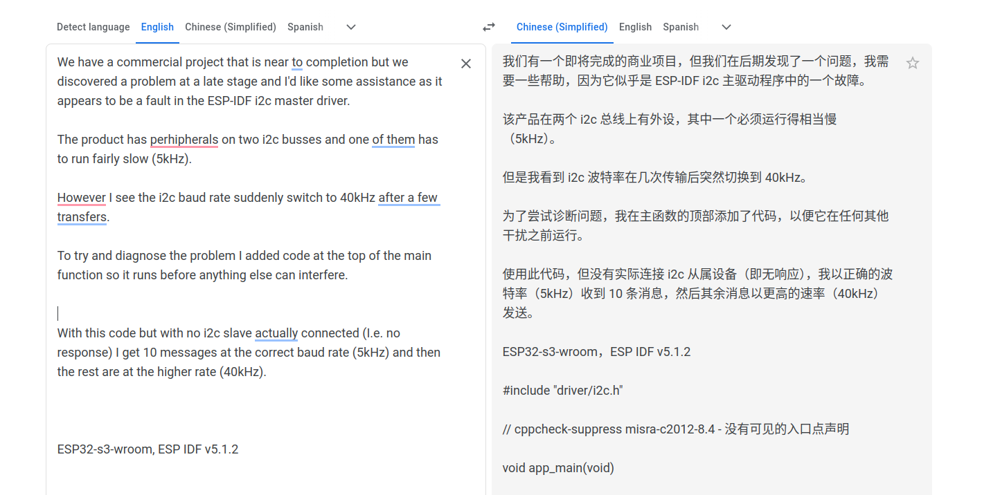
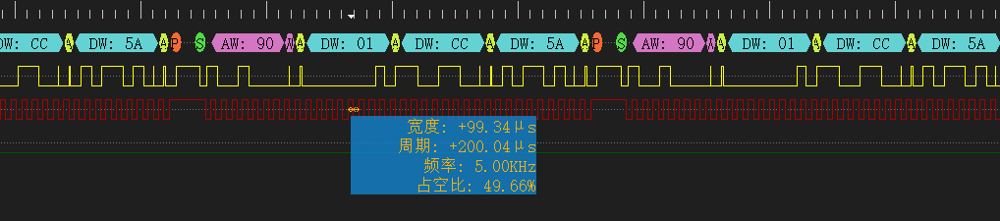
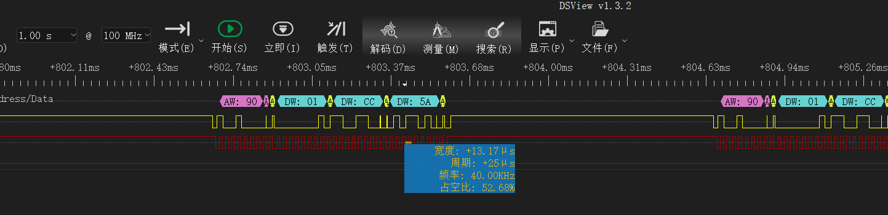
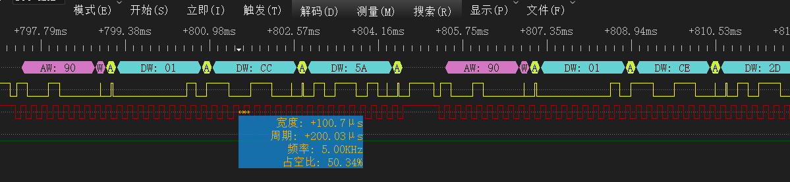

# i2c 频率问题

问题描述：



## 测试过程

测试代码：

```c
#include <stdio.h>
#include "driver/i2c.h"
#include "freertos/FreeRTOS.h"
#include "freertos/task.h"

#define I2C_EXT_SDA_GPIO 14
#define I2C_EXT_SCL_GPIO 21
#define I2C_EXT_SPEED 5000
#define EXTERNAL_I2C_CHANNEL I2C_NUM_0
#define CELL_ADC_ADDR 0x48

void app_main(void)
{
    const i2c_config_t conf0 = {
        .mode = I2C_MODE_MASTER,
        .sda_io_num = I2C_EXT_SDA_GPIO,
        .scl_io_num = I2C_EXT_SCL_GPIO,
        .sda_pullup_en = GPIO_PULLUP_DISABLE,
        .scl_pullup_en = GPIO_PULLUP_DISABLE,
        .master.clk_speed = I2C_EXT_SPEED,
        .clk_flags = 0,
    };
    i2c_param_config(EXTERNAL_I2C_CHANNEL, &conf0);
    i2c_driver_install(EXTERNAL_I2C_CHANNEL, conf0.mode, 0, 0, 0);

    while (1)
    {
        uint8_t buf[3];
        buf[0] = 1;
        buf[1] = 0XCC;
        buf[2] = 0x5A;
        esp_err_t res = i2c_master_write_to_device(I2C_NUM_0, CELL_ADC_ADDR, buf, 3, 10);
        vTaskDelay(1);
    }
}


```

### CLK频率波形分析

在I2C写的初期阶段，CLK的频率确实是以5Khz进行的：




当模拟从机关闭后，再起开启从机后，clk的频率变化为40Khz，与客户现象保持一致：




### 不同IDF版本问题是否复现

* idf master: 未复现
* idf release V5.2：未复现


### 问题排查：

当从机断开连接的时候，会触发`i2c_hw_disable`的操作，在里面同步触发`periph_module_disable`的操作：

```c
static inline void periph_ll_disable_clk_set_rst(periph_module_t periph)
{
    DPORT_CLEAR_PERI_REG_MASK(periph_ll_get_clk_en_reg(periph), periph_ll_get_clk_en_mask(periph));
    DPORT_SET_PERI_REG_MASK(periph_ll_get_rst_en_reg(periph), periph_ll_get_rst_en_mask(periph, false));
}
```

同时，在 **V5.1.2** 中，hw的disable和enable是分开的，分别对应如下：

```c
static void i2c_hw_disable(i2c_port_t i2c_num)
{
    I2C_ENTER_CRITICAL(&(i2c_context[i2c_num].spinlock));
    if (i2c_context[i2c_num].hw_enabled != false) {
        periph_module_disable(i2c_periph_signal[i2c_num].module);
        i2c_context[i2c_num].hw_enabled = false;
    }
    I2C_EXIT_CRITICAL(&(i2c_context[i2c_num].spinlock));
}

static void i2c_hw_enable(i2c_port_t i2c_num)
{
    I2C_ENTER_CRITICAL(&(i2c_context[i2c_num].spinlock));
    if (i2c_context[i2c_num].hw_enabled != true) {
        periph_module_enable(i2c_periph_signal[i2c_num].module);
        i2c_context[i2c_num].hw_enabled = true;
    }
    I2C_EXIT_CRITICAL(&(i2c_context[i2c_num].spinlock));
}


void periph_module_enable(periph_module_t periph)
{
    assert(periph < PERIPH_MODULE_MAX);
    portENTER_CRITICAL_SAFE(&periph_spinlock);
    if (ref_counts[periph] == 0) {
        periph_ll_enable_clk_clear_rst(periph);
    }
    ref_counts[periph]++;
    portEXIT_CRITICAL_SAFE(&periph_spinlock);
}

void periph_module_disable(periph_module_t periph)
{
    assert(periph < PERIPH_MODULE_MAX);
    portENTER_CRITICAL_SAFE(&periph_spinlock);
    ref_counts[periph]--;
    if (ref_counts[periph] == 0) {
        periph_ll_disable_clk_set_rst(periph);
    }
    portEXIT_CRITICAL_SAFE(&periph_spinlock);
}

static inline void periph_ll_enable_clk_clear_rst(periph_module_t periph)
{
    DPORT_SET_PERI_REG_MASK(periph_ll_get_clk_en_reg(periph), periph_ll_get_clk_en_mask(periph));
    DPORT_CLEAR_PERI_REG_MASK(periph_ll_get_rst_en_reg(periph), periph_ll_get_rst_en_mask(periph, true));
}

static inline void periph_ll_disable_clk_set_rst(periph_module_t periph)
{
    DPORT_CLEAR_PERI_REG_MASK(periph_ll_get_clk_en_reg(periph), periph_ll_get_clk_en_mask(periph));
    DPORT_SET_PERI_REG_MASK(periph_ll_get_rst_en_reg(periph), periph_ll_get_rst_en_mask(periph, false));
}


```

但是，在V5.2的版本中，disable和enable是一个操作，对应：

```c
static void i2c_hw_disable(i2c_port_t i2c_num)
{
    I2C_ENTER_CRITICAL(&(i2c_context[i2c_num].spinlock));
    if (i2c_context[i2c_num].hw_enabled != false) {
        I2C_RCC_ATOMIC() {
            i2c_ll_enable_bus_clock(i2c_num, false);
        }
        i2c_context[i2c_num].hw_enabled = false;
    }
    I2C_EXIT_CRITICAL(&(i2c_context[i2c_num].spinlock));
}

static void i2c_hw_enable(i2c_port_t i2c_num)
{
    I2C_ENTER_CRITICAL(&(i2c_context[i2c_num].spinlock));
    if (i2c_context[i2c_num].hw_enabled != true) {
        I2C_RCC_ATOMIC() {
            i2c_ll_enable_bus_clock(i2c_num, true);
            i2c_ll_reset_register(i2c_num);
        }
        i2c_context[i2c_num].hw_enabled = true;
    }
    I2C_EXIT_CRITICAL(&(i2c_context[i2c_num].spinlock));
}

static inline void i2c_ll_enable_bus_clock(int i2c_port, bool enable)
{
    if (i2c_port == 0) {
        SYSTEM.perip_clk_en0.i2c_ext0_clk_en = enable;
    } else if (i2c_port == 1) {
        SYSTEM.perip_clk_en0.i2c_ext1_clk_en = enable;
    }
}

/// use a macro to wrap the function, force the caller to use it in a critical section
/// the critical section needs to declare the __DECLARE_RCC_ATOMIC_ENV variable in advance
#define i2c_ll_enable_bus_clock(...) do {(void)__DECLARE_RCC_ATOMIC_ENV; i2c_ll_enable_bus_clock(__VA_ARGS__);} while(0)

```

所以关键就在于 是在复位外设的过程中把时钟频率的配置信息给清除了。


## 解决过程：

在`i2c_hw_disable`的时候，不去复位外设，而是去清除外设：

```c
static inline void periph_i2c_disable_clk_set_rst(periph_module_t periph)
{
    DPORT_CLEAR_PERI_REG_MASK(periph_ll_get_clk_en_reg(periph), periph_ll_get_clk_en_mask(periph));
    DPORT_CLEAR_PERI_REG_MASK(periph_ll_get_rst_en_reg(periph), periph_ll_get_rst_en_mask(periph, false));
}
```



[i2c_patch](./src/i2c_change.patch)