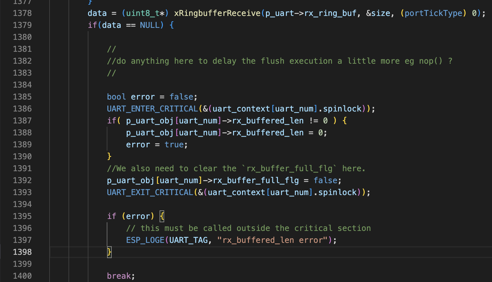
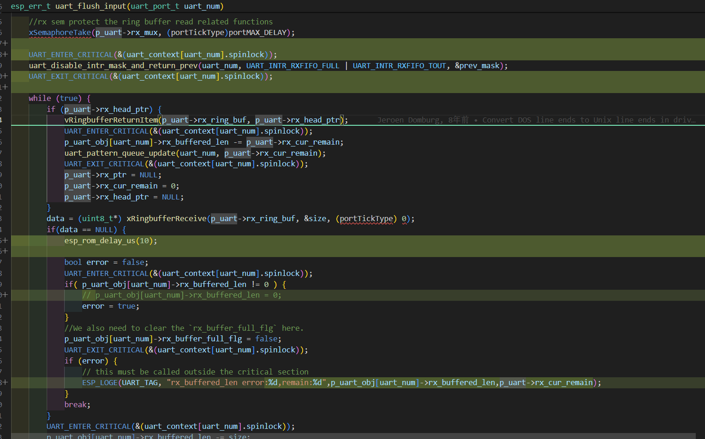
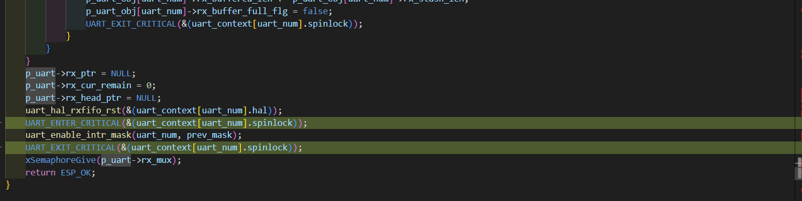
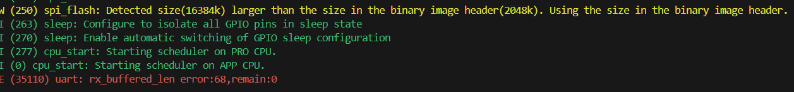
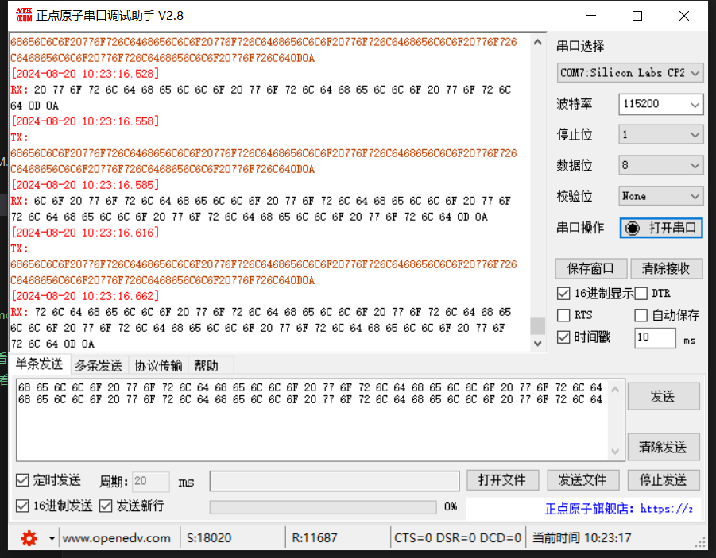
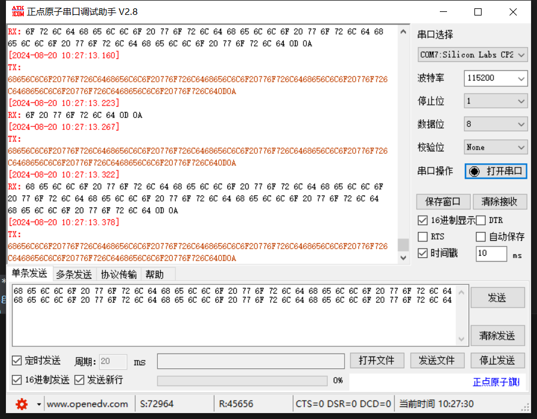
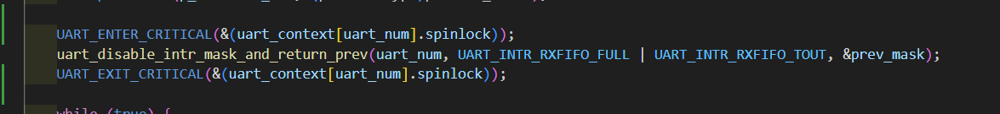
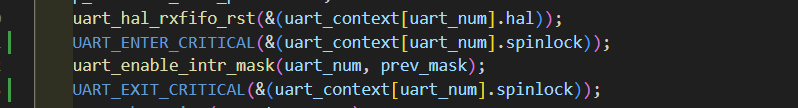

# uart flush input 中的 rx_buffered_len error


问题描述：

```txt
- We're based of 4.4.0 -  https://github.com/espressif/esp-idf/commit/8153bfe4125e6a608abccf1561fd10285016c90a  
- We've applied a fix on uart related to the proper restore of `RX interrupts after a flush` (https://github.com/espressif/esp-idf/commit/708e3b6ec0a21bdba1e9b1b7a21af629b5692b83#diff-8f585e8a3337213532ef1a8823cd3c7f7835158325bb599a8500a298e4b80c6c) .


>> 2. how to reproduce the issue? Can it be reproduced with a simple demo code? If so, it would be great to help provide one.
- we're evaluating how often the issue happens on the product with the final software.  
- What we noticed is that if you add more code before the execution enters into the critical region (line 1386 on image below) , the issue happens more often.
-- We suspect concurrency between the uart rx interrupt handler and the task we call flush_input from. In our case, the uart is initialized on cpu0 and our serial protocol handler is pinned to cpu1.

```


```txt
>> 1. 您正在使用的 IDF 的详细版本，IDF commit 将有所帮助。
- 我们基于 4.4.0 - https://github.com/espressif/esp-idf/commit/8153bfe4125e6a608abccf1561fd10285016c90a  
- 我们已经在 uart 上应用了一个与刷新后正确恢复 “RX 中断 ”有关的修复程序 (https://github.com/espressif/esp-idf/commit/708e3b6ec0a21bdba1e9b1b7a21af629b5692b83#diff-8f585e8a3337213532ef1a8823cd3c7f7835158325bb599a8500a298e4b80c6c) .

>> 2. 如何重现该问题？能否用简单的演示代码重现该问题？如果可以，最好能提供一个。
- 我们正在评估该问题在最终软件产品上的发生频率。 
- 我们注意到，如果在执行进入临界区域（下图第 1386 行）之前添加更多代码，问题发生的频率会更高。
-- 我们怀疑 uart rx 中断处理程序与我们调用 flush_input 的任务之间存在并发性。在我们的案例中，uart 在 cpu0 上初始化，而串行协议处理程序被固定在 cpu1 上。


```




## 测试过程

测试分支：
```shell
➜  esp-idf git:(v4.4) ✗ gcor 8153bfe     
```

分支改动内容：





测试代码：

```c
#include <stdio.h>
#include "freertos/FreeRTOS.h"
#include "freertos/task.h"
#include "driver/uart.h"
#include "driver/gpio.h"

#define BUF_SIZE (1024)

static void uart_init_task(void *arg)
{
    /* Configure parameters of an UART driver,
     * communication pins and install the driver */
    uart_config_t uart_config = {
        .baud_rate = 115200,
        .data_bits = UART_DATA_8_BITS,
        .parity = UART_PARITY_DISABLE,
        .stop_bits = UART_STOP_BITS_1,
        .flow_ctrl = UART_HW_FLOWCTRL_DISABLE,
        .source_clk = UART_SCLK_APB,
    };
    int intr_alloc_flags = 0;

#if CONFIG_UART_ISR_IN_IRAM
    intr_alloc_flags = ESP_INTR_FLAG_IRAM;
#endif

    ESP_ERROR_CHECK(uart_driver_install(UART_NUM_1, BUF_SIZE * 2, 0, 0, NULL, intr_alloc_flags));
    ESP_ERROR_CHECK(uart_param_config(UART_NUM_1, &uart_config));
    ESP_ERROR_CHECK(uart_set_pin(UART_NUM_1, GPIO_NUM_4, GPIO_NUM_5, -1, -1));

    while (1)
    {
        vTaskDelay(10 / portTICK_PERIOD_MS);
    }
}

static void uart_read_task(void *arg)
{
    uint8_t *data = (uint8_t *)malloc(BUF_SIZE);

    while (1)
    {
        // Read data from the UART
        uart_flush_input(UART_NUM_1);

        int len = uart_read_bytes(UART_NUM_1, data, BUF_SIZE, 10 / portTICK_PERIOD_MS);

        // Write data back to the UART
        uart_write_bytes(UART_NUM_1, (const char *)data, len);
    }
}

void app_main(void)
{
    xTaskCreatePinnedToCore(uart_init_task, "uart_init_task", 5 * 1024, NULL, 4, NULL, 0);
    xTaskCreatePinnedToCore(uart_read_task, "uart_read_task", 5 * 1024, NULL, 5, NULL, 1);
}


```

### 1.分配在不同的核上，中断不放在IRAM上：

有效复现问题，关rx中断已加锁，flush中加空延时






### 2.分配在不同核上，中断放在IRAM上：
有效复现问题，关rx中断已加锁，flush中加空延时



### 3.分配在同一个核上，中断放在IRAM上：
关rx中断已加锁，flush中加空延时：

未复现问题

### 4.分配在同一个核上，中断未放在IRAM上：
关rx中断已加锁，flush中加空延时：

未复现问题


## 问题分析

### 核0初始化 UART

`uart_driver_install`在核0上初始化，其中`uart_isr_register`注册中断：

```c
    r = uart_isr_register(uart_num, uart_rx_intr_handler_default, p_uart_obj[uart_num], intr_alloc_flags, &p_uart_obj[uart_num]->intr_handle);
```

其中`uart_rx_intr_handler_default`中断函数存在更新rx_buffered_len的操作：

```c
p_uart->rx_buffered_len += p_uart->rx_stash_len;
```

如下为`uart_isr_register`函数说明：

```c
/**
 * @brief Register UART interrupt handler (ISR).
 *
 * @note UART ISR handler will be attached to the same CPU core that this function is running on.
 *
 * @param uart_num UART port number, the max port number is (UART_NUM_MAX -1).
 * @param fn  Interrupt handler function.
 * @param arg parameter for handler function
 * @param intr_alloc_flags Flags used to allocate the interrupt. One or multiple (ORred)
 *        ESP_INTR_FLAG_* values. See esp_intr_alloc.h for more info.
 * @param handle Pointer to return handle. If non-NULL, a handle for the interrupt will
 *        be returned here.
 *
 * @return
 *     - ESP_OK   Success
 *     - ESP_FAIL Parameter error
 */
esp_err_t uart_isr_register(uart_port_t uart_num, void (*fn)(void*), void * arg, int intr_alloc_flags,  uart_isr_handle_t *handle);
```

从函数申明中可以看到，UART ISR 处理程序将连接到与此函数运行在同一 CPU 内核上。所以，此时的RX接收中断函数运行在核0。

进一步分析`uart_isr_register`,中断由`esp_intr_alloc`注册：

```c
/**
 * @brief Allocate an interrupt with the given parameters.
 *
 * This finds an interrupt that matches the restrictions as given in the flags
 * parameter, maps the given interrupt source to it and hooks up the given
 * interrupt handler (with optional argument) as well. If needed, it can return
 * a handle for the interrupt as well.
 *
 * The interrupt will always be allocated on the core that runs this function.
 *
 * If ESP_INTR_FLAG_IRAM flag is used, and handler address is not in IRAM or
 * RTC_FAST_MEM, then ESP_ERR_INVALID_ARG is returned.
 *
 * @param source The interrupt source. One of the ETS_*_INTR_SOURCE interrupt mux
 *               sources, as defined in soc/soc.h, or one of the internal
 *               ETS_INTERNAL_*_INTR_SOURCE sources as defined in this header.
 * @param flags An ORred mask of the ESP_INTR_FLAG_* defines. These restrict the
 *               choice of interrupts that this routine can choose from. If this value
 *               is 0, it will default to allocating a non-shared interrupt of level
 *               1, 2 or 3. If this is ESP_INTR_FLAG_SHARED, it will allocate a shared
 *               interrupt of level 1. Setting ESP_INTR_FLAG_INTRDISABLED will return
 *               from this function with the interrupt disabled.
 * @param handler The interrupt handler. Must be NULL when an interrupt of level >3
 *               is requested, because these types of interrupts aren't C-callable.
 * @param arg    Optional argument for passed to the interrupt handler
 * @param ret_handle Pointer to an intr_handle_t to store a handle that can later be
 *               used to request details or free the interrupt. Can be NULL if no handle
 *               is required.
 *
 * @return ESP_ERR_INVALID_ARG if the combination of arguments is invalid.
 *         ESP_ERR_NOT_FOUND No free interrupt found with the specified flags
 *         ESP_OK otherwise
 */
esp_err_t esp_intr_alloc(int source, int flags, intr_handler_t handler, void *arg, intr_handle_t *ret_handle);

```

The interrupt will always be allocated on the core that runs this function(中断总是分配给运行此函数的内核)。指明了**rx的中断函数被注册到核0上**。


### 核1运行flush_input

在核1上的`uart_flush_input`中存在关闭rx接收中断的操作：

```c
uart_disable_intr_mask_and_return_prev(uart_num, UART_INTR_RXFIFO_FULL | UART_INTR_RXFIFO_TOUT, &prev_mask);
```

其与`uart_disable_rx_intr`行为保持一致：

```c
esp_err_t uart_disable_rx_intr(uart_port_t uart_num)
{
    return uart_disable_intr_mask(uart_num, UART_INTR_RXFIFO_FULL | UART_INTR_RXFIFO_TOUT);
}
```


此时就存在，在核1上操作和0的中断，而`p_uart->rx_buffered_len`的操作处于核0上，导致存在对`p_uart->rx_buffered_len`的影响，进一步触发`rx_buffered_len error`的问题。


## 解决方案

参考`IDF Release 4.4 及以后版本`中`uart_flush_input`的改动，增加在开启与关闭uart rx中断时加锁，并将`uart_driver_install`与`uart_flush_input`放在同一核上。






```c
UART_ENTER_CRITICAL(&(uart_context[uart_num].spinlock));
uart_disable_intr_mask_and_return_prev(uart_num, UART_INTR_RXFIFO_FULL | UART_INTR_RXFIFO_TOUT, &prev_mask);
UART_EXIT_CRITICAL(&(uart_context[uart_num].spinlock));
```

```c
UART_ENTER_CRITICAL(&(uart_context[uart_num].spinlock));
uart_enable_intr_mask(uart_num, prev_mask);
UART_EXIT_CRITICAL(&(uart_context[uart_num].spinlock));
```

```c
xTaskCreatePinnedToCore(uart_init_task, "uart_init_task", 5 * 1024, NULL, 4, NULL, 0);
xTaskCreatePinnedToCore(uart_read_task, "uart_read_task", 5 * 1024, NULL, 5, NULL, 0);
```
