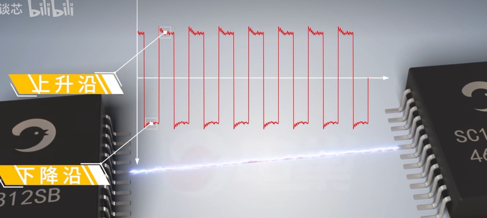

# 信号线串电阻

### 1.阻抗匹配，吸收反射信号
发射端阻抗一般是14-40Ω，接收端一般是CMOS输入，输入阻抗较大。

当信号从发送端到接收端，就会产生反射，会与发送产生干扰，产生过冲或震荡。

在发射端串一个电阻，可以有效改善，阻值一般小于100Ω

### 2.吸收干扰信号
走线较长，或者靠近一些快速脉冲信号的时候，发射信号就很容易耦合一些窄脉冲或者毛刺。

阻值一般是KΩ级别，靠经接收端

