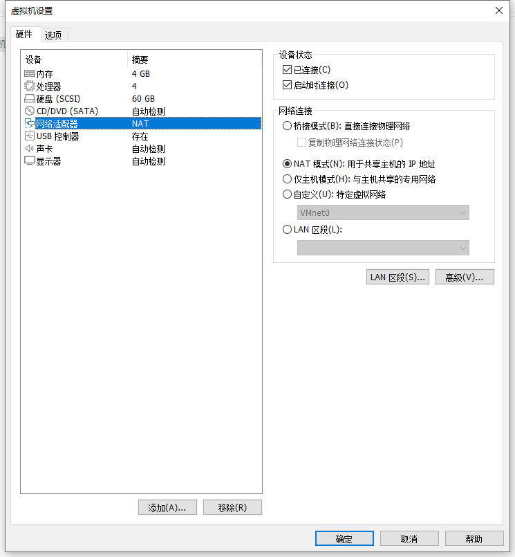
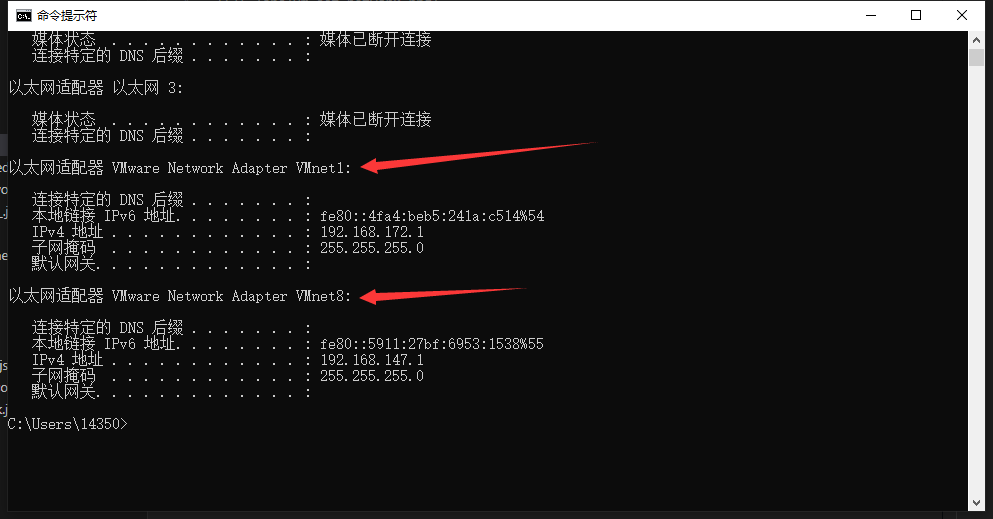
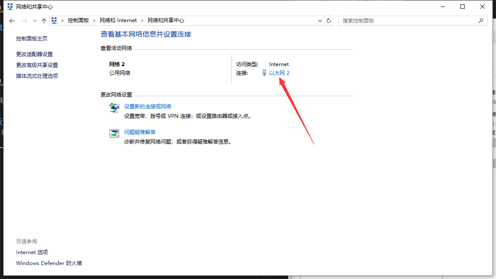
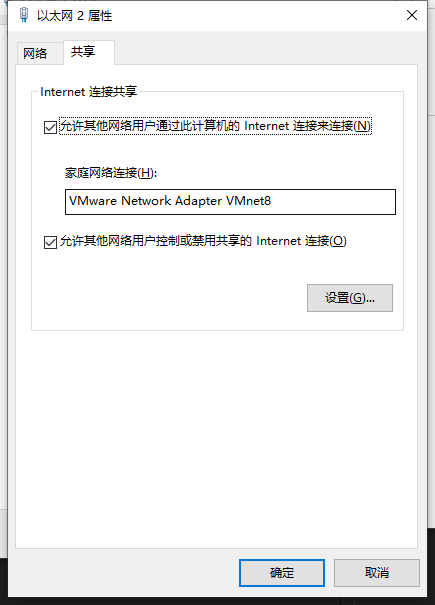
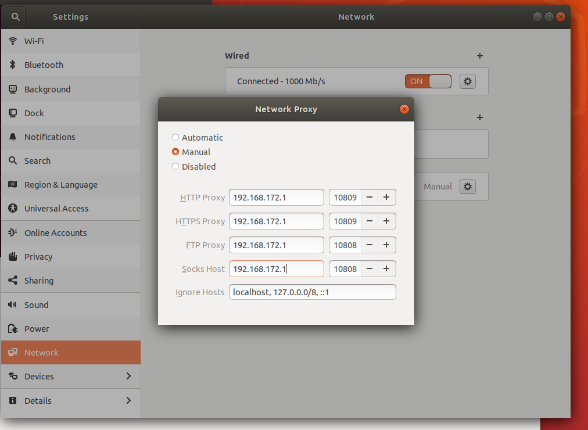
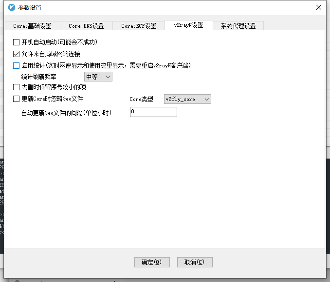

# VMWare虚拟机使用主机代理

## 1.虚拟机网络设置为NET模式


## 2.查看虚拟机IP
cmd：
```shell
ipconfig
```


vm开头的，这两个IP地址不确定，到后面都要试一试。

## 3.控制面板设置网络共享
控制面板\网络和 Internet\网络和共享中心


这里他会自己有的，不需要我们选择



## 4.虚拟机设置
这里的IP地址就是上面cmd里的ipv4地址，两个都试一下



代理软件要开局域网共享：



添加完成后，重新开关下linux的网络即可。
