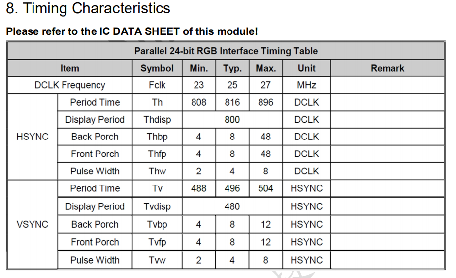
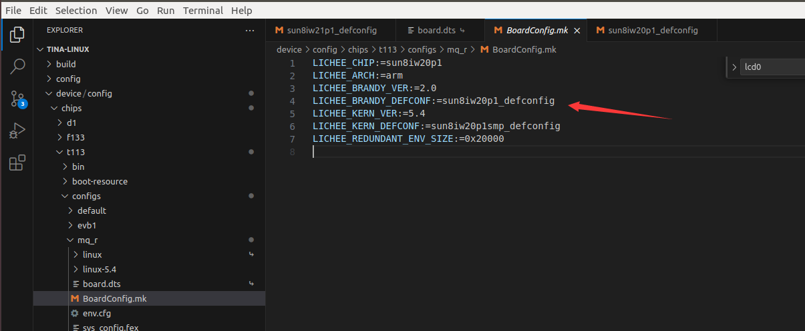
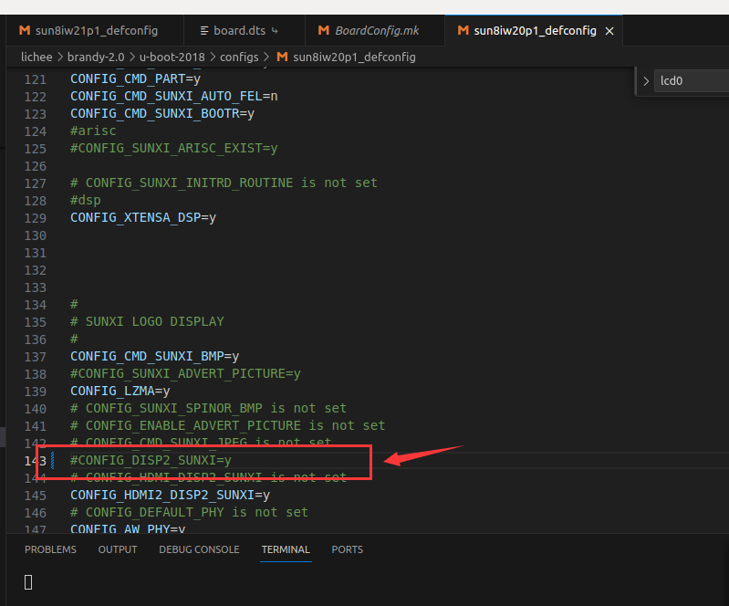
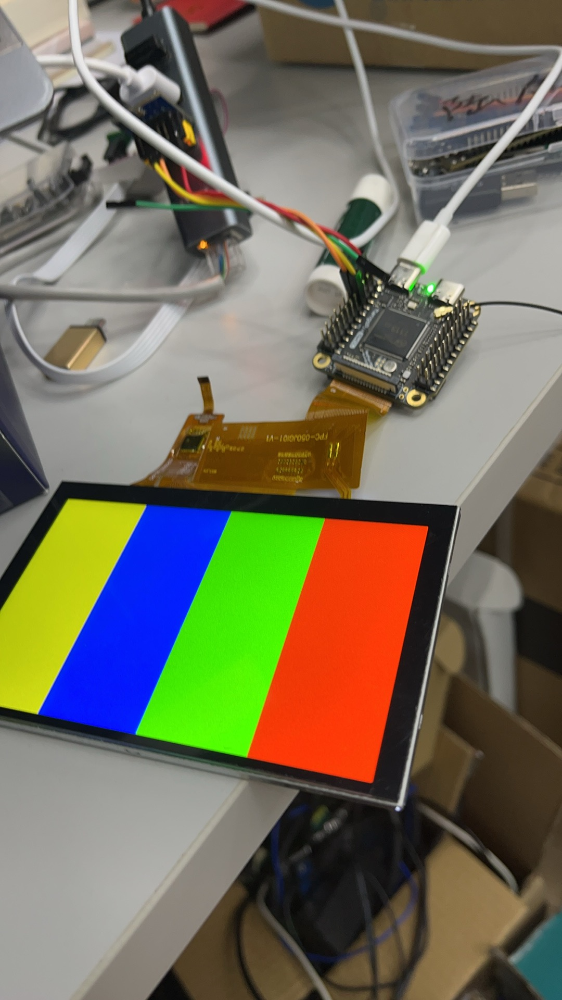

# 02 RGB屏幕驱动测试

屏幕的参考手册：[5寸IPS屏幕，800x480，RGB，GT911驱动，华泰科技](../../ref/模块/华泰IPS5寸.pdf)

对于t113而言，其设备树在：
```shell
/home/ubuntu/Tina-Linux/device/config/chips/t113/configs/mq_r/board.dts
```

### 1.设备树修改
我们需要修改的lcd驱动如下：

主要是我写done的部分
```dts
&lcd0 {
	lcd_used            = <1>;

	lcd_driver_name     = "default_lcd";
	lcd_backlight       = <50>;
	lcd_if              = <0>;

	lcd_x               = <800>;
	lcd_y               = <480>;
	lcd_width           = <150>;
	lcd_height          = <94>;
	lcd_dclk_freq       = <24>;

	lcd_pwm_used        = <1>;
	lcd_pwm_ch          = <7>;
	lcd_pwm_freq        = <500>;
	lcd_pwm_pol         = <0>;

	lcd_hbp             = <12>; //done
	lcd_ht              = <816>; //done
	lcd_hspw            = <4>; //done
	lcd_vbp             = <12>; //done
	lcd_vt              = <496>; //done
	lcd_vspw            = <4>; //done

	lcd_lvds_if         = <0>;
	lcd_lvds_colordepth = <1>;
	lcd_lvds_mode       = <0>;
	lcd_frm             = <0>;
	lcd_io_phase        = <0x0000>;
	lcd_gamma_en        = <0>;
	lcd_bright_curve_en = <0>;
	lcd_cmap_en         = <0>;

	deu_mode            = <0>;
	lcdgamma4iep        = <22>;
	smart_color         = <90>;

	pinctrl-0 = <&rgb18_pins_a>;
	pinctrl-1 = <&rgb18_pins_b>;
};
```



- HT（Hsync Total） HT 的值是 816，这个值不需要修改
- HBP（Hsync Back Porch）不过由于全志平台的 HBP 的含义是 HBP + HSPW，4+8=12
- HSPW（Hsync Plus Width），HSPW 的值是 4
- VT（Vsync Total）vT 的值是 496
- VBP（Vsync Back Porch）不过由于全志平台的 VBP 的含义是 VBP + VSPW，4+8=12
- VSPW（Vsync Plus Width）VSPW 的值是 4


### 2.uboot修改

此外，需要关闭UBOOT显示，不然会导致屏幕的CLK出现异常，不太清楚现在的sdk有没有修改。

打开麻雀的配置文件，可以发现配置是sun8iw20p1_defconfig



把CONFIG_DISP2_SUNXI给注释掉



un8iw21p1_defconfig里面的CONFIG_DISP2_SUNXI也注释掉


### 3.屏幕测试
常见的屏幕测试如下，分别是雪花屏，清除雪花屏和彩色条
```shell
cat /dev/unrandom > /dev/fb0 
cat /dev/zero > /dev/fb0
echo 8 > /sys/class/disp/disp/attr/colorbar
```

