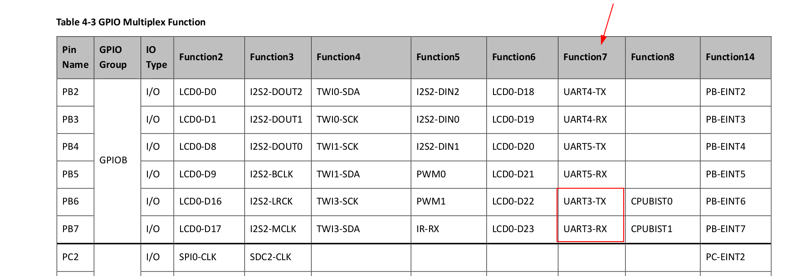
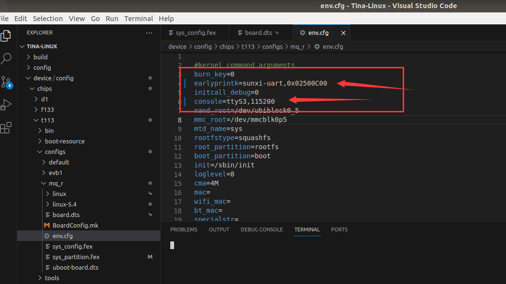
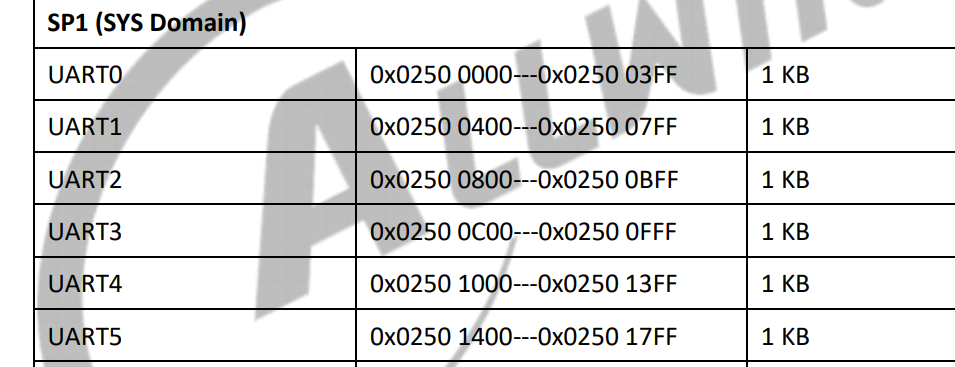
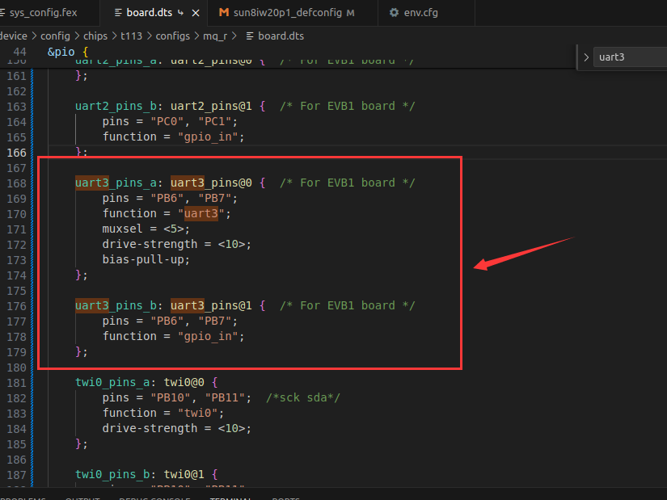
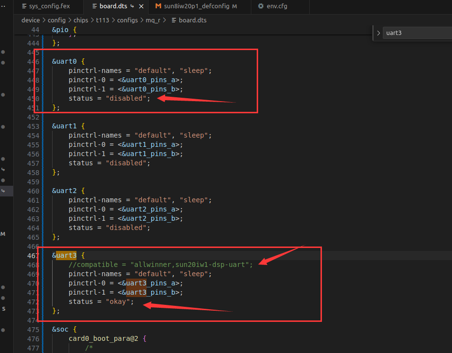
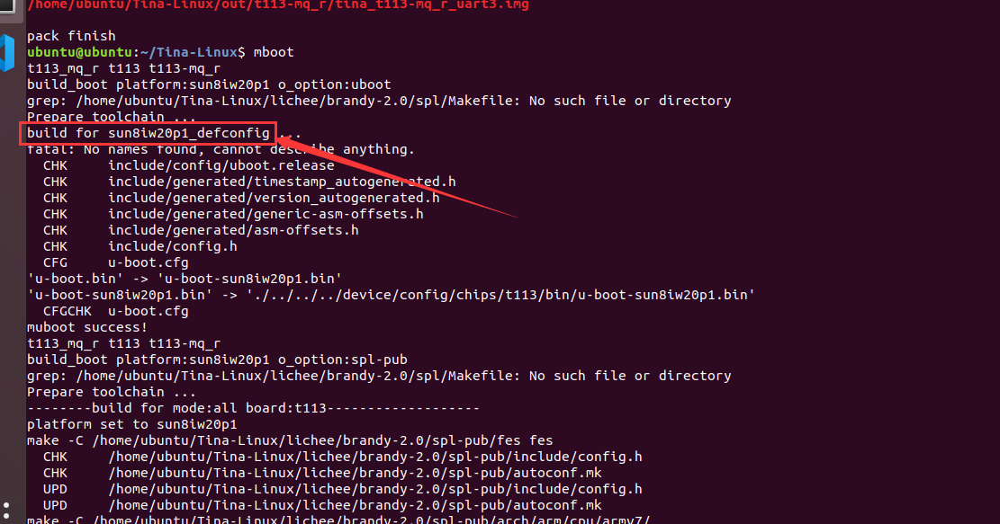
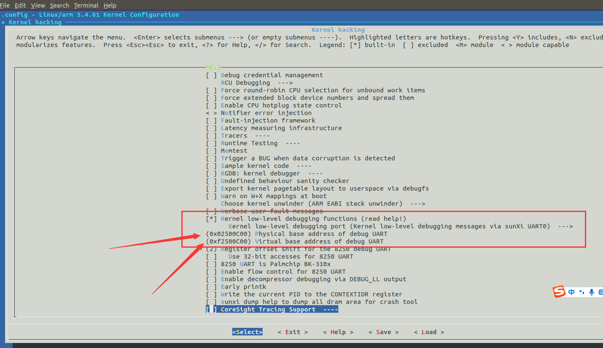

# 03 更换Debug口


### 1.修改sysconfig.fex
```c
device/config/chips/t113/configs/mq_r/sys_config.fex
```
```shell
[uart_para]
;uart_debug_port = 0
;uart_debug_tx   = port:PE02<6><1><default><default>
;uart_debug_rx   = port:PE03<6><1><default><default>

uart_debug_port = 3
uart_debug_tx   = port:PB06<7><1><default><default>
uart_debug_rx   = port:PB07<7><1><default><default>
```



这里的7代表功能7

### 2.修改env.cfg
```c
device/config/chips/t113/configs/mq_r/env.cfg
```


```shell
burn_key=0
earlyprintk=sunxi-uart,0x02500C00
initcall_debug=0
console=ttyS3,115200
```

解释一下0x02500C00




### 3.修改board.dts




```dts
	uart3_pins_a: uart3_pins@0 {  /* For EVB1 board */
		pins = "PB6", "PB7";
		function = "uart3";
		muxsel = <5>;
		drive-strength = <10>;
		bias-pull-up;
	};

	uart3_pins_b: uart3_pins@1 {  /* For EVB1 board */
		pins = "PB6", "PB7";
		function = "gpio_in";
	};
```

```dts
&uart0 {
	pinctrl-names = "default", "sleep";
	pinctrl-0 = <&uart0_pins_a>;
	pinctrl-1 = <&uart0_pins_b>;
	status = "disabled";
};

&uart1 {
	pinctrl-names = "default", "sleep";
	pinctrl-0 = <&uart1_pins_a>;
	pinctrl-1 = <&uart1_pins_b>;
	status = "disabled";
};

&uart2 {
	pinctrl-names = "default", "sleep";
	pinctrl-0 = <&uart2_pins_a>;
	pinctrl-1 = <&uart2_pins_b>;
	status = "disabled";
};

&uart3 {
	//compatible = "allwinner,sun20iw1-dsp-uart";
	pinctrl-names = "default", "sleep";
	pinctrl-0 = <&uart3_pins_a>;
	pinctrl-1 = <&uart3_pins_b>;
	status = "okay";
};
```

### 4.修改uboot
我们可以先用mboot查看下配置文件在哪里



```shell
sun8iw20p1_defconfig
```

在末尾追加
```c
CONFIG_BAUDRATE=115200
CONFIG_SPECIFY_CONSOLE_INDEX=y
CONFIG_CONS_INDEX=4                            # UART 3+1 = 4 
```

### 5.配置内核

```shell
make kernel_menuconfig
```


