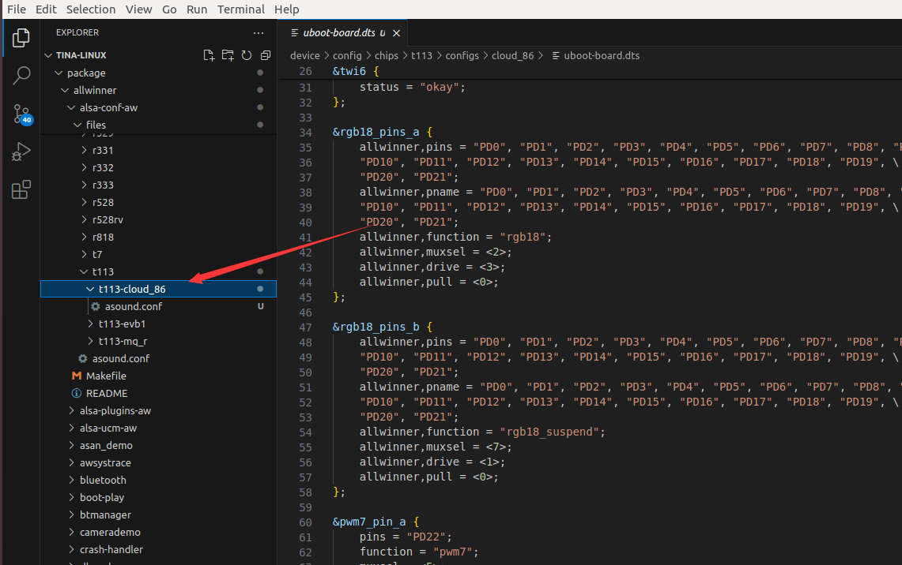
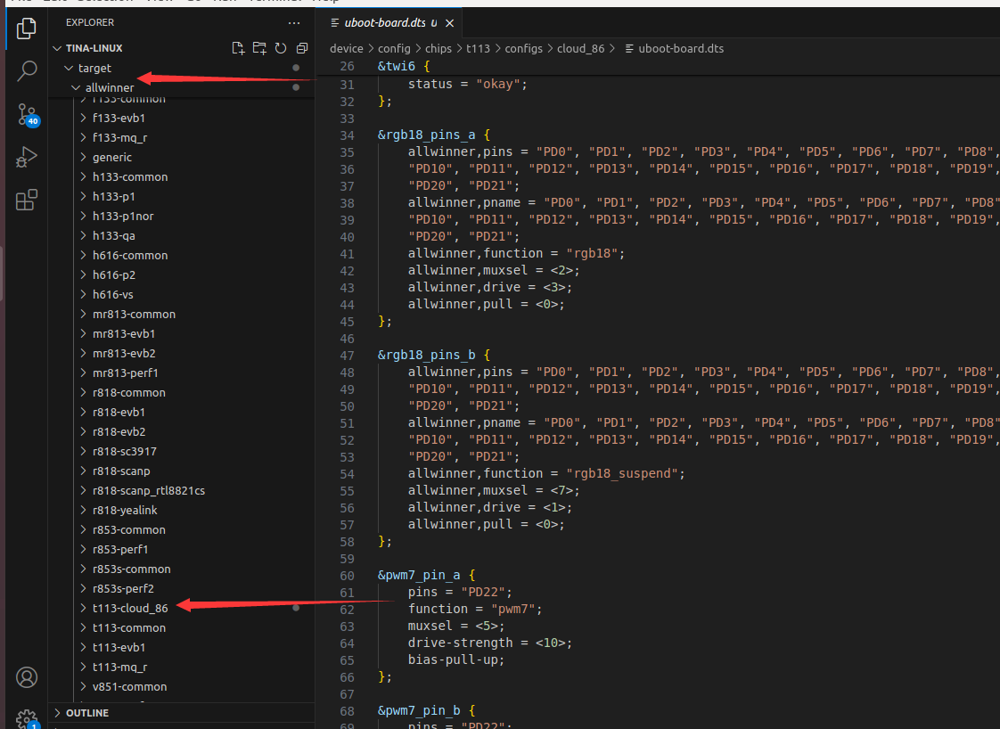
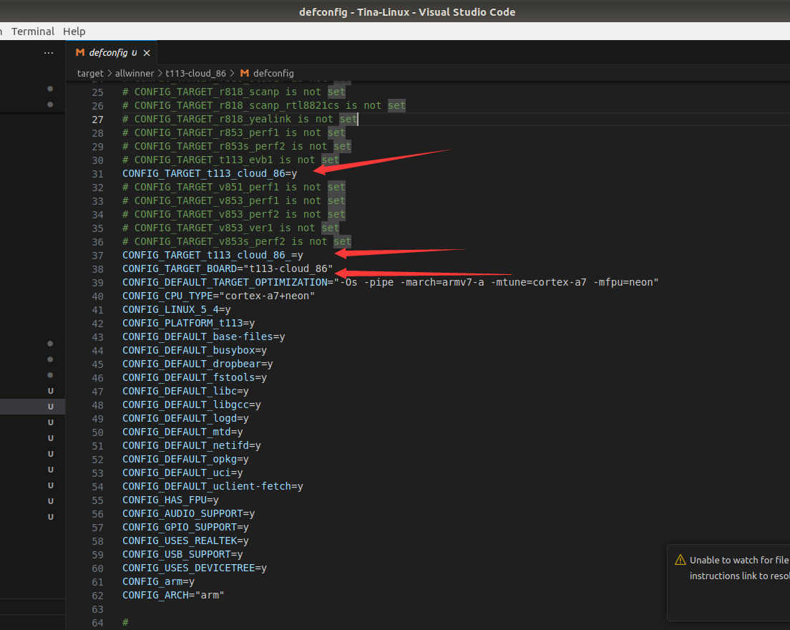
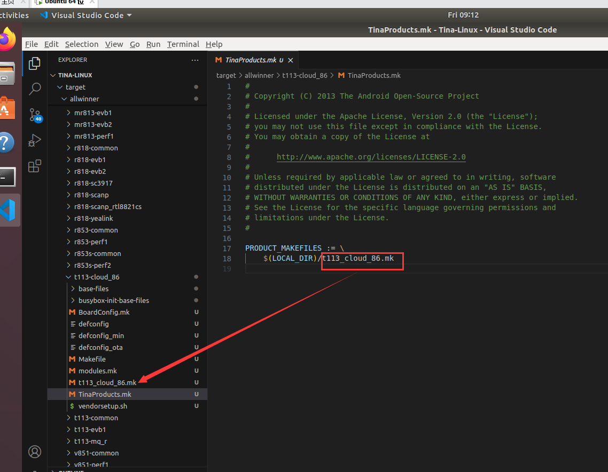

# 04 新建板级支持包

## 1.复制一份chips的配置文件
```shell
/home/ubuntu/Tina-Linux/device/config/chips/t113/configs/cloud_86
```

修改sys_config.fex

```c
[product]
version = "100"
machine = "cloud_86"
```


## 2.添加alsa-conf-aw

```c
/home/ubuntu/Tina-Linux/package/allwinner/alsa-conf-aw/files/t113
```

拷贝一份，创建自己的文件

```c
/home/ubuntu/Tina-Linux/package/allwinner/alsa-conf-aw/files/t113/t113-cloud_86
```



## 3.修改target

```c
/home/ubuntu/Tina-Linux/target/allwinner
```

我们还是在里面复制一份出来



### 3.1修改defconfig




### 3.2修改Makefile

主要是BOARD,BOADENAME

```C
include $(TOPDIR)/rules.mk

ARCH:=arm
BOARD:=t113-cloud_86
BOARDNAME:=t113-cloud_86
FEATURES:=fpu dt
CPU_TYPE:=cortex-a7
CPU_SUBTYPE:=neon
MAINTAINER:=Allwinner

KERNEL_PATCHVER:=5.4
UBOOT_PATCHVER:=2018
KERNELNAME:=zImage dtbs

include $(BUILD_DIR)/target.mk

DEFAULT_PACKAGES +=

$(eval $(call BuildTarget))
```


### 3.3修改TinaProducts.mk
```mk
PRODUCT_MAKEFILES := \
    $(LOCAL_DIR)/t113_cloud_86.mk
```

注意，这两个地方要一样




### 3.4修改vendorsetup

```sh
add_lunch_combo t113_cloud_86-tina
```

注意，后面-tina不要动

## 4.生成改动

```
ubuntu@ubuntu:~/Tina-Linux$ source build/envsetup.sh setup
```