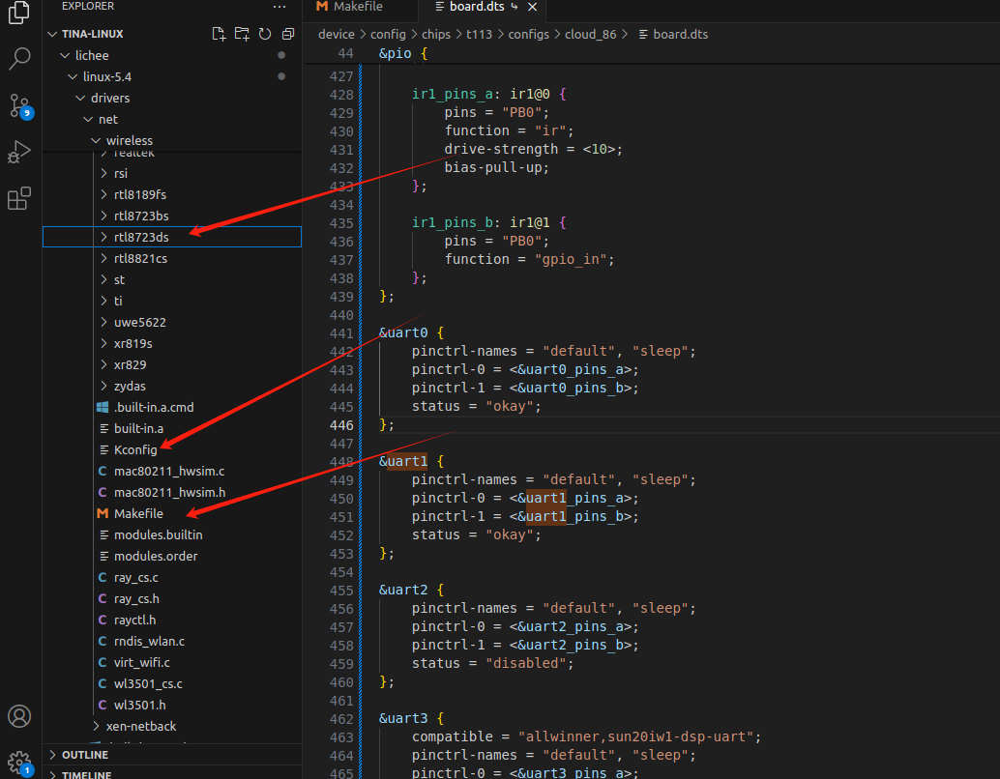
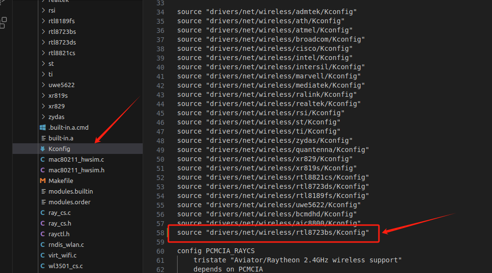
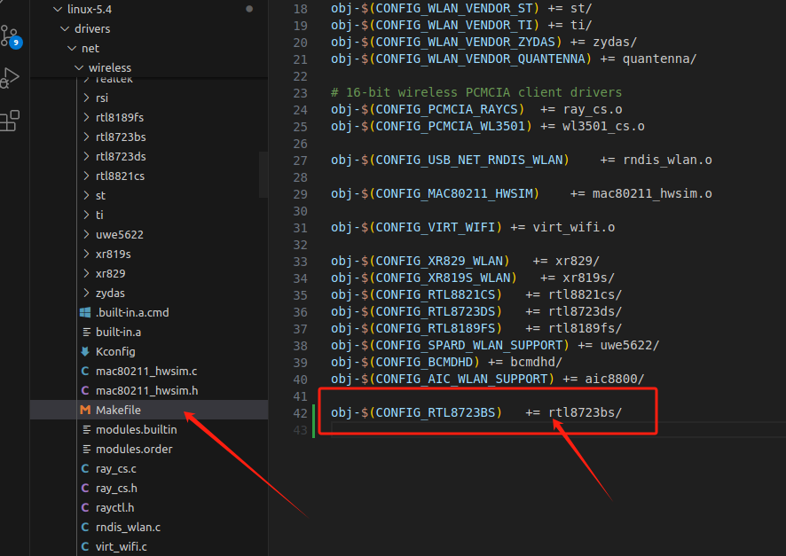
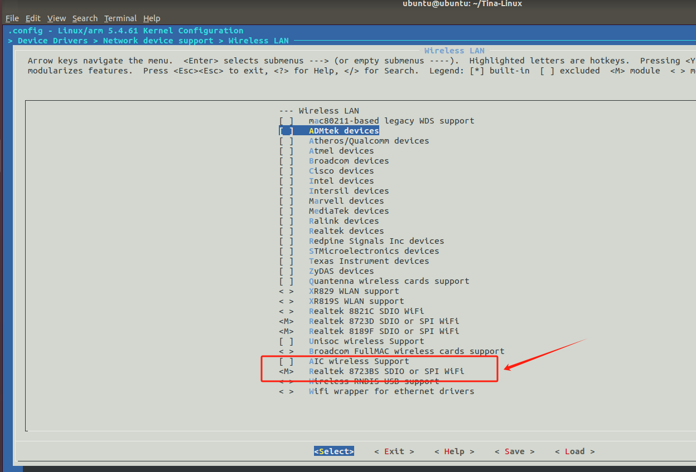
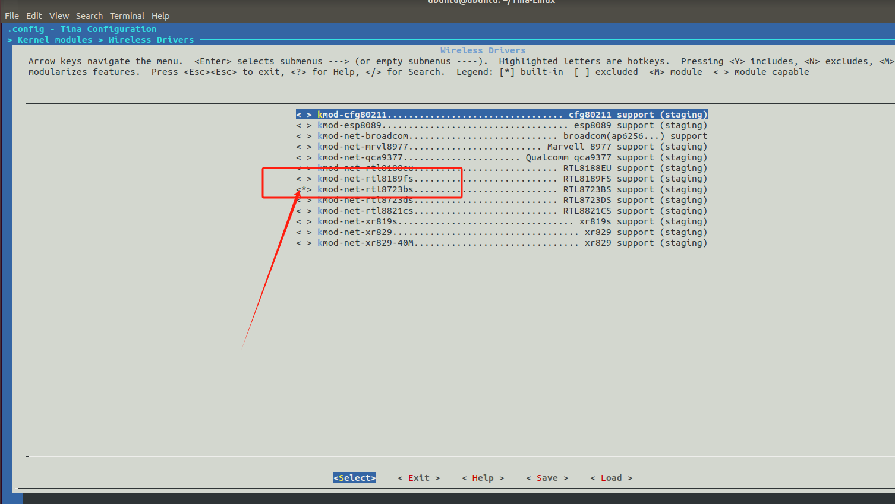
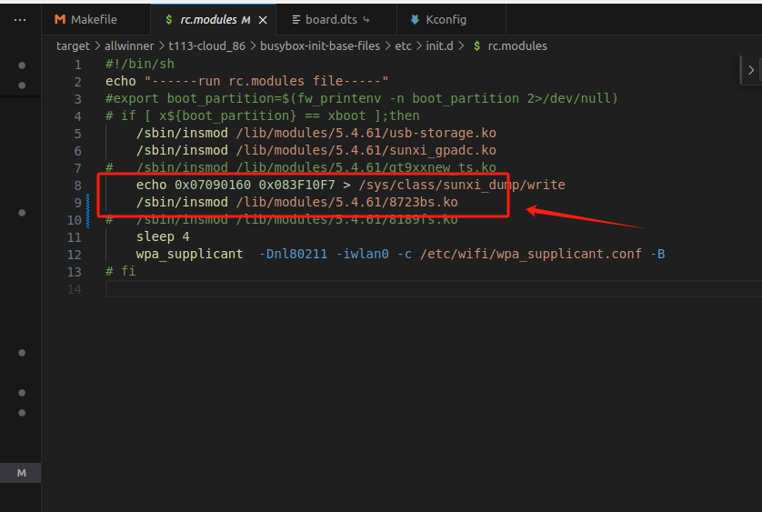
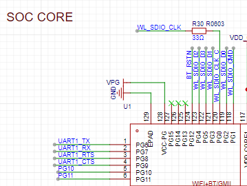
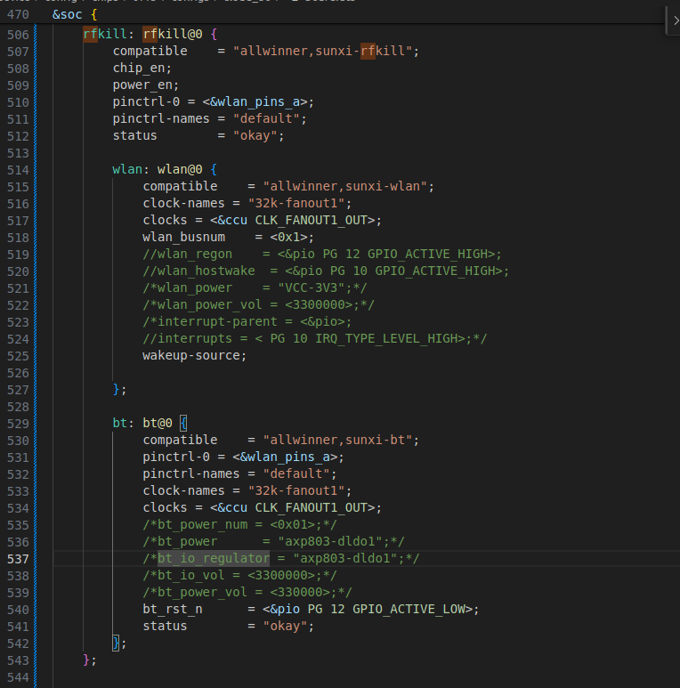
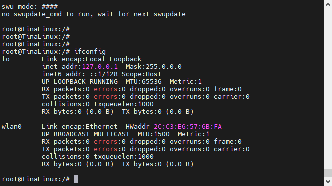

# 06 无线网卡 RTL8723BS

[RTL8723BS驱动文件](./src/rtl8723bs.zip)

## 1.添加驱动文件

驱动存放路径：

```shell
lichee/linux-5.4/drivers/net/wireless/rtl8723ds
```



修改wireless下的kconfig和Makefile

### Kconfig

增加一行8723bs的kconfig
```shell
source "drivers/net/wireless/rtl8723bs/Kconfig"
```



### Makefile

增加一行8723bs

```shell
obj-$(CONFIG_RTL8723BS)   += rtl8723bs/
```



## 2.添加驱动

```shell
make kernel_menuconfig
```




```shell
make menuconfig 
```



## 3.修改系统启动挂载的模块

这和每一个人的用的板级支持包有关，这里的路径是我的板极包路径

```shell
target/allwinner/t113-cloud_86/busybox-init-base-files/etc/init.d/rc.modules
```




```shell
/sbin/insmod /lib/modules/5.4.61/8723bs.ko
```

## 5.设备树配置



先查看sdc1的配置，wifi是挂在这上面的

```dts
sdc1_pins_a: sdc1@0 {
    pins = "PG0", "PG1", "PG2",
            "PG3", "PG4", "PG5";
    function = "sdc1";
    drive-strength = <30>;
    bias-pull-up;
};

sdc1_pins_b: sdc1@1 {
    pins = "PG0", "PG1", "PG2",
            "PG3", "PG4", "PG5";
        function = "sdc1";
};
```

开启uart1

```dts
&uart1 {
	pinctrl-names = "default", "sleep";
	pinctrl-0 = <&uart1_pins_a>;
	pinctrl-1 = <&uart1_pins_b>;
	status = "okay";
};
```

配置wifi

```dts
	rfkill: rfkill@0 {
		compatible    = "allwinner,sunxi-rfkill";
		chip_en;
		power_en;
		pinctrl-0 = <&wlan_pins_a>;
		pinctrl-names = "default";
		status        = "okay";

		wlan: wlan@0 {
			compatible    = "allwinner,sunxi-wlan";
			clock-names = "32k-fanout1";
			clocks = <&ccu CLK_FANOUT1_OUT>;
			wlan_busnum    = <0x1>;
			//wlan_regon    = <&pio PG 12 GPIO_ACTIVE_HIGH>;
			//wlan_hostwake  = <&pio PG 10 GPIO_ACTIVE_HIGH>;
			/*wlan_power    = "VCC-3V3";*/
			/*wlan_power_vol = <3300000>;*/
			/*interrupt-parent = <&pio>;
			//interrupts = < PG 10 IRQ_TYPE_LEVEL_HIGH>;*/
			wakeup-source;

		};

		bt: bt@0 {
			compatible    = "allwinner,sunxi-bt";
			pinctrl-0 = <&wlan_pins_a>;
			pinctrl-names = "default";
			clock-names = "32k-fanout1";
			clocks = <&ccu CLK_FANOUT1_OUT>;
			/*bt_power_num = <0x01>;*/
			/*bt_power      = "axp803-dldo1";*/
			/*bt_io_regulator = "axp803-dldo1";*/
			/*bt_io_vol = <3300000>;*/
			/*bt_power_vol = <330000>;*/
			bt_rst_n      = <&pio PG 12 GPIO_ACTIVE_LOW>;
			status        = "okay";
		};
	};
```




## 5.启动测试



### 常见的测试指令

```shell
root@TinaLinux:/# wifi_scan_results_test

*********************************
***Start scan!***
*********************************
bssid / frequency / signal level / flags / ssid
1c:1f:f1:bb:6c:68       2437    -69     [WPA-PSK-CCMP][WPA2-PSK-CCMP][WPS][ESS]ChinaUnicom-3LRNAS
00:78:12:01:c3:67       2432    -91     [WPA2-PSK-CCMP][ESS]    243
******************************
Wifi get_scan_results: Success!
******************************

```

```shell
root@TinaLinux:/# wifi_connect_ap_test ChinaUnicom-3LRNAS 244244244
==================================
Connecting to the network(ChinaUnicom-3LRNAS)......
[  135.285527] IPv6: ADDRCONF(NETDEV_CHANGE): wlan0: link becomes ready
Connected to the AP(ChinaUnicom-3LRNAS)
Getting ip address(ChinaUnicom-3LRNAS)......
udhcpc: started, v1.27.2
udhcpc: sending discover
udhcpc: sending select for 192.168.101.63
udhcpc: lease of 192.168.101.63 obtained, lease time 86400
Wifi connect ap : Success!
==================================
root@TinaLinux:/# /usr/sbin/odhcp6c-update: line 165: flock: not found
/usr/sbin/odhcp6c-update: line 165: flock: not found
```